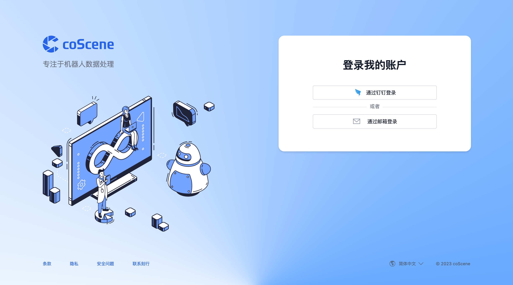
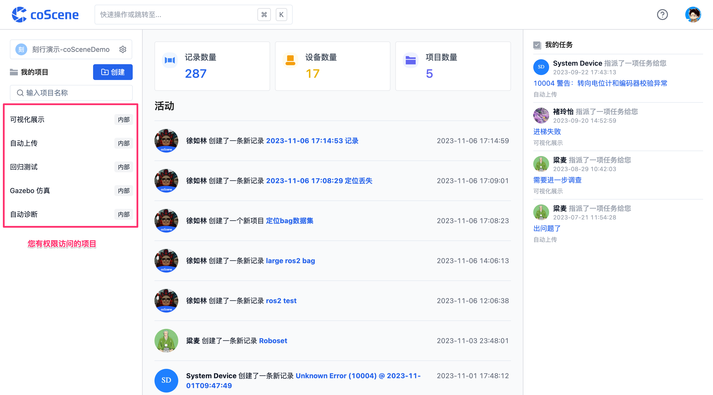
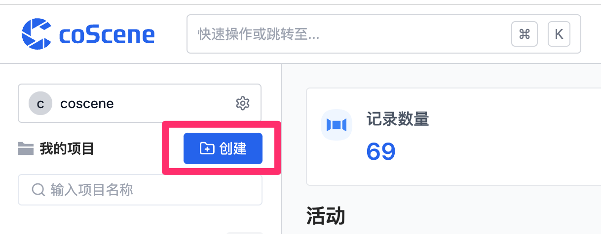
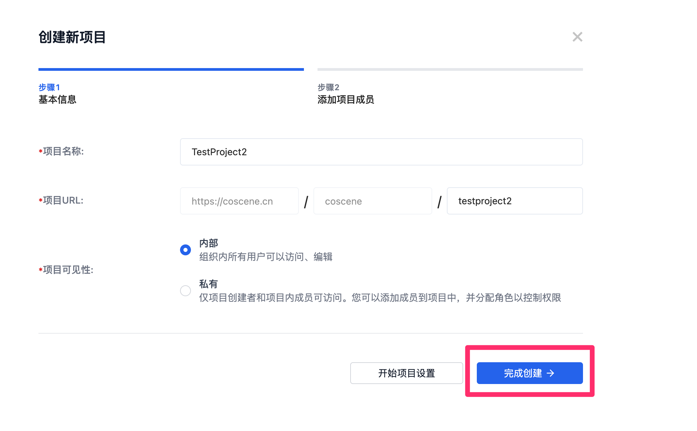

# 登录并加入你的第一个项目

## 1. 登录

您可以在平台主页使用钉钉或是邮箱的方式直接进行登陆，请访问刻行时空平台网站 [https://coscene.cn](https://coscene.cn) 开始你的第一步。

## 2. 访问项目

项目是 coScene 中管理数据的基本类型，项目可以是**一个部门、一个小组或一个专项课题**。在首页，可以查看组织中您有访问权限的项目。点击进入一个项目，即可访问项目中的数据。

## 3. 创建项目

若您登录后，组织中没有可访问的项目，可以创建一个新的项目。请注意，在组织内，创建的项目默认为组织内可见，可以被组织内的成员访问。您可以在创建时的向导中更改该选项，或者是项目创建后的项目设定内，更改项目的可见性。

您可以在项目创建的过程中，跟随项目创建向导更改不同的项目设置。

恭喜你！你已经完成了刻行时空平台的第一步，接下来我们将会介绍如何使用记录功能，上传并可视化你的机器人数据！
