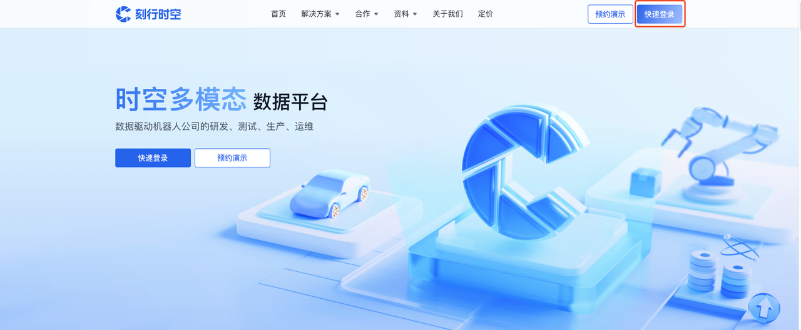
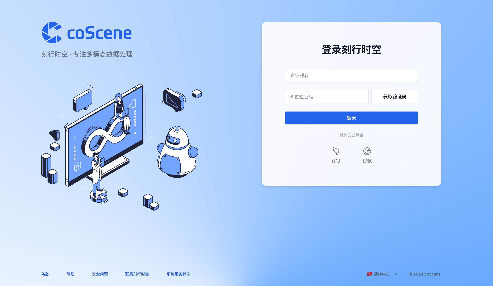
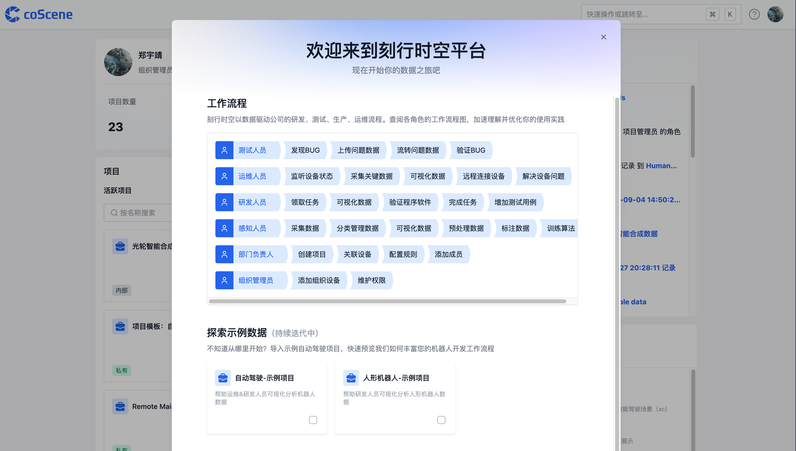

# 登录刻行时空

1. 通过浏览器访问[刻行时空平台 https://www.coscene.cn/](https://www.coscene.cn)，点击右上角的【快速登录】，进入登录界面

2. 选择登录方式进入平台，若无法登录可以联系 contact@coscene.io

3. 企业首次登录时，请创建您的组织，填写「组织名称」与「组织 ID」，勾选「同意」，点击【创建组织】

:::info
企业中首次登录刻行时空数据平台的人员，会自动成为「组织管理员」；
当其他同事使用企业的「飞书/钉钉/企业邮箱」登录时，会自动加入到同一个组织（即首次登录者创建的组织）
:::

4. 现在即可进入组织，开始你的数据之旅啦

