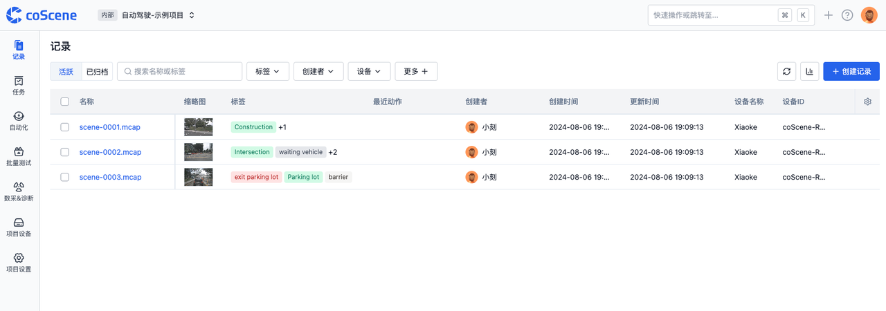

# 创建项目

## 项目一览

「项目」是管理数据的基本单元，项目可以是一个部门、一个小组或一个专项课题。在平台首页项目栏，所有您可以访问的项目会被直接列在项目列表中。

## 创建空白项目

1. 从首页中点击创建项目，并选择【空白项目】

2. 按需输入项目名称、网址并选择项目的可见范围后完成创建。

## 创建示例项目

示例项目是刻行时空平台提供的基于不同场景的项目模版，每个示例项目中包含示例数据，帮助你快速了解平台能力。

1. 点击创建项目之后，选择一个示例模板，设定项目名称等信息后，即可进入示例项目。

2. 在记录列表查看示例项目中包含的记录。

3. 点击一条记录进入记录详情页查看记录中的示例文件，用户可查看后续文档使用该文件体验更多平台功能。

