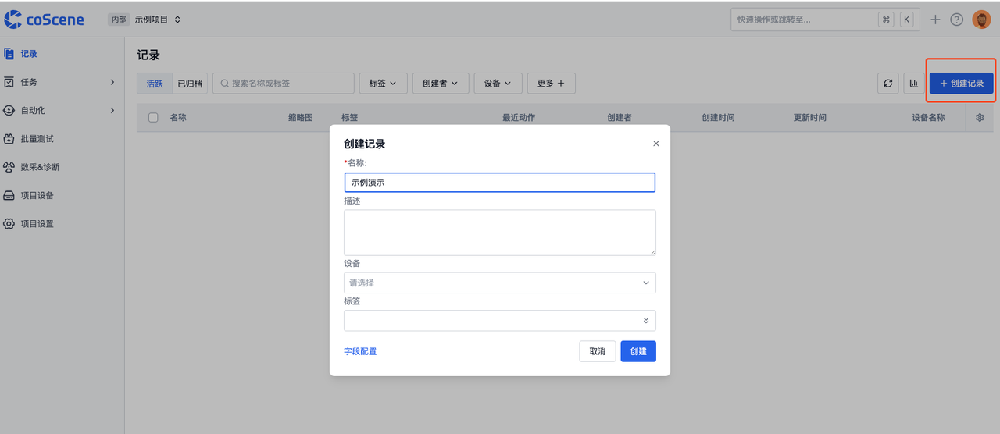
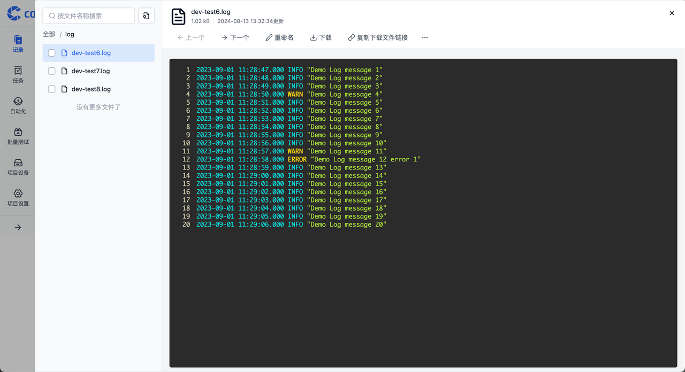
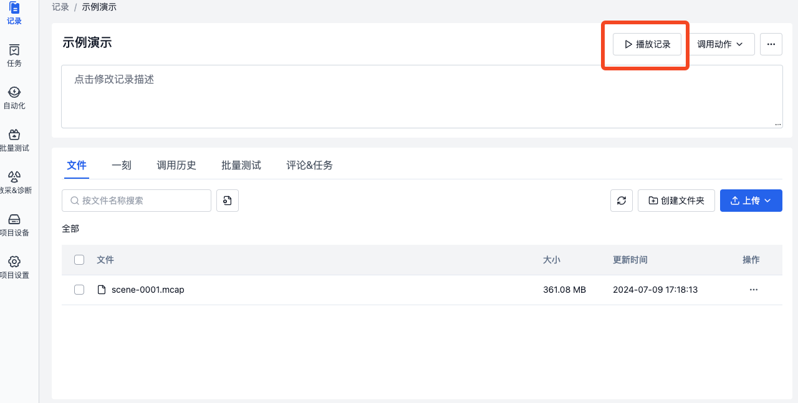

# 创建并可视化记录

创建完项目后，就可以在项目内创建并管理记录了。

记录是一段时间内相似场景的数据集合，你可以在记录内上传，修改，编辑，以及可视化刻行支持的数据。关于记录的详细概念 请参看[数据模型中的记录章节](../3-concepts/1-data-models.md#记录-record)。

## 创建记录

在记录表格页，点击【创建记录】按钮手动创建一条记录。其他创建方式可参阅[创建记录](../4-recipes/4-record/1-create-record.md)

## 上传文件

### 从本地上传文件

点击记录名称进入记录详情，点击【上传】按钮，选择一种方式上传文件。

在文件上传成功之后，我们就可以在文件列表中看到刚刚上传的文件了。

#### 常规文件预览

对于文本文件、Excel表格、PDF文档、图片等常规文件类型，平台提供了默认的文件预览方式。这种方式直观且易于理解，让您可以快速浏览文件内容。

#### 多模态数据预览

对于 ROS Bag、MCAP 这样包含多模态数据的复杂文件，平台提供了播放记录功能。这一功能让你可以像播放视频一样，顺序查看文件中记录的各种数据（如传感器数据、图像、音频等），非常适合于数据回放、事件重现或分析复杂交互场景。

## 可视化数据

请创建一个【自动驾驶的示例项目】来获取可视化的示例数据。

在记录中，点击播放记录进入可视化播放界面。

有关可视化的更多使用教程详情，请参考[数据可视化](../4-recipes/6-viz/1-about-viz.md)
