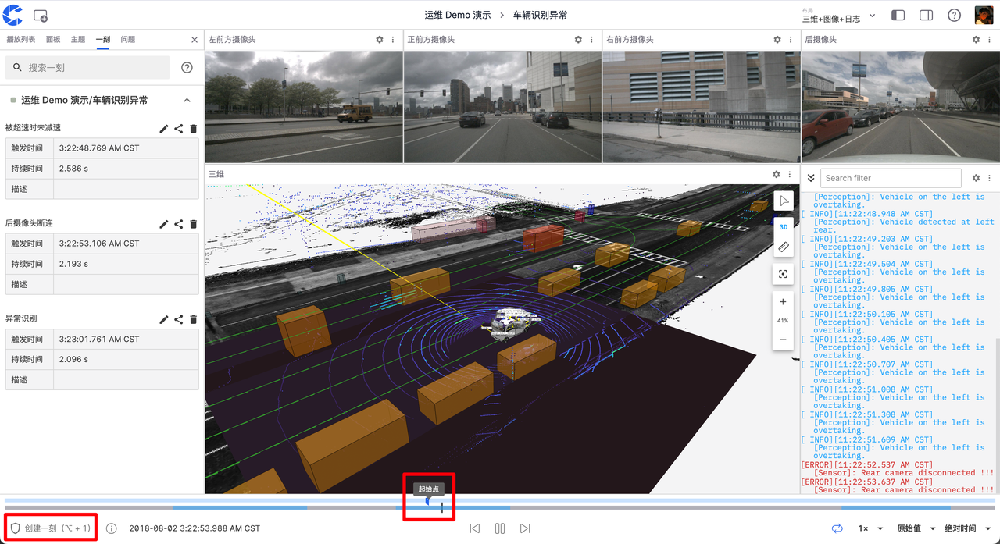
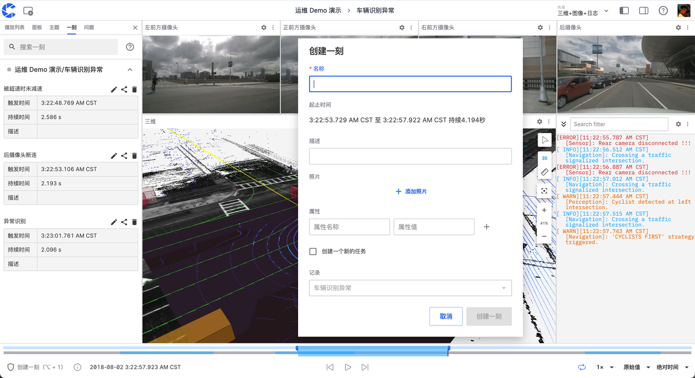
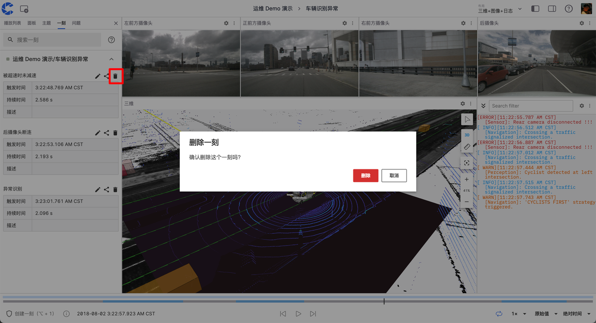
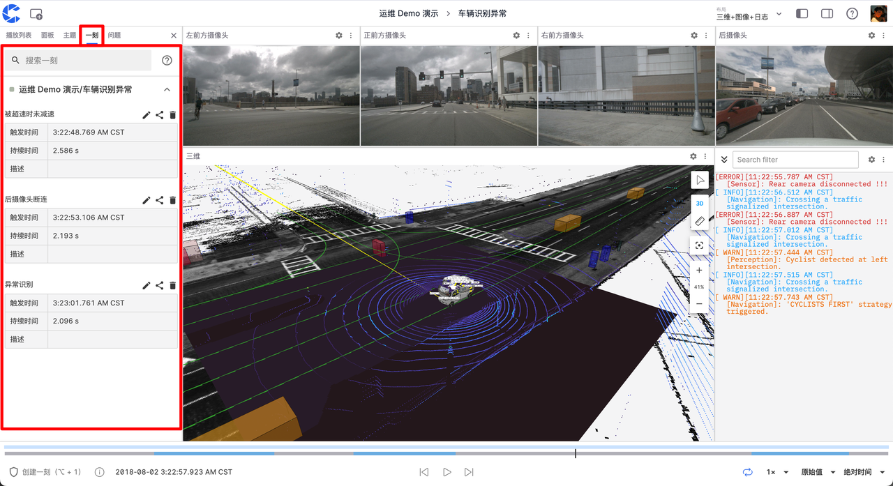

# 创建你的第一条“一刻”

在可视化界面播放数据时，你可以创建"一刻"来快速标记多模态数据流中的特定时间段。这些"一刻"可能包含重要的数据变化、异常现象或任何你认为值得关注的内容。通过创建"一刻"，你可以方便地回顾、分析和分享这些信息，大大提高数据处理的效率和准确性。

## 创建"一刻"

1. 在可视化页面的左下角点击【创建一刻】，或使用快捷键【Alt + 1】（Mac 用户使用 Option + 1）来标记一刻的起点。

2. 再次点击以标记一刻的终点。此时会自动弹出创建一刻的窗口，蓝色区域表示一刻的时间范围。

3. 填写相关信息后，点击"创建一刻"即可完成。

## 管理"一刻"

在左侧的一刻面板中，你可以对已创建的"一刻"进行编辑、分享和删除操作。

### 编辑

点击编辑按钮可修改当前一刻的信息。

### 分享

点击分享按钮可将当前一刻的链接复制到剪贴板。

### 删除

点击删除按钮可删除选中的一刻。

## 查看"一刻"

你可以通过以下两种方式查看已创建的"一刻"：

1. 在可视化页面左侧的一刻面板中查看当前记录的所有一刻。

2. 在记录详情页面的"一刻"标签页中查看该记录的所有一刻。

