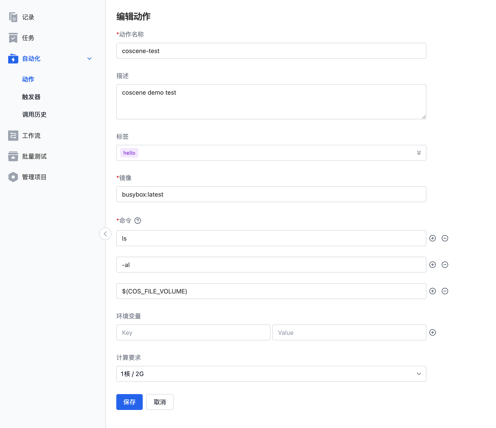
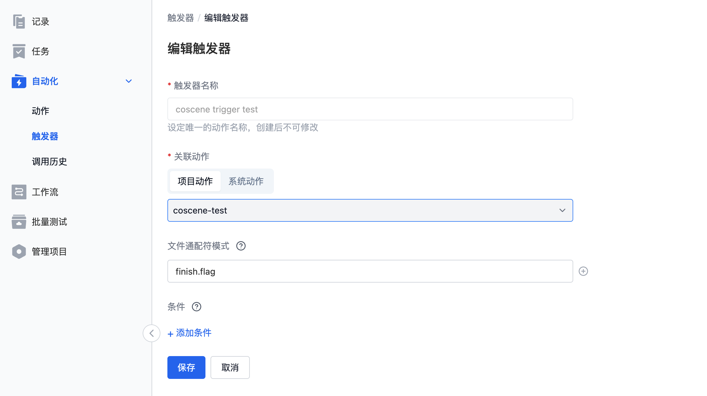
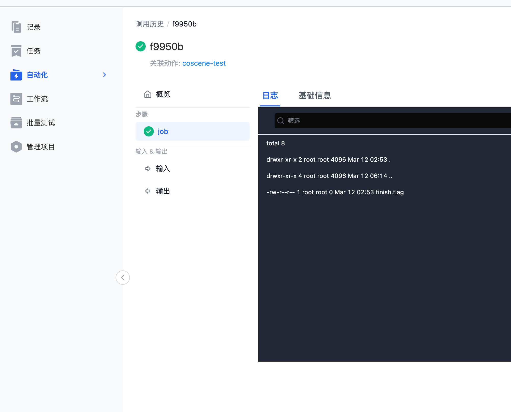

# 了解刻行自动化

## 序言

本文将针对刻行提供的自动化模块功能进行介绍，了解相关功能模块的概念以及使用。

## 概念介绍

自动化主要有三个子功能入口，动作、触发器和调用历史。触发器关联动作，文件的上传会触发触发器的运行，符合条件的触发器会触发动作运行，完成一次自动化的运行，展示在调用历史页面。

### 动作

定义了用户的行为，指想要执行的操作逻辑，主要是用户自己的业务代码逻辑。例如列举目录下所有文件 (`ls -al`)、运行特定的程序 (`python hello.py`) 等。

#### 动作名称
用户按照功能填写有含义的名称。

#### 描述
详细的介绍动作的相关信息，可不填。

#### 镜像
当前支持两种方式操作：

1. 用户可以将自定义镜像上传至刻行平台，然后使用对应的镜像地址，具体查看[推送镜像](https://docs.coscene.cn/docs/recipes/regression/image-management#2-%E6%8E%A8%E9%80%81%E9%95%9C%E5%83%8F)
2. 使用**公开可访问**的镜像地址，如 Docker Hub 上的各类开放镜像

#### 命令

镜像运行之后执行的命令信息，请依据自定义镜像的实际需求修改，**请注意命令和相关的参数等均需要独立成行**。如 `ls -al` 的命令需要拆分为两行填写。

#### 环境变量

用户可以预设相关的环境变量提供给程序读取使用，刻行预设了部分环境变量，在定义时请避免使用相关的名称，防止程序出现意料之外的错误。

* `COS_CODE_VOLUME` 代码的挂载目录，值为 `/cos/codes`
* `COS_BIN_VOLUME` 二进制文件的挂载目录，值为 `/cos/bins`
* `COS_BUNDLE_VOLUME` 测试包文件的挂载目录，值为 `/cos/bundles`
* `COS_FILE_VOLUME` 原始上传数据文件的挂载目录，值为`/cos/files`
* `COS_ARTIFACT_VOLUME` 批量测试的 artifact 目录，用户可以在运行过程中将产出物写入到相关目录进行保存，值为 `/cos/artifacts`
* `COS_OUTPUT_VOLUME` 输出文件的目录，用户可以将程序的输出数据写入到相关的目录进行保存，例如 bag 文件。后续可以与原始 bag 文件进行对比播放，具体值为 `/cos/outputs`

下列的环境变量的值为可选项，当存在时为 uuid 格式的 id 信息，不存在时为空。
* `COS_ORG_ID` 组织 ID
* `COS_USER_ID` 用户 ID
* `COS_WAREHOUSE_ID` warehouse ID
* `COS_PROJECT_ID` 项目 ID
* `COS_RECORD_ID` 记录 ID

#### 计算要求

限制了程序的 cpu 和内存的最大使用量，1 核代表最高可以使用 1 核的 cpu，2G 代表最大使用 2G 的内存。当程序使用超过配置的计算资源时，可能会导致程序被刻行系统终止导致程序非正常退出，请预估使用资源并配置合理的计算要求。
默认提供了四种配置，`1核/2G`, `2核/4G`, `4核/8G`, `8核/16G` ，如果有更高的需求，请联系刻行团队。

### 触发器

触发器定义了动作的触发时机，当新文件上传成功时，触发器会依据配置进行检查。文件通配符可以限制上传文件的名称格式等，条件组可以约束上传文件所属记录的范围，例如只允许有 `hello` 标签的记录在文件上传成功时触发运行。

#### 触发器名称

按照业务需求填写有含义的名称信息。

#### 关联动作

用户在动作页面创建的动作均为项目动作，可以选择使用。刻行依据客户的场景，内置开发了通用的一些系统动作，减少用户的开发量，如自动诊断功能等，如有相关通用需求，请联系刻行团队。

#### 文件通配符

用于匹配上传的文件是否符合相关的格式定义，决定后续的触发器是否触发动作运行，具体的语法逻辑请参考页面介绍。

#### 条件

支持筛选关联记录的标签信息，当只有符合标签的要求记录才可以满足触发器条件。**请注意，记录标签的改变并不会触发刻行系统检验相关的触发器**，例如给记录打上一个新的标签，触发器并不会检验然后运行对应的动作，*当前只有上传文件才会触发触发器的运行*

### 调用历史

调用历史展示了项目内所有动作的执行历史，用户可以点击记录查看单条运行记录的详情信息，提供了状态、时间、操作用户等概览信息。另外也提供了具体的执行日志信息，用户可以查看日志来检测程序的运行情况，方便开发调试。

#### 调用历史列表页面

#### 单次运行详情页面

