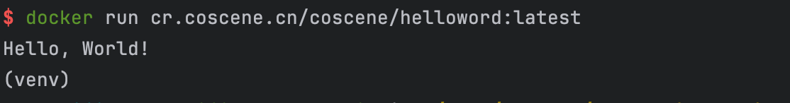

# 准备镜像

使用 Docker 构建自己的镜像。

## 前置条件

本机已经安装并启动 Docker。若本机需要安装 Docker，请参考对应的[安装文档](https://docs.docker.com/engine/install/)。

## 准备镜像文件

新建一个文件夹，其中包含 dockerfile 和相关的测试代码。下面以一个简单的名为 hello.py 的 Python 文件和 dockerfile 来进行演示。

- 示例 dockerfile

```bash

FROM python:3.12 AS builder

# copy files
COPY hello.py /usr/src/app/

WORKDIR /usr/src/app

# set command/entrypoint, adapt to fit your needs
CMD ["python", "hello.py"]

```

- 示例测试代码

```python
if __name__ == "__main__":
    print("Hello, World!")

```

## 打包镜像

我们假设镜像名字为 `cr.coscene.cn/coscene/helloworld`, 标签为 `latest`

```bash
docker build -f dockerfile -t cr.coscene.cn/coscene/helloword:latest .

```
如果需要镜像支持不同的平台而进行交叉编译，具体请查看[文档](https://docs.docker.com/build/building/multi-platform/)

## 运行镜像

镜像打包完成之后，我们可以运行镜像来验证一下代码功能。

```bash

docker run cr.coscene.cn/coscene/helloword:latest  

```

查看输出，镜像的打包正确，输出了我们的预期结果。


