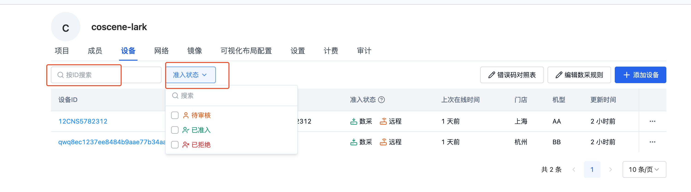
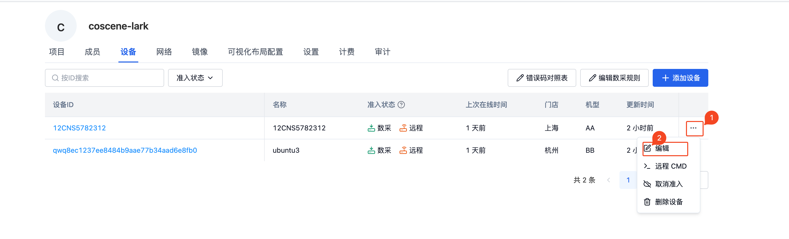
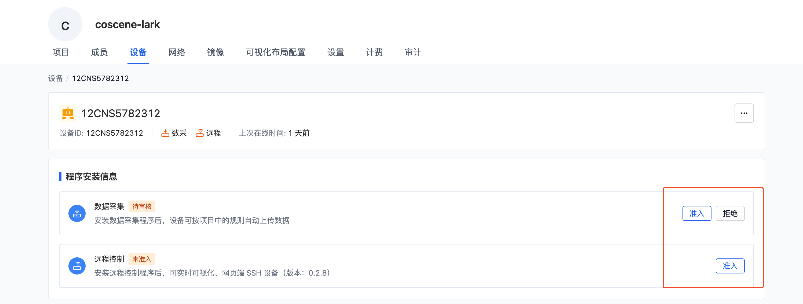
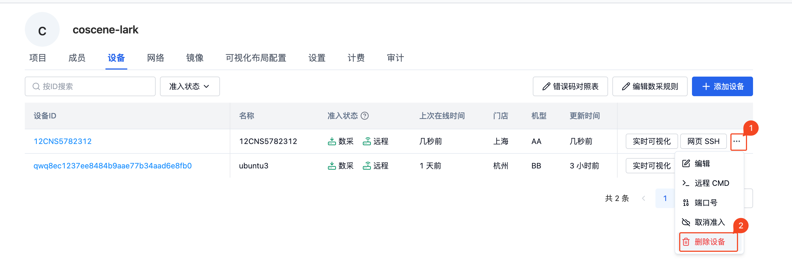

# 管理设备

设备在组织层面进行管理，组织内的设备可应用于所有项目。「组织管理」-「设备」页面查看现有的设备列表。

## 过滤设备

> 所有组织用户均可查看过滤设备信息。

如图所示，当前支持「设备 ID」和「准入状态」两个字段的筛选

## 编辑设备

> 组织成员及以上角色可以编辑更新设备信息。

在设备列表中选择需要操作的设备，点击【编辑】按钮，对设备的信息进行修改操作。

## 设备准入

> 只有组织管理员可以准入设备。

当你完成[从设备端添加](./2-create-device.md#从设备端添加)后，设备列表会出现【准入】的操作按钮。在设备详情页，可以单独的准入「数据采集」和「远程控制」模块。

当「数据采集」准入之后，机器端的程序会按照规则开始采集数据，并且自动上传至对应的项目。

当「远程控制」准入之后，用户可以通过刻行平台对机器进行实时的操作，如 SSH 连接，实时可视化等功能

## 删除设备

> 当设备已准入时，只有组织管理员可以删除设备。当设备无准入信息时，组织成员及以上角色均可删除设备。

在设备列表中选择需要删除的设备，点击【删除设备】，二次确认后即可删除设备。当删除设备之后
1. 已准入设备将取消准入，无法自动上传数据
2. 组织中将清除该设备及来自设备端的请求
3. 记录中将无法添加该设备
4. 记录中将无法查看该设备的详细信息

