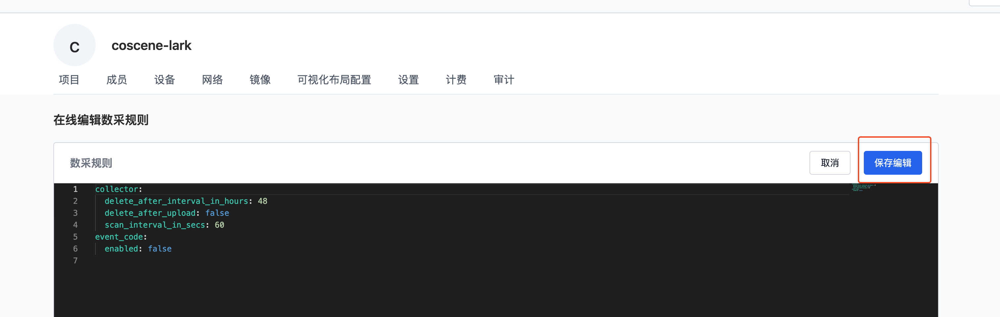

# 数采规则

> 准入的设备可按数据采集规则，将数据自动上传到项目中。数采规则应用于所有设备共用一套配置，如果需要按照项目划分采集规则，请参考[关于数据自动采集与诊断](../9-data-diagnosis/1-intro.md) 使用规则引擎来处理满足相关需求。

## 关于数采规则

> 数采规则应用于组织中的全部设备，仅组织管理员可编辑

数采规则定义需要监控的设备日志所在目录、设备信息文件的存放目录等。当设备准入之后，设备会主动拉取组织配置的数采规则信息，依据配置的规则在机器端动态运行。

## 编辑数采规则

数采规则的结构格式参见下文。

进入组织管理页面的「设备」分页，点击【编辑数采规则】按钮。


在线编辑数采规则，在完成配置后点击【保存编辑】。



<br />

## 数采规则格式

数采规则主要对三个模块进行设置：

- **数据收集器设置（collector）**：完成数据采集后，是否删除设备端数据
- **存储设置（mod）**：设备端数据的存储目录；设备标识文件的地址
- **事件设置（event_code）**：事件错误码的上传规则地址以及是否上传条件限制
- **更新设置（updater）**：当前程序是否开启自动更新

<br />

示例数采设备信息文件如下：

```yaml
collector:
  delete_after_upload: true # 默认值为 False
  delete_after_interval_in_hours: 48 # 默认值为 -1，即不删除文件
  scan_interval_in_secs: 60 # 默认值：60，即 60s 对文件夹扫描一次

mod:
  name: 'default' # mod 名称，默认 default，定制版请联系刻行产品了解详细信息
  conf:
    enabled: true # 是否启用，默认为 true
    robot_file: '/root/.ros/sn.txt' # 设备标识文件，用于存放设备唯一标识码，如 sn
    base_dir: '/root/.ros/auto-upload/' # 数据监听目录

event_code: # 错误码功能
  enabled: false # 错误码白名单配置，默认 False
  whitelist:
    '1001': 8 # key 为错误码，字符串类型；value 为次数，表示在 reset_interval_in_sec 周期内只上传规定次数，多余数据会忽略上传
  reset_interval_in_sec: 86400 # 计算周期，默认为一天
  code_json_url: cos://organizations/current/configMaps/device.errorCode # 默认采用云端配置模式，支持其他公开文件

updater:
  enabled: true # 自动升级配置，默认值：True
```

<br />

### 数据收集器设置

设置完成数据采集后，是否删除设备端数据，以释放设备端硬盘存储

```yaml
# 数据收集器设置
collector:
  delete_after_upload: true # 默认值为 False
  delete_after_interval_in_hours: 48 # 默认值为 -1，即不删除文件；否则默认会删除 48 小时以前的旧数据
  scan_interval_in_secs: 60 # 默认值：60，即 60s 对文件夹扫描一次
```

<br />

### 存储设置

设置设备端数据的存储地址

```yaml
# 数据处理设置，可定制，具体信息请咨询刻行产品了解详细过程
mod:
  name: 'default' # mod 名称，默认 default，定制版请联系刻行产品了解详细信息
  conf:
    enabled: true # 是否启用，默认为 true
    robot_file: '/root/.ros/sn.txt' # 设备标识文件，用于存放设备唯一标识码，如 sn
    base_dir: '/root/.ros/auto-upload/' # 数据监听目录
```

<br />

### 事件代码设置

设置触发数据采集的事件错误码和条件

```yaml
# 事件代码设置
event_code: # 错误码功能
  enabled: false # 错误码功能是否启用，默认 False
  whitelist:
    '1001': 8 # key 为错误码，字符串类型；value 为次数，表示在 reset_interval_in_sec 周期内只上传规定次数，多余数据会忽略上传
  reset_interval_in_sec: 86400 # 计算周期，单位为秒，默认值为 86400s
  code_json_url: cos://organizations/current/configMaps/device.errorCode # 默认采用云端配置
```

- **whitelist**：在白名单中的事件错误码发生时，会触发数据的自动上传。可设置该错误码发生后，最多上传的次数，防止同一问题多次重复上报
- **reset_interval_in_sec**：重置关于错误码「最多上传的次数」的设置。例如 86400 表示 24 小时后，当同一错误码再次发生时，「上传次数」重新从 1 开始计数
- **code_json_url**：事件代码的 JSON 数据源地址

<br />

### 更新设置

设置是否自动更新数采程序

```yaml
# 更新设置
updater:
  enabled: true # 是否自动更新数采程序，默认值为 true
```
