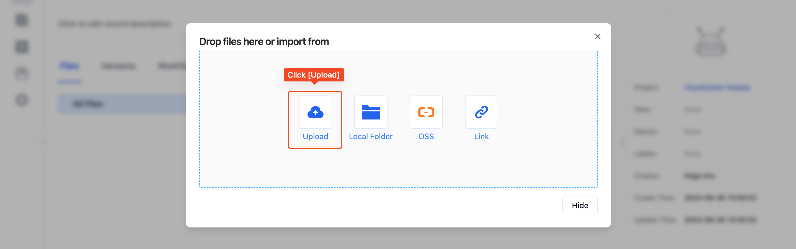
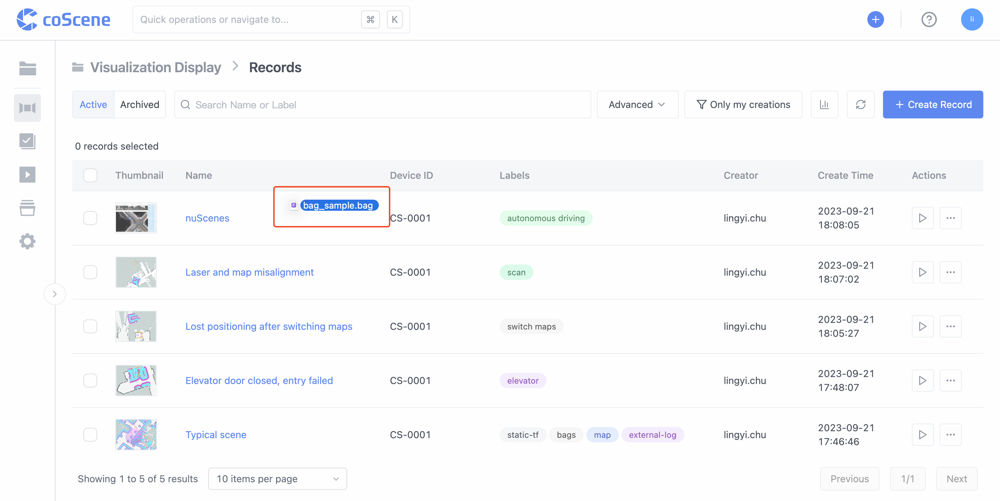

# 创建记录

当用户需要查看设备在一段时间内产生的数据时，可以在项目中创建一条记录，并将设备产生的所有数据上传到记录中

## 创建记录的 2 种方式

### 1. 从记录列表中创建记录

第一步：在项目中的「记录列表」，点击【创建记录】按钮，输入记录名称，即创建成功:

第二步：在「记录详情页」，点击【上传文件】，将设备产生的数据从本地上传到记录中

### 2. 拖拽文件到项目中，即创建记录

在项目中任意界面，将文件拖拽到浏览器中，即可触发【创建记录】并上传文件

## 记录的属性

一条记录可以设置以下几个属性，用于归类和检索：

- 起止时间：记录发生的开始时间和结束时间
- 设备：可以从设备列表中选择已添加的设备，或添加一个新的设备
- 标签：可以设置分类标签
- 描述：可以填写记录发生时的现场描述、故障问题等信息

- 缩略图：您可以上传一张现场照片或关键帧，帮助识别记录

