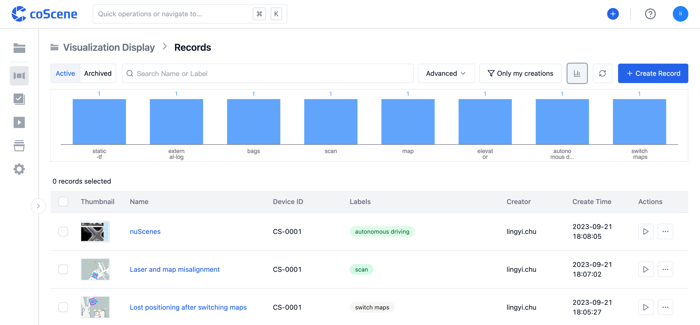
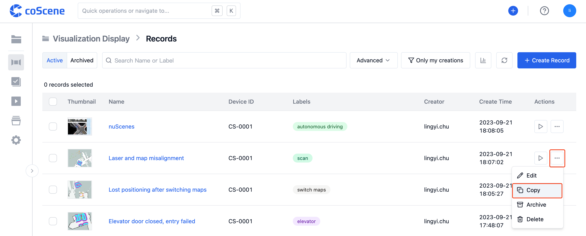

# 管理记录

在记录列表页，您可以新增、编辑、复制、归档已创建的记录，也可以对记录进行搜索和过滤、对已有的分类做统计。

## 分类和设置标签

- 当您在创建或编辑记录时，可以对记录设置标签，每个标签可以对应一种分类。
- 对每一条记录都可以设置多个标签。

  
  

## 统计

- 点击「记录列表」中的【统计】按钮，可以展示出每个标签下的记录数量：

  

## 搜索和过滤

- 您可以在「记录列表」的搜索框中，输入关键字，对记录的名称和描述内容进行搜索：

  

- 您也可以【点击高级】按钮，展开更多的过滤项，对记录的起止时间、标签、设备等属性进行过滤：

  

## 复制

当您希望对采集的数据进行重复利用、再聚合时，您可以将记录从一个项目复制到另一个项目

- 选择记录并点击【复制】按钮，从弹窗中选取复制到的项目，即可完成记录的复制：

  

  

## 归档

您可以归档项记录来存放低活跃度的数据，以供他人查看和参考。

> 谁可以使用这个功能 
> 组织管理员、项目管理员和项目成员可归档记录

### 归档记录

> 记录归档后，变为只读状态，记录内所有数据不再更新。

**归档单个记录**

- 点击项目的【记录】页面，进入【活跃】记录列表。

  

- 选择待归档的记录，点击右侧的【归档】按钮。

  

**批量归档记录**

- 点击项目的【记录】页面，进入【活跃】记录列表。

  

- 勾选待归档的记录后，点击【归档记录】。
  

### 取消归档记录

> 记录取消归档后，恢复可读可写状态。

**取消归档单个记录**

- 点击项目的【记录】页面，进入【已归档】记录列表。

  

- 选择需要取消归档的记录，点击右侧的【取消归档】按钮。

  

**批量取消归档记录**

- 点击项目的【记录】页面，进入【已归档】记录列表。

  

- 勾选待取消归档的记录后，点击【取消归档】。

  
