# 关于数据可视化

刻行平台提供了高效的数据可视化界面，通过不同的「面板」和「布局」将机器数据呈现为可视化数据，从而处理各种常见的机器问题。
 
## 如何进行进入可视化界面

在记录中，点击【播放记录】或直接点击文件进入可视化界面

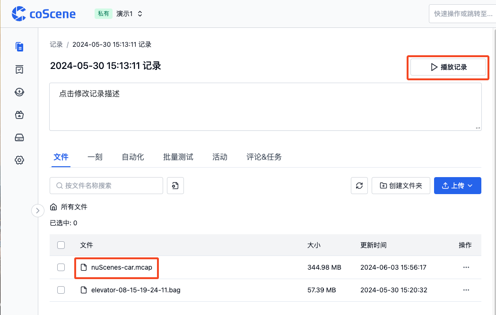

## 可视化界面的基本元素
可视化界面的基本元素包括「顶部工具栏」、「面板」、「侧边栏」和「时间轴」。

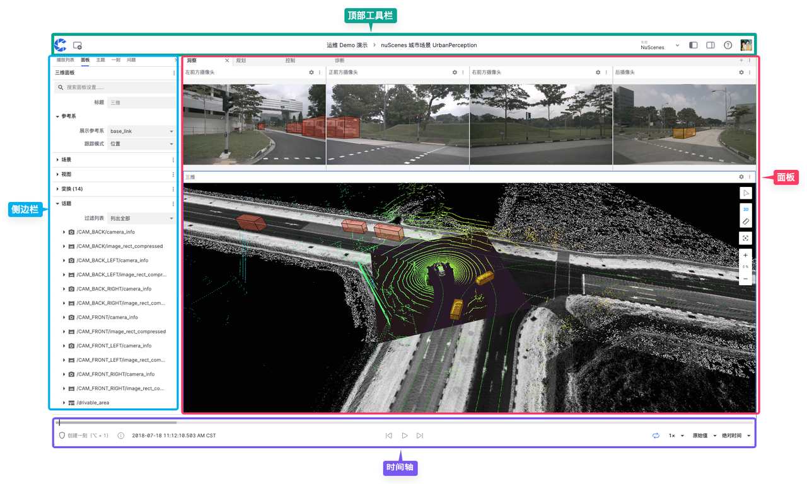

### 顶部工具栏
「顶部工具栏」是用户在可视化界面中进行导航和访问部分功能的区域

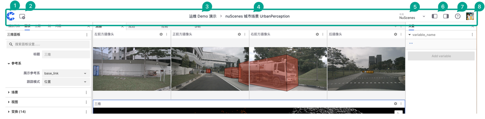

以下是该区域的功能介绍：
1. 首页按钮
2. 添加面板按钮
3. 所属项目名称
4. 所属记录名称
5. 布局菜单栏
6. 左右侧边栏收起按钮
7. 帮助文档
8. 用户菜单栏

### 面板

「面板」是模块化的可视化界面，允许用户添加、编辑和拖放不同模块。它可以配置和排列成个性化的「布局」与组织和项目共享。

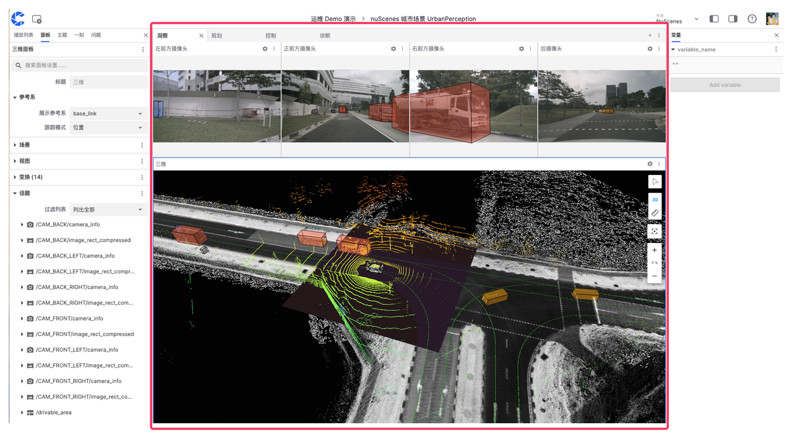

### 侧边栏

「侧边栏」是可视化界面中用于配置和管理不同设置和信息的界面，分为「左侧边栏」和「右侧边栏」。

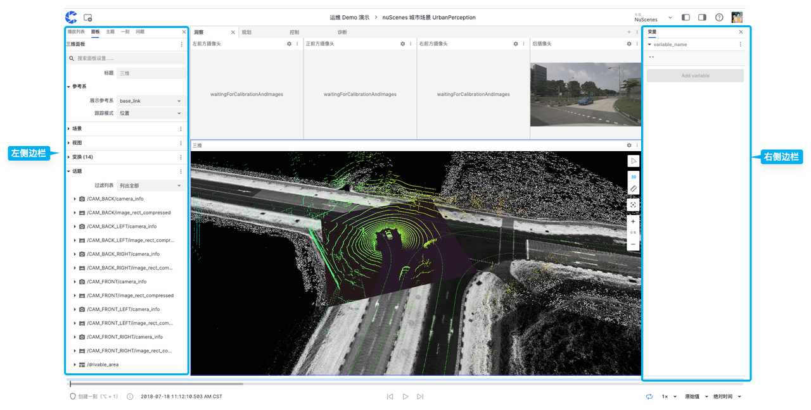

#### 左侧边栏

「左侧边栏」可以显示【播放列表】、【面板】、【主题】、【一刻】和【问题】的信息。

##### 播放列表

「播放列表」是用于管理数据文件的工具，支持按序或按需播放不同的文件。「添加文件」还支持从组织内添加不同项目的记录文件。

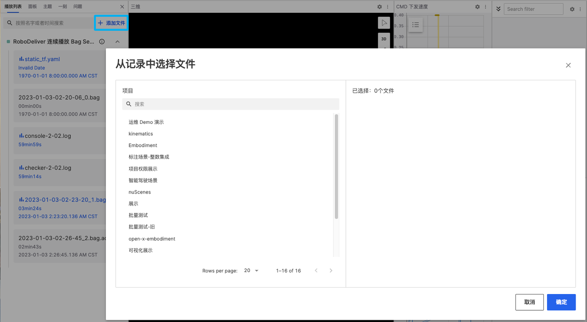

##### 面板

「面板」中可以查看和更改当前面板的属性，可点击不同类型的面板进行切换。

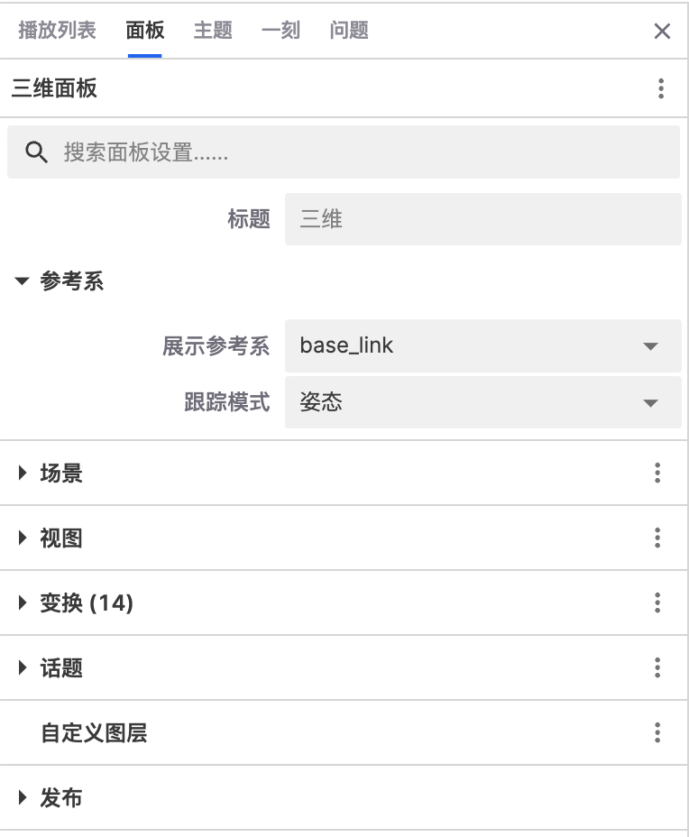

##### 主题

「主题」是指数据流的类别或频道，每个主题代表一种特定类型的数据源或传感器数据，用户可以在搜索栏中筛选。

 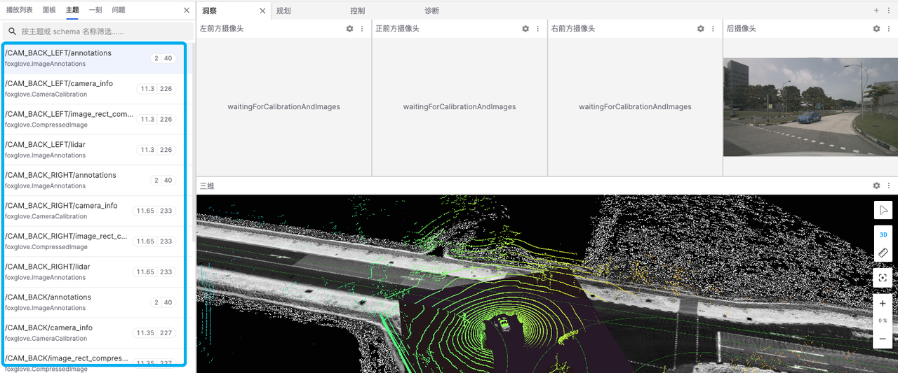

 
##### 一刻

「一刻」列表中可以显示、编辑、复制和删除创建的一刻

 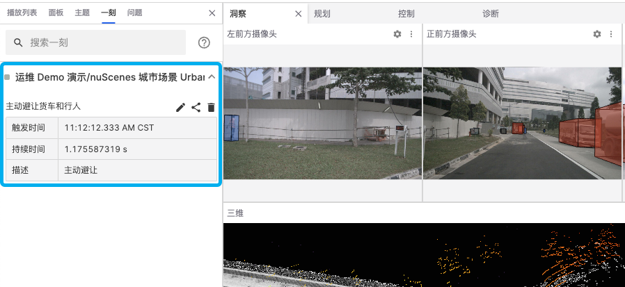

##### 问题

「问题」列表可以显示可视化界面出现故障时的具体错误类型。例如，图中出现了 "network error" 这个问题从而导致面板加载失败。

 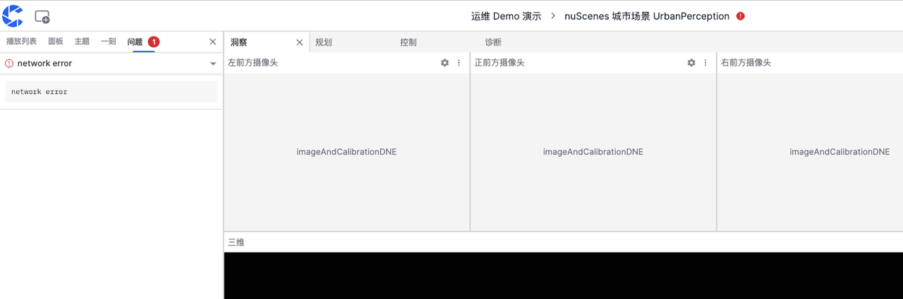

#### 右侧边栏

可视化界面中的「右侧边栏」可编辑变量信息
 
 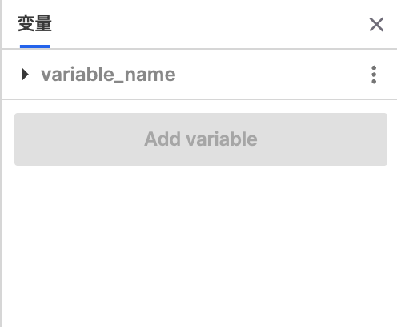
 
#### 时间轴
 
「时间轴」是用于控制和查看可视化播放进度的工具，显示了不同时刻精准的时间点，即时间戳。
 
 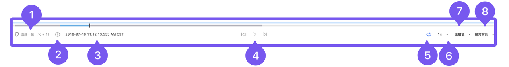
 
以下是该区域的功能介绍：
1. 【创建一刻】按钮，用于选择「一刻」的起止点
2. 显示文件播放的开始时间、结束时间和持续时间
3. 当前进度时间戳
4. 暂停及前进后退按钮
5. 循环播放按钮
6. 倍速播放按钮
7. 播放画质选项按钮
8. 绝对相对时间切换按钮

---

