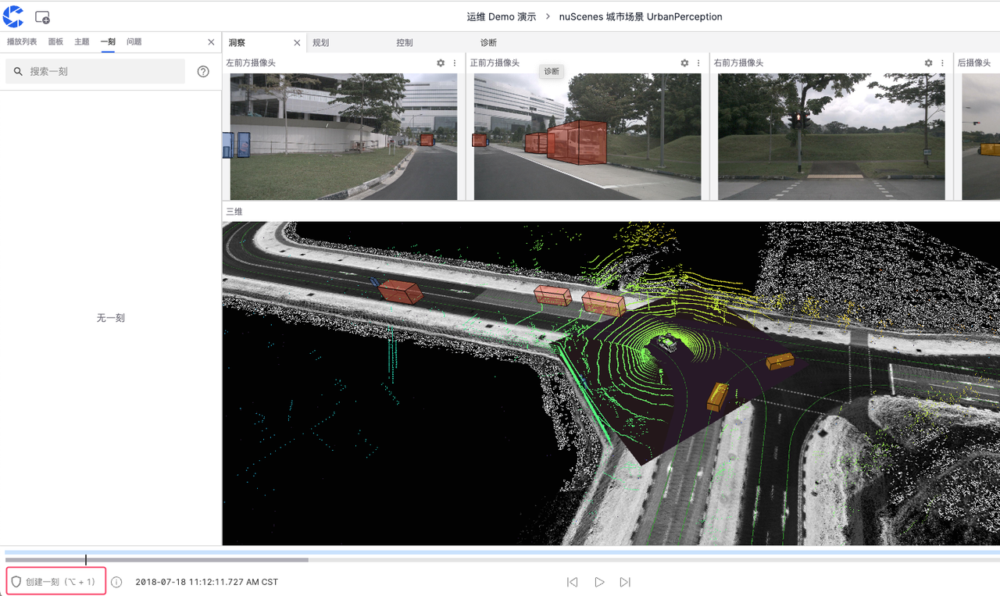
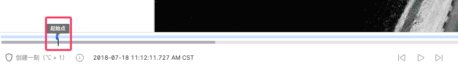
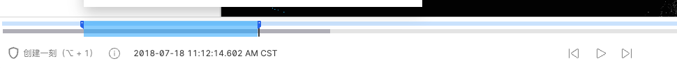
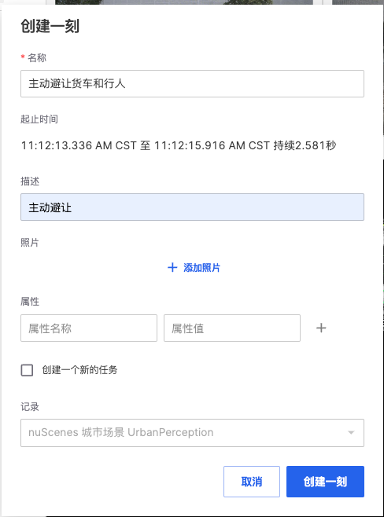
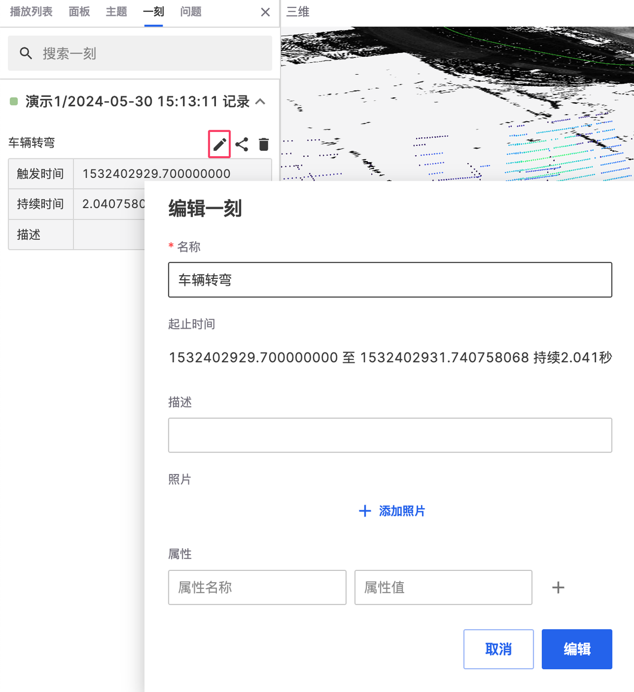
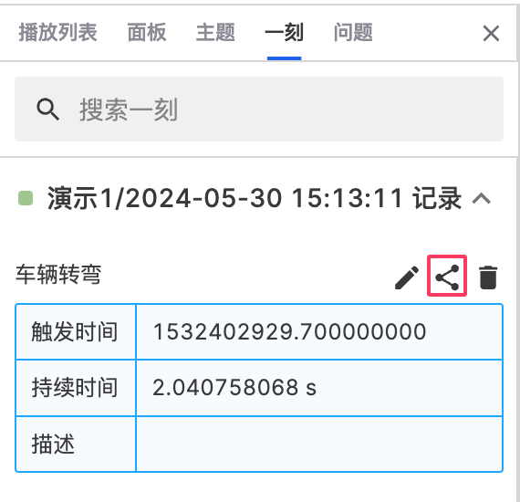
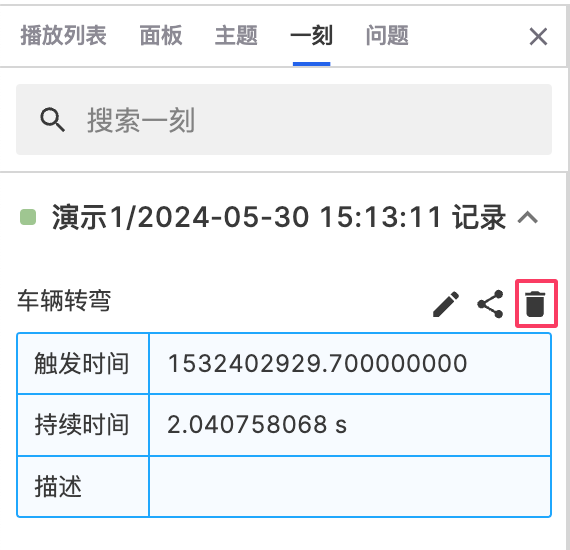
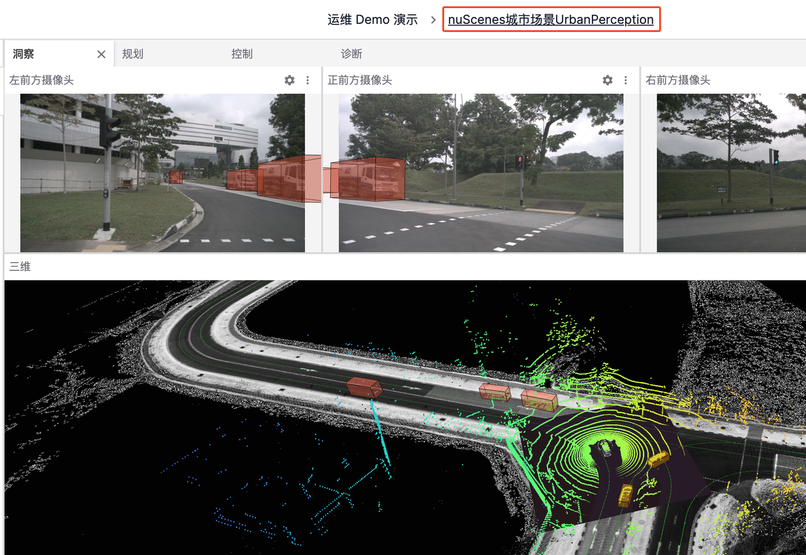
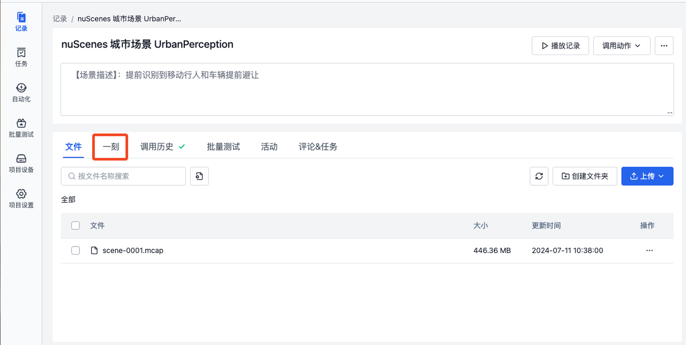
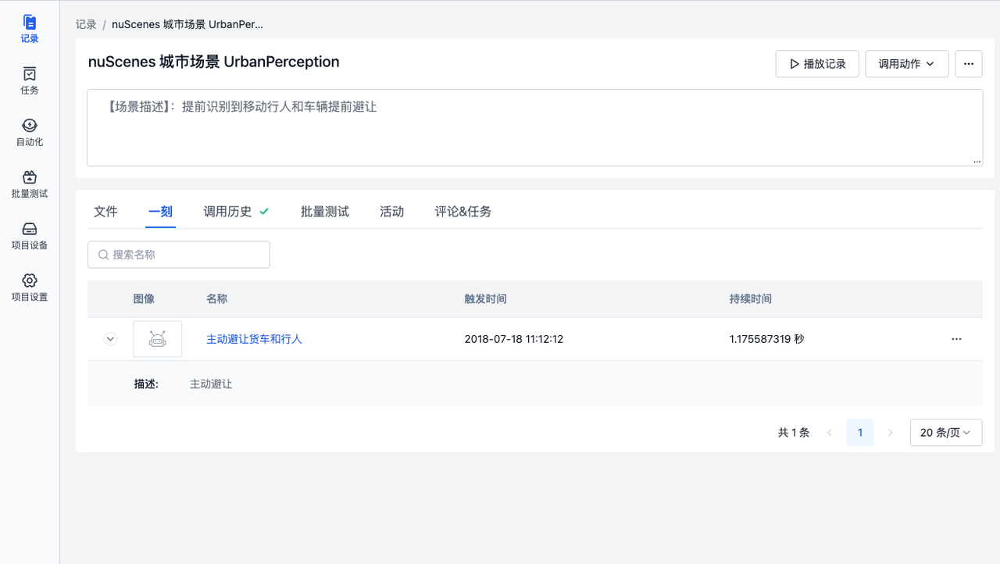

# 在可视化界面中的一刻
 
「一刻」是记录中的关键帧，它可以是可视化界面中故障或有趣的画面

## 创建一刻

1. 点击记录中的【播放记录】按钮进入可视化界面
 

2. 点击左下角的【创建一刻】按钮，选择起止点
如图，可使用快捷键或点击【创建一刻】按钮在需要的时间点确定起点
 

在需要的时间点再次点击确定终点，图示蓝色范围就是「一刻」的起止时间

3. 可通过点击拖动更改「一刻」的范围   
4. 输入名称，描述等字段信息完成创建
 
 

## 管理一刻

在左侧边栏中的【一刻】中实现对「一刻」的编辑，复制和删除

### 编辑一刻

点击图示编辑按钮修改「一刻」的字段信息
 
 

### 复制一刻

点击图示复制按钮来将当前「一刻」的链接复制到剪切板
 
 

### 删除一刻

点击图示删除按钮来删除这条「一刻」
 
 

## 查看一刻

1. 点击可视化页面顶部工具栏中的记录名称，前往记录详情页
 
 

2. 点击图示的【一刻】按钮
 
 

3. 进入一刻详情页，查看创建「一刻」的信息

 

---

