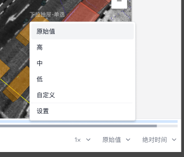

# 帧率优化选项

「帧率优化选项」用于在数据量较大且带宽受限的情况下，通过主动调整 `topic` 数据的帧率来实现流畅的播放效果。

## 设置

「帧率优化选项」位于可视化界面右下角，提供四个预设档位：

| 档位   | 目标帧率                       |
| ------ | ------------------------------ |
| 原始值 | 保持原始数据帧率，不做任何处理 |
| 高     | 60 fps                         |
| 中     | 30 fps                         |
| 低     | 10 fps                         |

:::warning

以下类型的消息不会进行任何帧率的调整：

- `transform` 类型消息
- 帧间存在依赖关系的数据（如 `CompressedVideo` 中的 `H.264` 编码视频流）

:::

## 规划中的进一步优化

现有方案对所有的 `topic` 进行统一的处理，有时候并不能满足所有用户的需求。

对此刻行已经在研发到 `topic` 级别的设置 未来将支持针对不同类型的 topic 采用不同的降帧策略。

### 自定义设置功能（规划中）

通过自定义设置面板，用户可以：

- 为不同的 topic 独立配置帧率限制
- 灵活调整数据采样频率

