# 可视化前的准备

在可视化播放之前，需要上传相应文件以及按需对文件媒体类型进行设置。

## 文件准备

在刻行平台创建一条记录并上传 bag/mcap 格式的文件及播放相关的文件。创建记录和上传文件步骤详情请见[创建记录](../4-record/1-create-record.md)和 [上传文件](../4-record/2-upload-files.md)。

## 管理文件媒体状态
缺少地图与坐标文件可能会影响可视化的播放效果，对于缺少此类文件的数据，用户可以：
- 将包含此类信息的 bag 文件复制到对应记录中，并将其设置为静态 Bag （在播放时仅使用其地图与坐标数据而不播放该文件）。
- 手动导入地图与坐标文件
- 对记录文件提取地图和静态坐标

### 设置静态 bag
1. 上传包含此类信息的静态 bag 至记录中

 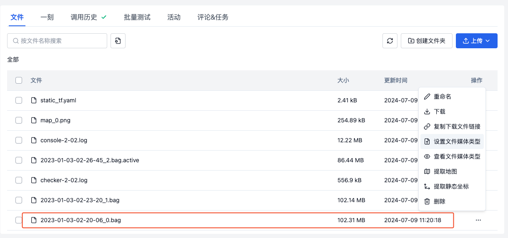

2. 点击记录右侧的【操作】按钮，在弹窗选择【设置文件媒体类型】
 
 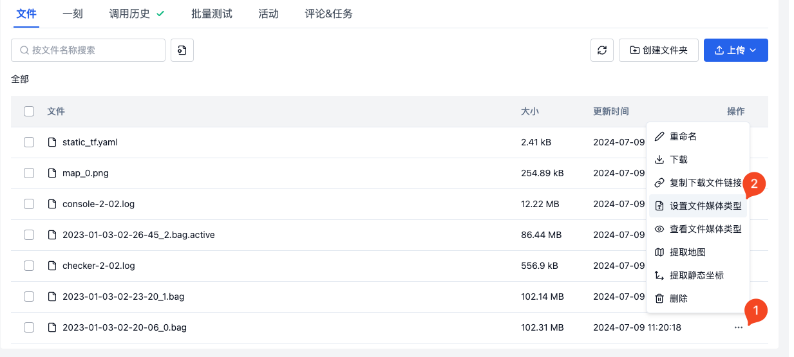

3. 将该 Bag 文件的媒体类型设置为「静态 Bag」后点击【确定】按钮完成修改

 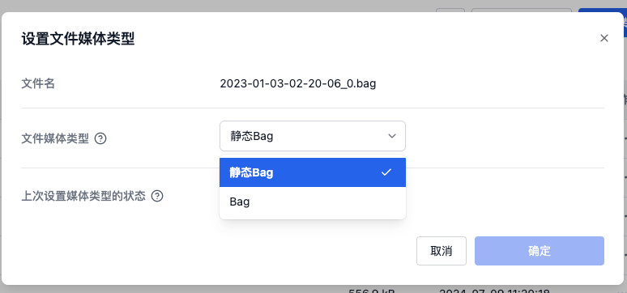

### 手动导入静态地图和坐标文件

#### 静态地图
1. 上传地图文件至记录中，点击记录右侧中的【更多】按钮

  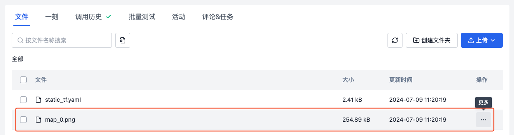
   
2. 点击记录文件右侧的【操作】按钮，在弹窗选择【设置文件媒体类型】

 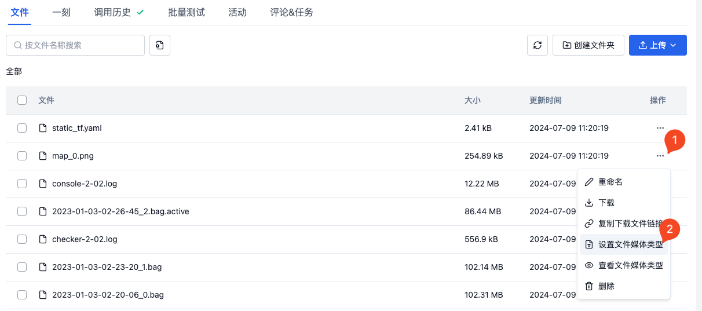

3. 将该文件的媒体类型设置为「地图」后点击【确定】按钮完成修改

 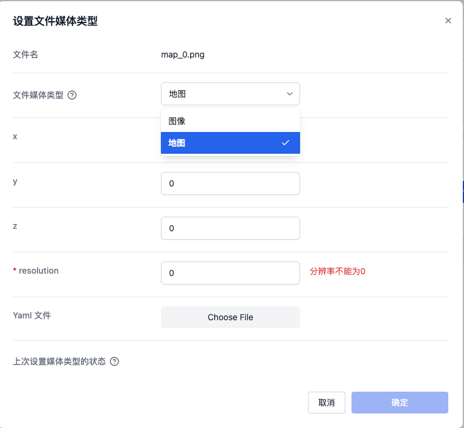

   
#### 静态坐标
1. 上传静态坐标文件至记录中
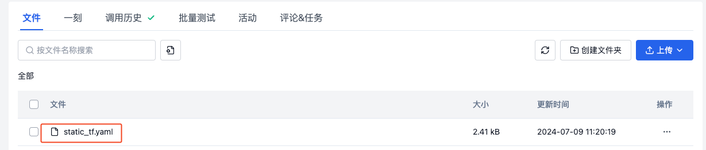

   
2. 点击记录文件右侧的【操作】按钮，在弹窗选择【设置文件媒体类型】
 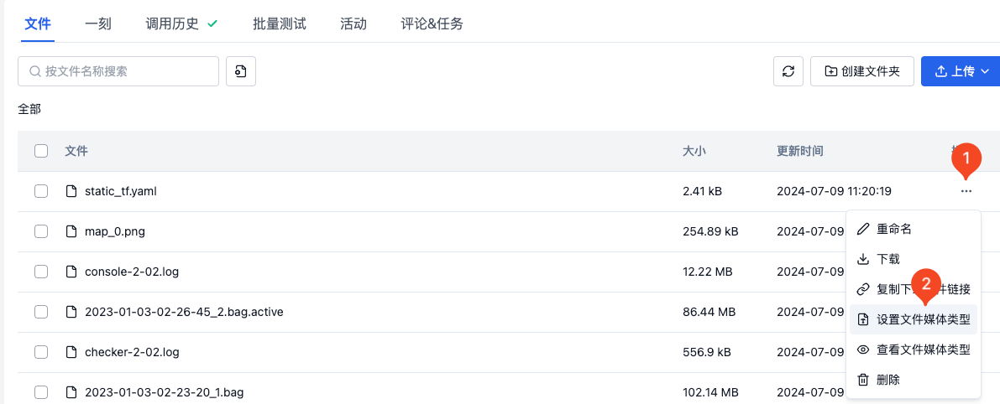

3.  将该文件的媒体类型设置为「静态 TF」后点击【确定】按钮完成修改
  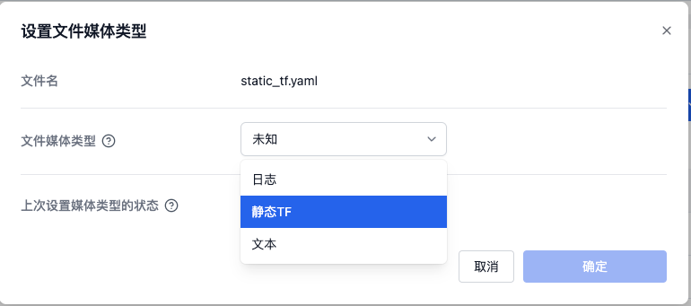
  
### 对记录文件提取地图和坐标
 
1. 在记录列表找到可以被提取的记录
 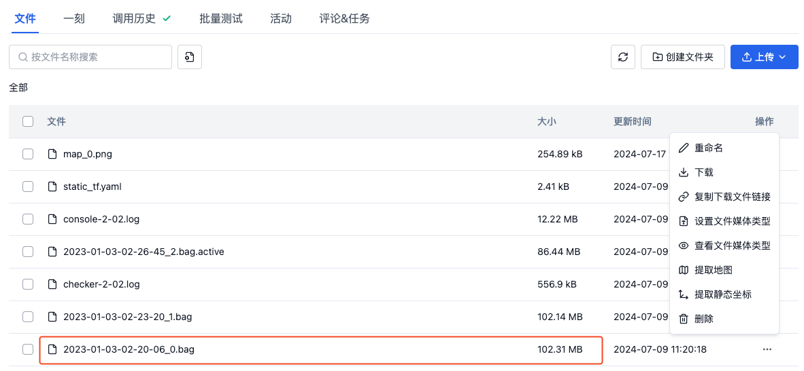

2. 点击记录文件右侧的【操作】按钮，在弹窗依次选择【提取地图】和【提取动态坐标】
 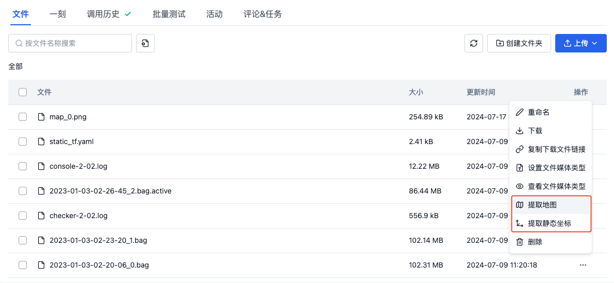

3. 依次选择后，点击【自动化】中的【调用历史】，查看动作调用的状态
 

4. 动作调用成功后，回到记录详情页的记录，查看生成的地图和坐标文件，完成提取。
 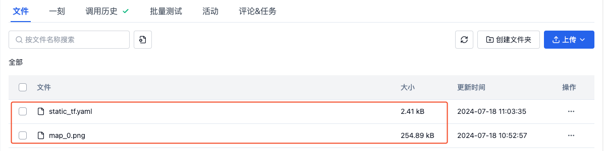

---

