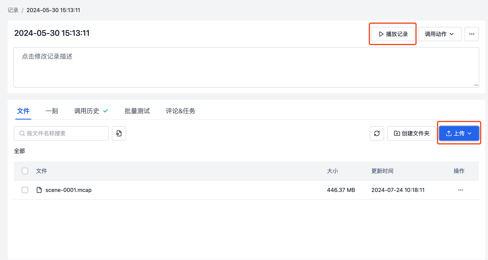
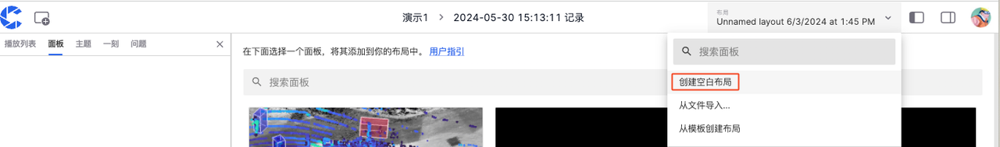
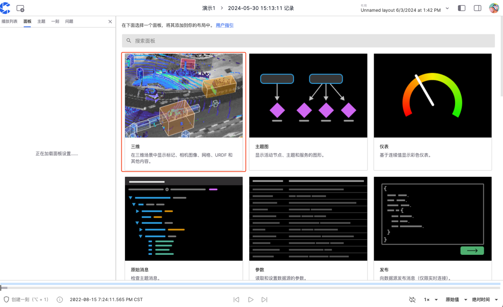
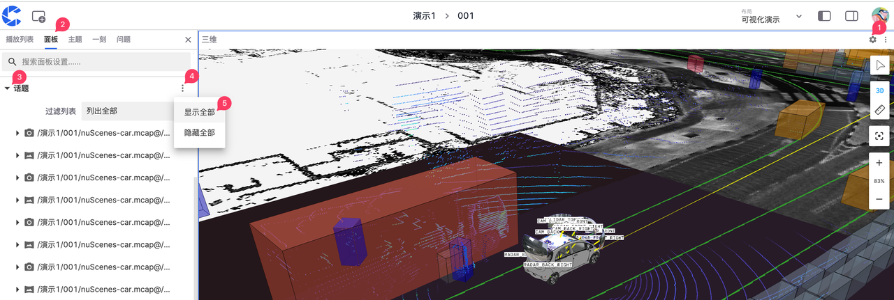
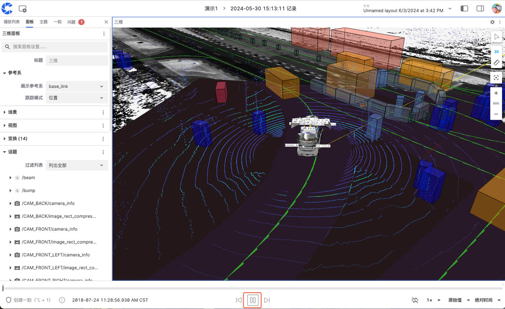

# 利用三维面板可视化你的数据

本章节将以 “scene-0001.mcap” 文件为例，展示使用刻行的三维面板可视化数据的步骤。

## 文件准备

1. 在项目中创建一条记录，创建步骤详情请见[创建记录](../4-record/1-create-record.md)。
2. [下载示例文件](https://download.coscene.cn/public-sample-data/scene-0001.mcap)，点击【上传】按钮将文件上传到记录中。上传文件详情请见[上传文件](../4-record/2-upload-files.md)。
3. 点击【播放记录】按钮，进入可视化页面。
    

## 添加三维面板

1. 在可视化页面的【布局菜单栏】中选择【创建空白布局】
    

2. 选择「三维」面板添加进你的布局中
    

## 展开话题

1. 点击「面板顶栏」中的【设置】按钮，进入「左侧边栏」中的面板属性页面。 
2. 点击【话题】右侧的【显示全部】按钮，展示所有话题。
    

## 播放
1.点击「时间轴」上的暂停按钮，播放数据
 

---

