# 三维面板

「三维面板」是指在 3D 场景中显示标记、实体、摄像机图像、网格、URDF 模型等内容的面板。该面板能够直观地展示和操作三维对象，提供了丰富的视觉和交互体验。本章节将介绍三维面板的各种属性值和工具栏，帮助用户更好使用三维面板可视化数据。

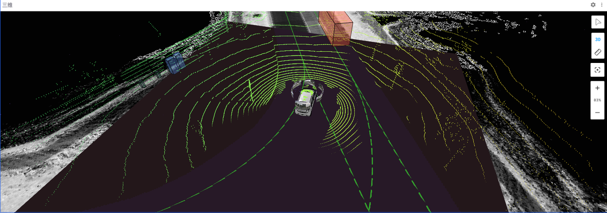

## 三维面板中的属性值

点击「三维面板」后在左侧边栏点击【面板】按钮，「三维面板」界面包括：参考系、场景、视图、变换、话题、自定义图层和发布属性。

### 参考系

「参考系」是在三维可视化中用来定义数据和对象的位置和方向的坐标系统。它为场景中的所有元素提供了一个共同的基准，使得各种数据能够在同一个空间中正确显示和交互。
 
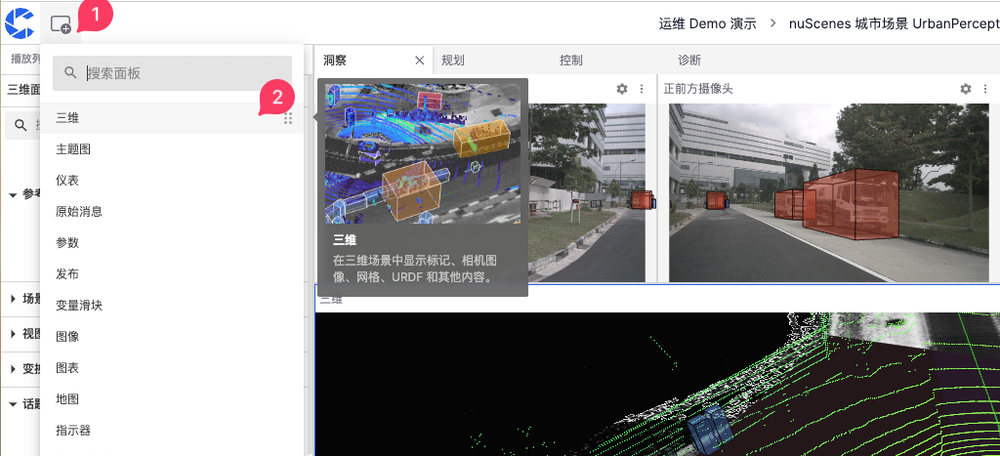

#### 展示参考系
- map：常用于全局坐标系，以地图为基准，适合展示全局定位数据。
- base_link：基于机器人或车辆中心点的参考系，通常位于车辆的几何中心，适用于展示相对于车辆本身的位置和运动数据。
- CAM：基于车辆不同位置的摄像头数据
- LIDAR：基于车辆不同位置的激光雷达数据

#### 跟踪模式

「跟踪模式」用于定义视图如何跟随选定的参考系，包括：姿态、位置和固定三种模式。

1. 姿态：视图会跟随参考系的位置和方向变化。如果参考系发生旋转或移动，视图也会相应地旋转和移动

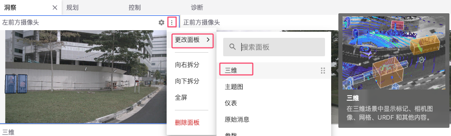

2. 位置：视图只会跟随参考系的位置变化，而不会跟随其方向变化
   
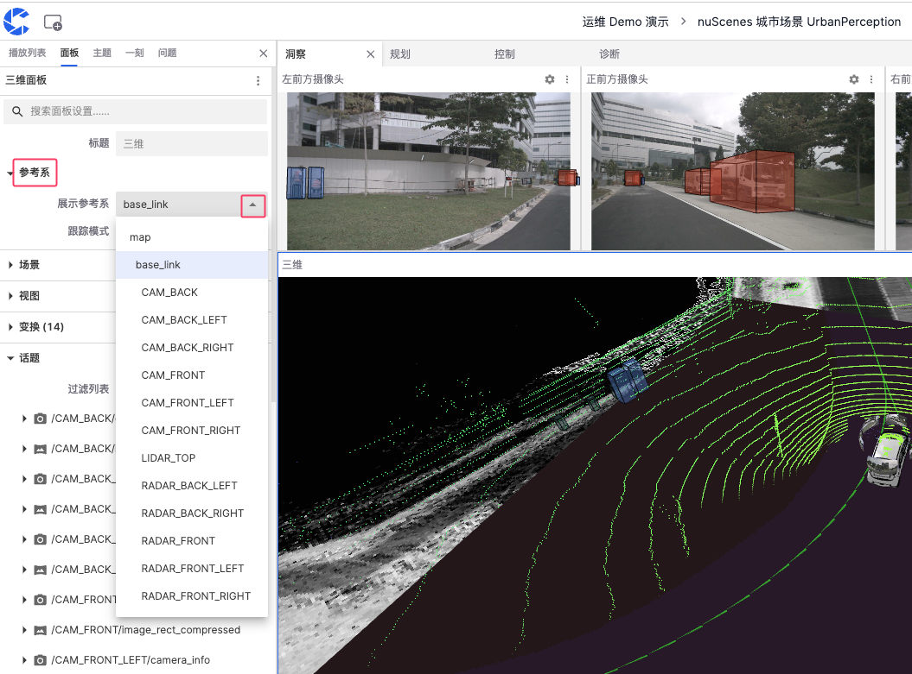

3. 固定：视图不会跟随参考系的任何变化，视角保持固定不变

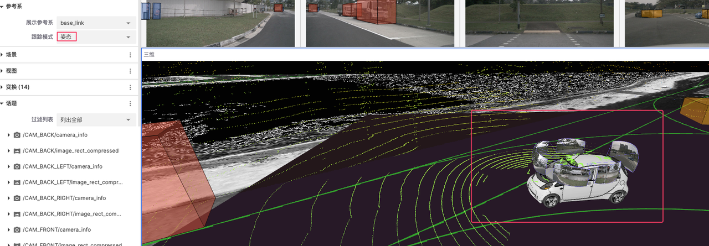
      
### 场景

「场景」是三维可视化界面中用于配置和展示数据的整体环境，通过调整渲染统计、背景、标签比例、忽略 COLLADA 和网格上轴属性来自定义和优化数据的显示效果。

#### 渲染统计

渲染统计用于显示或隐藏渲染统计信息，打开此选项可以看到当前渲染的帧率等性能指标。

 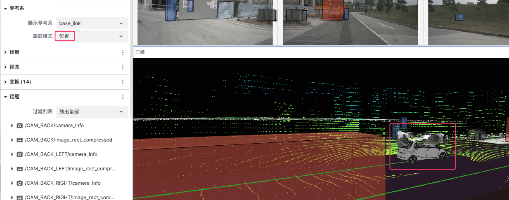

#### 背景

用于设置场景的背景颜色以提高对比数据的对比度和可视化效果
 
 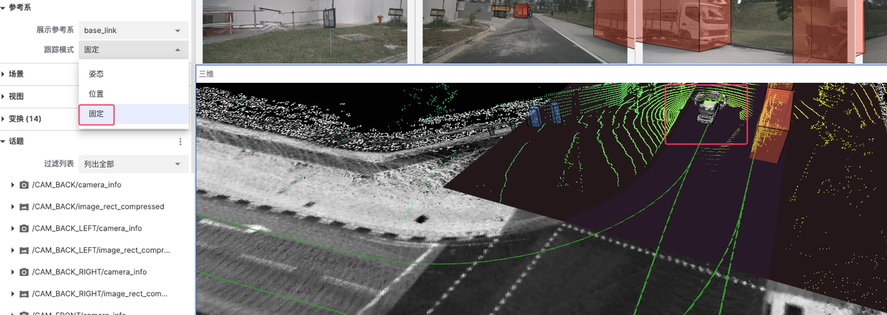

#### 标签比例

用于调整场景中显示的标签的比例大小

 

#### 忽略 COLLADA

用于选择是否忽略 COLLADA 模型的渲染，从而加快渲染速度或避免不必要的模型显示。

#### 网格上轴

用于设置场景中网格的上轴方向，这会影响整个场景的坐标系方向
 
 

### 视图

「视图」是三维可视化中用于设置和调整摄像机视角和显示参数的功能模块。通过调整视图中的不同属性，用户可以获得更好的数据展示效果。

 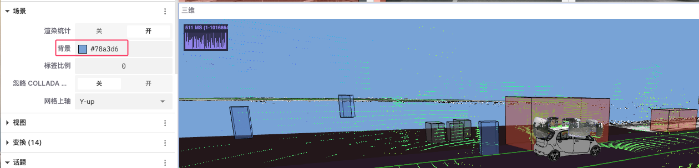

- 同步相机：使视图将与其他视图同步移动和旋转，便于多视图联动观察数据
- 距离：调整摄像机与目标物体的距离，达到拉近或拉远视角的效果
- 透视：打开透视后，近大远小的透视效果会被应用，使得三维场景更加真实
- 目标 X, Y, Z：用于调整摄像机的目标位置的坐标以改变其焦点位置
- 极角：摄像机绕目标点旋转的角度，用于调整摄像机围绕目标的上下旋转角度
- 方向角：摄像机围绕目标点的水平旋转角度，用于调整摄像机围绕目标的左右旋转角度
- Y 轴视野：用于调整摄像机的垂直视野角度
- 近面：摄像机的近剪裁面距离，用于调整摄像机视图中最近的可见距离
- 远面：摄像机的远剪裁面距离，用于调整摄像机视图中最远的可见距离
  
### 变换

「变换」是对物体在三维空间中的位置、旋转和缩放进行调整，使其在三维面板中能够正确显示和操作。
 
 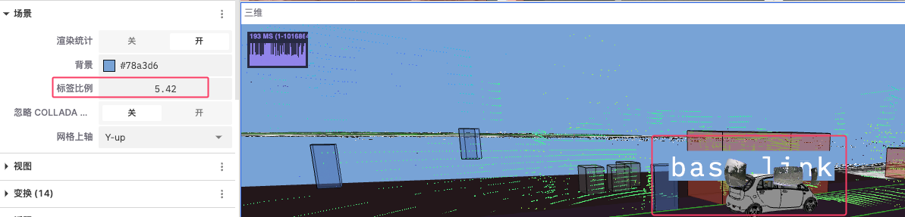

 #### 设置
- 可编辑：控制是否允许编辑变换设置。
- 标签：控制是否显示标签。
- 标签大小：调整标签的大小。
- 轴比例：调整轴的比例。
- 线宽：设置线条的宽度。
- 线颜色：选择线条的颜色。
- 启用预加载：控制是否启用预加载功能，以提升显示性能。
  
 #### 参考系
 - 可编辑：控制是否允许编辑变换设置。
- 标签：控制是否显示标签。
- 标签大小：调整标签的大小。
- 轴比例：调整轴的比例。
- 线宽：设置线条的宽度。
- 线颜色：选择线条的颜色。
- 启用预加载：控制是否启用预加载功能，以提升显示性能。

### 话题

「话题」指的是数据流的类别或频道。每个话题代表一种特定类型的数据源或传感器数据，例如摄像头图像、激光雷达数据、注释信息等。

 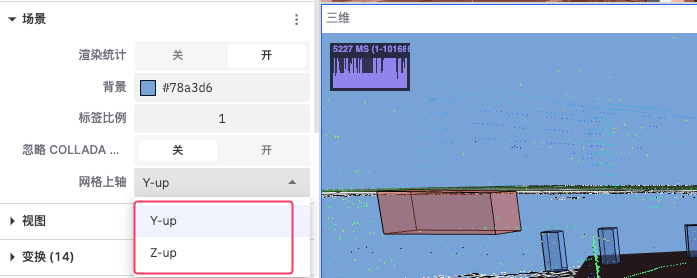

#### 过滤列表

「过滤列表」用于控制和管理用户界面上显示的话题，用户可以列出全部话题、列出可见话题及列出不可及话题。

#### 话题分类和含义

##### 摄像头数据

表示不同方位摄像头的校准信息和压缩图像数据，用户可以点开摄像头数据话题对其可视化参数进行调整。
- 距离：设定从摄像头到目标物体的距离
- 平面投射因子：调整图像在三维场景中的投射比例，影响图像如何贴合到场景中的平面上
- 线宽：调整图像或数据边界线条的粗细
- 颜色：调整图像或数据点的颜色
   
 

##### 激光雷达数据

表示不同方位的激光雷达数据，通常用点云表示，用户可以点开激光雷达数据话题对其可视化参数进行调整。

 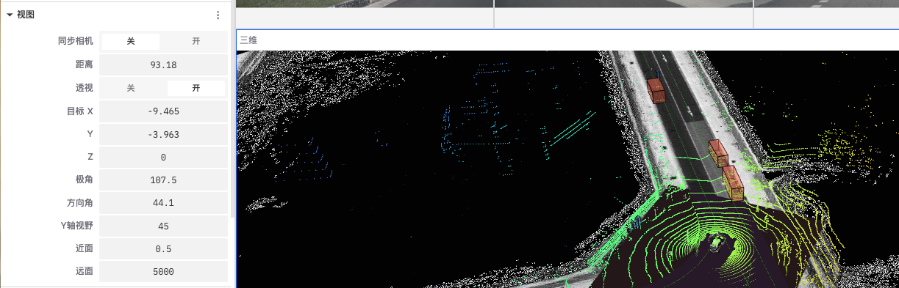

- 点大小：通过增加或减少点的大小，可以更清晰地显示点云数据的密度和结构。例如，较大的点可以更清晰地显示稀疏数据，而较小的点可以更好地展示细节
- 点形状：选择合适的点形状可以影响点云的视觉效果。例如，圆形点可能更适合模拟实际的物体形状，而方形点可以更好地显示边界
- 衰减时间：设置点云数据在显示器上消失之前的持续时间，帮助用户观察数据的变化动态
- 颜色模式：选择点云数据的着色模式，可以根据数据的不同属性为点云着色
- 颜色映射值：选择用于颜色映射的数据维度或属性，例如，选择 X 轴表示点云将根据其在 X 轴上的位置进行着色
- 色板：选择用于点云着色的色板，如 Turbo、Viridis 等
- 透明度：用于调整点云数据的透明度
- 最小值和最大值：设置用于颜色映射的最小值和最大值范围
- Stixel View：是基于像素的立体视觉技术，用于显示和分析点云数据的立体结构和深度信息
  
##### 地理和位置数据

表示地理位置、路径和环境信息的数据，这些数据通常包括可行驶区域、全局地图、语义地图等。
  
 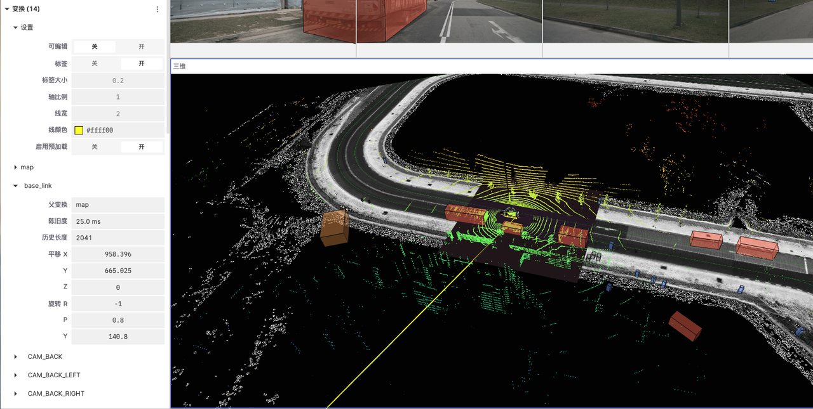
  
- 「drivable_area」和 「map」中的 Frame lock：锁定显示帧以减少抖动或不稳定情况，保证显示的一致性
- 「semantic_map」：
  - 显示轮廓：控制是否显示数据的轮廓以更清晰地看到数据边界
  - 选择变量：根据选择的变量来决定数据的显示方式
     
##### 标记和注释

用于在可视化场景中添加附加信息或标识。
 
 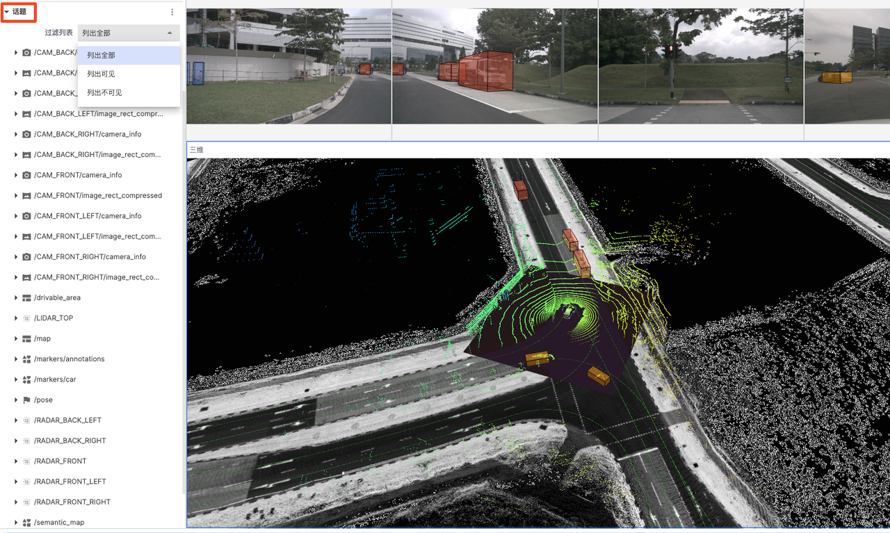

- Color：用于显示标记的显示颜色
- Show Outlines：选择是否显示周围轮廓，增强视觉效果
- Selection Variable：用于显示数据变量
   
## 三维面板中的工具

「三维面板」右侧有一排工具栏用于控制和操作三维视图，从上到下分别是【检查对象】、【切换2D / 3D 摄像头】、【测距仪】、【重新局中】和「画面缩放」。
  
 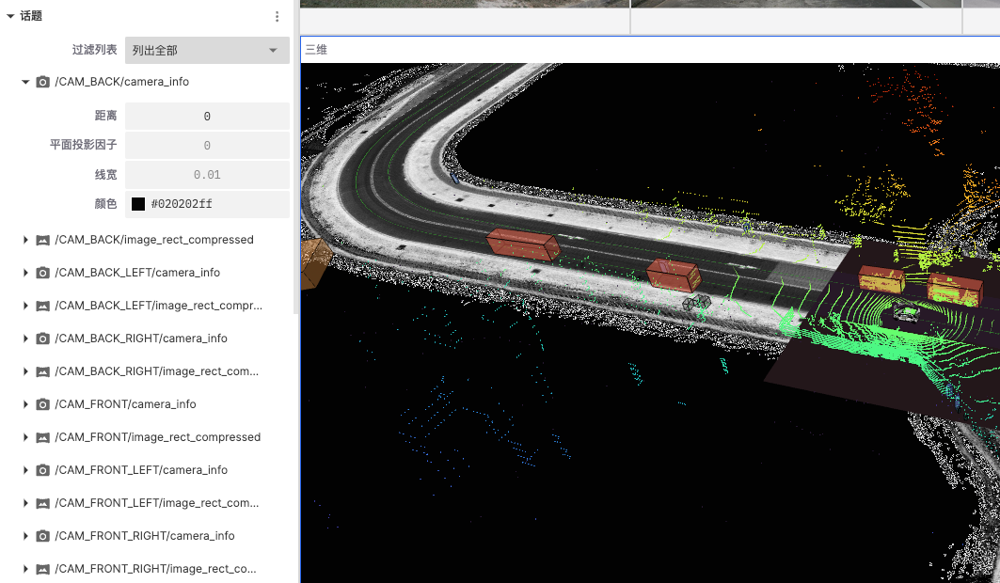

### 检查对象

用于显示三维场景中的物体信息
1. 点击工具栏中的 【检查对象】按钮
2. 点击需要查看的物体即会弹出该物体的主题等信息
3. 点击退出按钮
   
 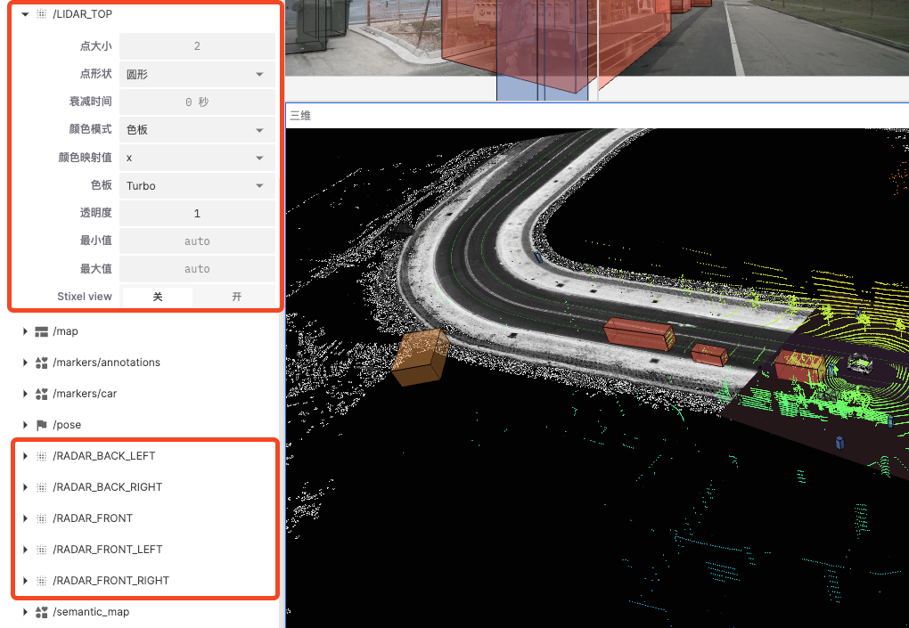

### 切换2D / 3D 摄像头

用于切换三维场景视图的显示模式
点击工具栏中【3D】按钮便可从2D 与 3D视角之间切换
  
 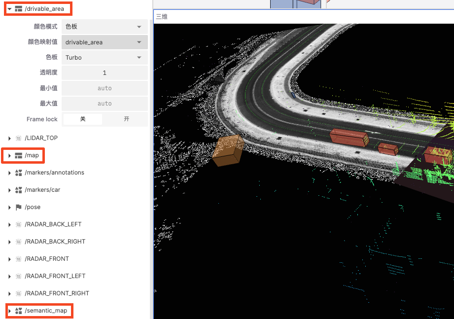
 
### 测距仪

用于测量三维场景中两点之间的距离
1. 点击工具栏中的【测距仪】
2. 在需测量的起点位置轻点一下确定起点
3. 在测量终点位置轻点确定终点
4. 再次点击【测距仪】便可清除当前测量的距离

 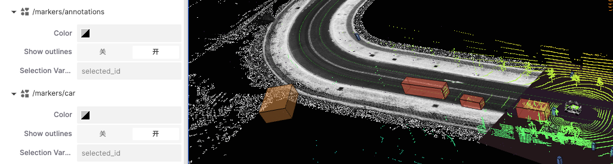

### 重新局中 & 画面缩放

用于控制三维视图的局中和缩放效果
1. 【重新局中】按钮会将画面大小调整至 100%
2. 点击 【+】和 【-】可以放大和缩小画面
3. 亦可通过键盘鼠标来放大和缩小画面

  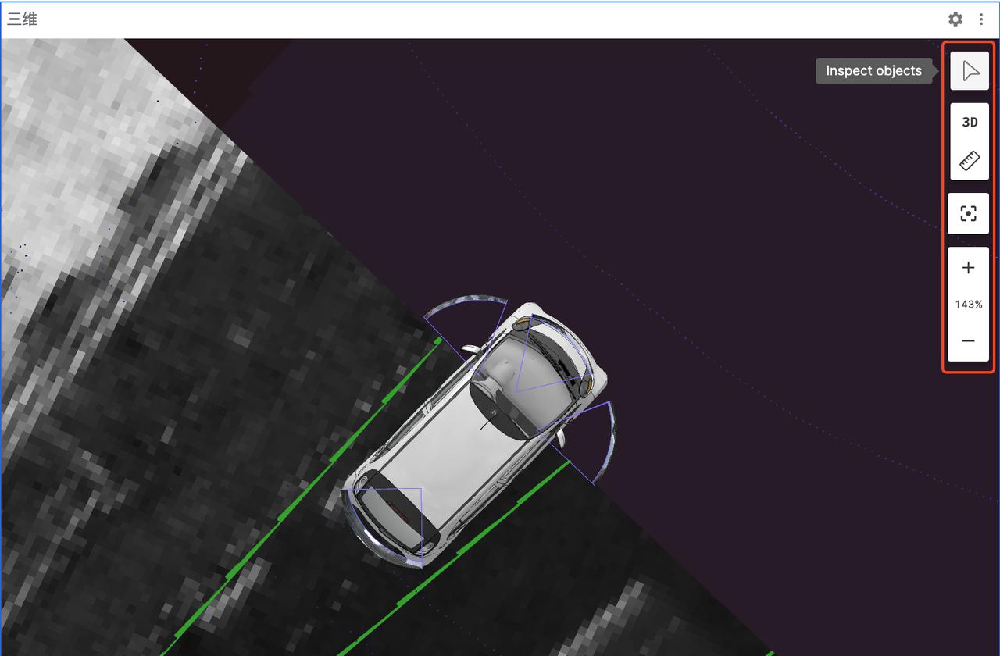

---

