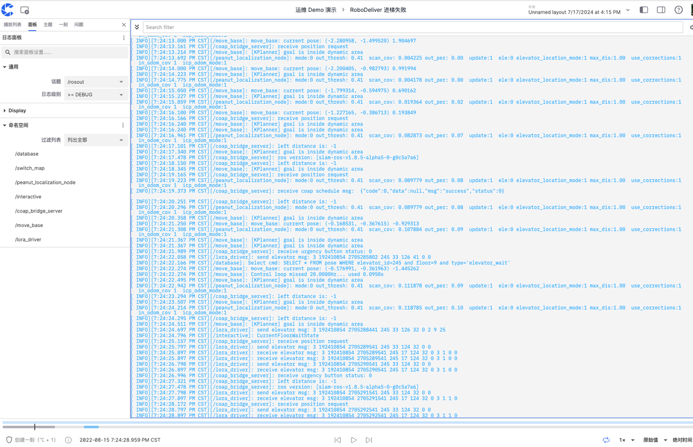
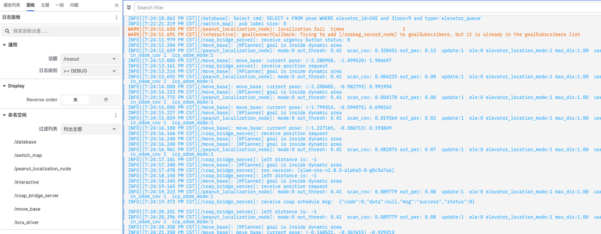
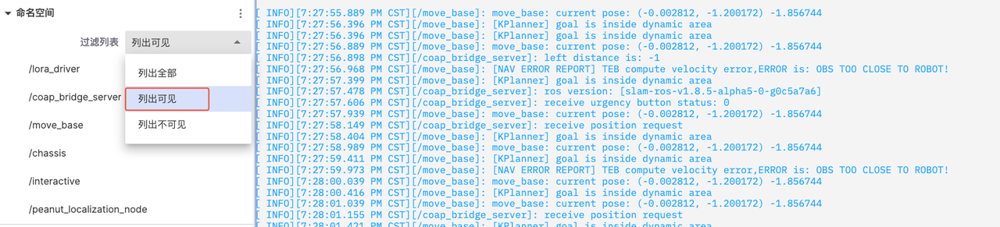
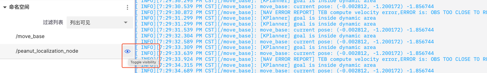
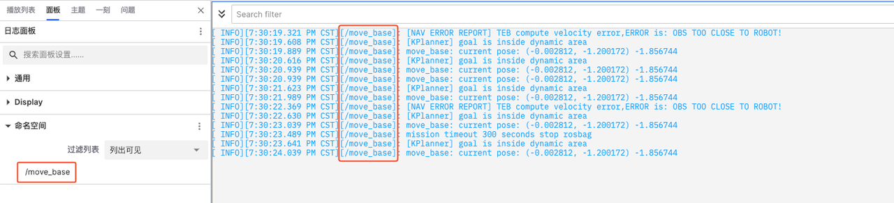

# 日志面板

「日志面板」是用于显示和管理机器生成的日志信息的面板，它帮助用户实时监控、过滤和分析系统运行时的各种事件和状态更新。
  
 

## 日志面板中的属性值
日志面板中含通用、Display 和命名空间三类属性值可以设置。
 
 

### 通用

- 「话题」：确定日志面板中展示的具体日志来源。例如，选择 /rosout 来显示 ROS 系统中的日志信息
- 「日志级别」：用于过滤日志信息，只显示指定级别及以上的日志。例如，选择 >= DEBUG 将显示 DEBUG 级别及以上的日志，包括 INFO、WARN、ERROR 等。

### Display

- 「Reverse order」：控制日志显示顺序，关闭时，日志按时间顺序显示，最旧日志在最上方

### 命名空间

- 「过滤列表」：根据不同的命名空间，只显示与该命名空间相关的日志信息，便于查找和分析特定模块或功能的日志
例如，若只想在面板中显示 /move-base 的日志

1. 在「过滤列表」中选择列出可见

 

2. 隐藏其他日志模块
    
 

4. 查看过滤后的日志
   
 

---
