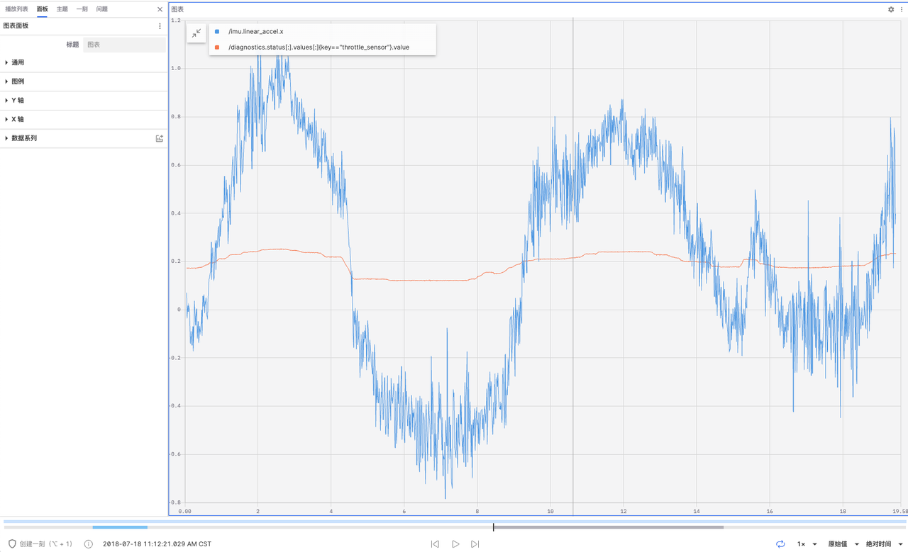
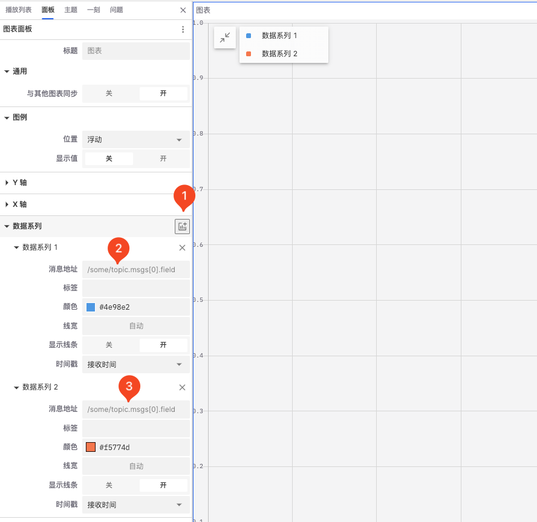
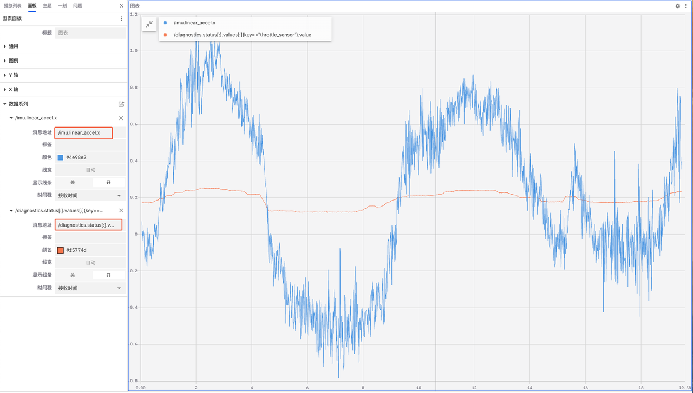
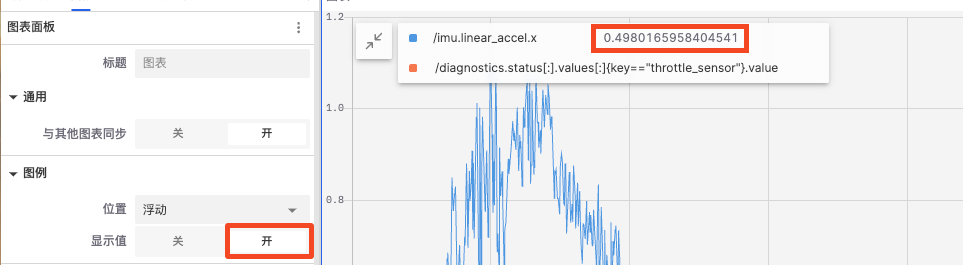
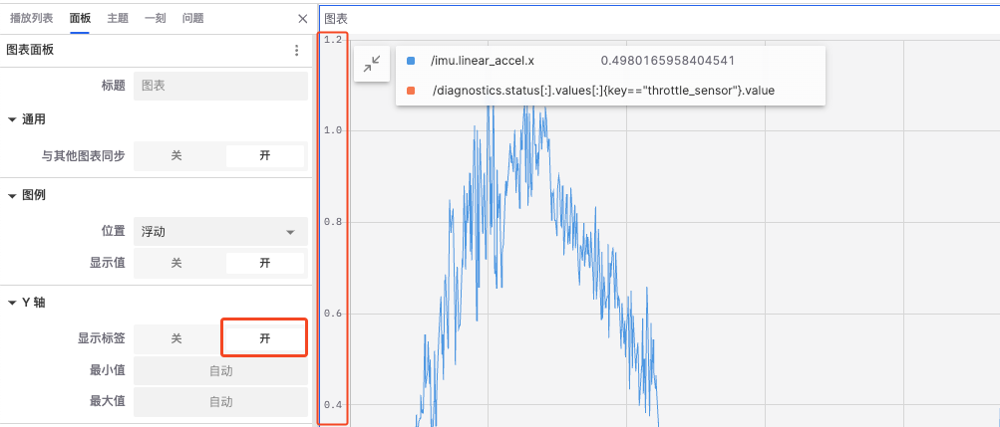
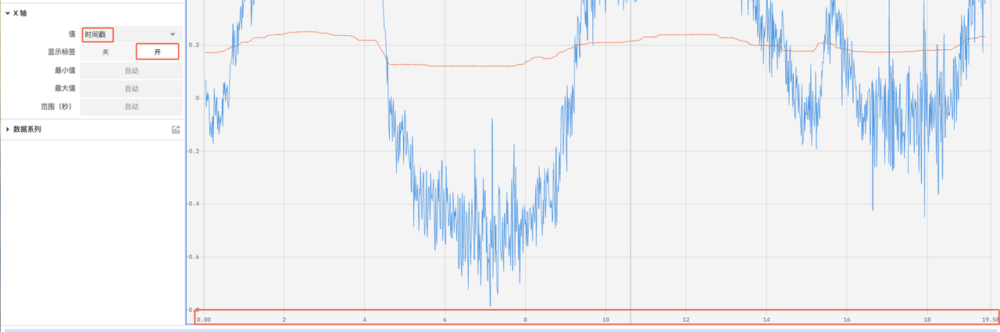

# 图表面板

「图表面板」用于绘制和展示数据随时间或其他变量变化的可视化工具。它允许用户配置多个数据系列，并通过图表的形式直观地展示这些数据的变化趋势。
 

## 图表面板中的属性值

图表面板中含数据系列、通用、图例、Y轴和 X轴 四类属性值可以设置。

### 数据系列

1. 添加新的数据系列
   

2. 输入消息地址

3. 配置数据系列
- 标签：设置数据系列的标签文本
- 颜色：设置数据系列的颜色
- 线宽：设置数据系列的线条宽度
- 显示线条：启用或禁用数据系列的标签显示
- 时间戳：时间戳用于标记数据点的时间位置，确保数据按时间顺序在图表中正确绘制
  - 接收时间：使用接收时间作为时间戳，可以显示数据到达系统的实际时间
  - 头时间戳：使用头时间戳可以显示数据在源设备上的实际发生时间

### 通用

- 与其他图表同步：在多图表视图中，启用此选项可以使多个图表同步缩放和移动，便于对比和分析数据

### 图例
 

- 位置：设置图例的位置，可以选择浮动、左、上和隐藏
- 显示值：如图示，启用后可以在图例中直接看到数据点的数值

### Y轴
 

 
- 显示标签：控制是否在 Y 轴显示刻度标签
- 最小值和最小值：设置 Y 轴的起始值和结束值
   
### X轴
 

- 值：选择 X 轴显示的值，可以从时间戳、索引、地址（当前）和地址（累计）中选择
- 显示标签：控制是否在 X 轴显示刻度标签
- 最大值和最小值：设置 X 轴的起始值和结束值
- 范围（秒）：控制 X 轴显示的时间段长度

---

