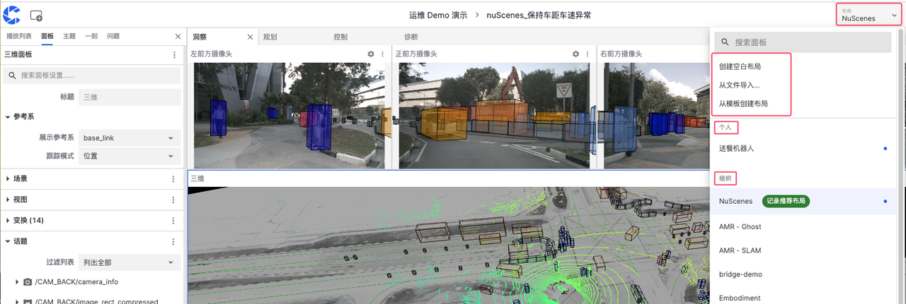
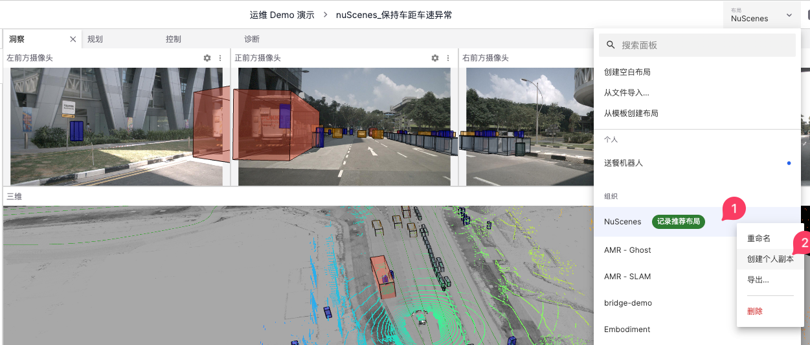
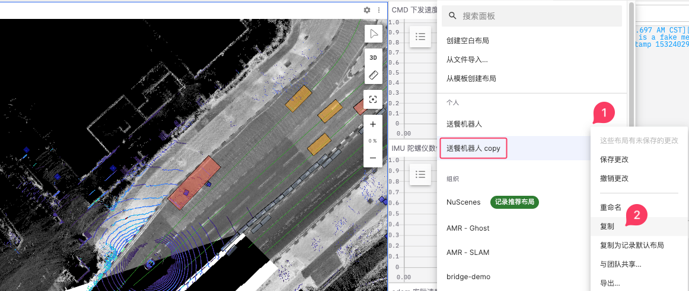
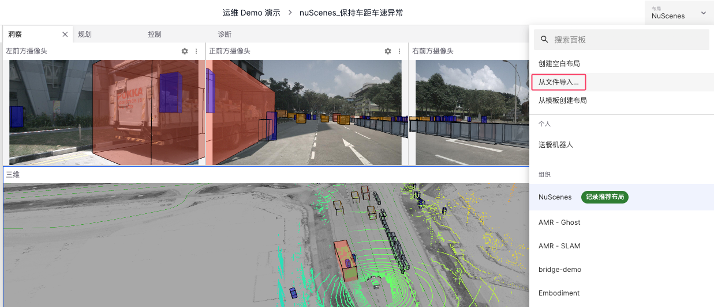
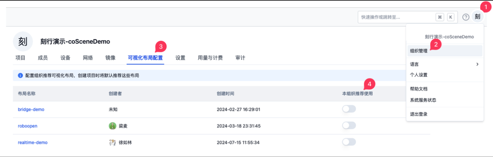
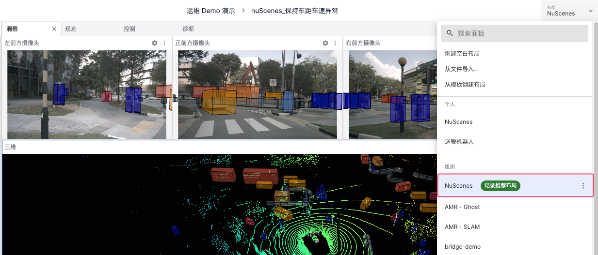
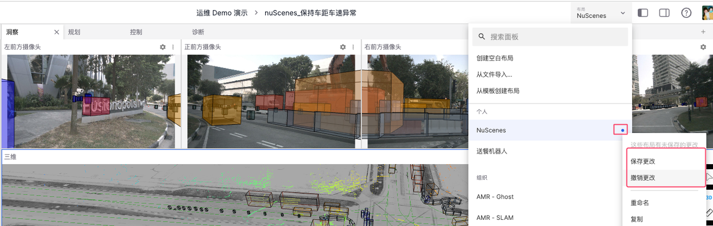
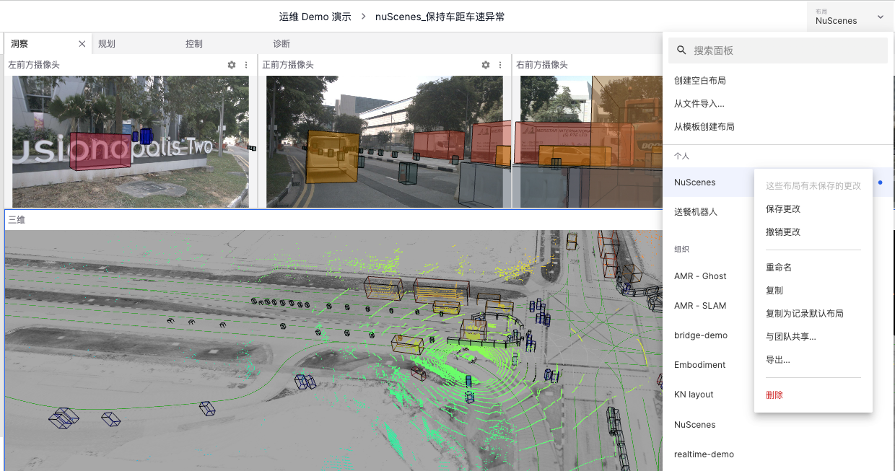

# 布局

「布局」是可视化界面中安排元素的方式，可与项目和组织成员共享。

## 创建布局

点击【布局菜单栏】，可通过以下方式创建布局：【创建空白布局】、【复制现有布局】或【从文件导入布局】。

### 创建空白布局

在布局菜单栏点击【创建空白布局】按钮进入以下页面，选择一个需要的面板之后进入。
 

### 复制布局创建

1. 对于组织中已有的心仪布局，可右键点击并选择弹出菜单栏中的【创建个人副本】，将该布局添加到个人布局中。
 
   

2. 同样地，右键点击个人布局中的复制选项，可创建该布局的副本。
  
   

### 导入布局

通过布局菜单栏中的【从文件导入】可将本地的布局文件导入到个人的布局中
  
   

## 推荐布局

「推荐布局」是一种预先设定并建议使用的布局类型，它包括「组织推荐布局」和「项目推荐布局」。

### 组织推荐

「组织推荐布局」是由组织管理员设置并推荐使用的布局。可进入头像菜单栏的【组织管理】中的【可视化布局配置】，选择本组织推荐使用的布局。
   
   

### 项目推荐

「项目推荐布局」是由项目管理员设置并推荐使用的布局。可进入【项目设置】中的【可视化布局配置】，选择本项目推荐使用的布局。

   

### 记录推荐

「记录推荐布局」是个人对单条记录生效的推荐布局。在可视化页面中的【布局菜单栏】，右键点击需设置的布局，点击「复制为记录默认布局」。

   
   
如图示，布局 “NuScenes” 就被成功地设置成为了记录推荐布局，之后进入该记录的可视化界面将默认使用该布局。
 
   

### 布局优先级

- 对于同时设置了三种推荐布局的记录而言，「记录推荐布局」的优先级大于「项目推荐布局」大于「组织推荐布局」。
- 对于布局的任意编辑和改动将可通过保存或撤销更改的方式改动。
  
## 管理布局

管理布局是对现有布局进行编辑和修改的过程。
 
   
   
### 重命名布局

修改布局的名称以便更好地识别和分类。

### 导出布局

将布局保存为文件，以便共享或在其他环境中使用。

### 分享布局

将布局与团队共享，使组织成员能够使用和更改分享的布局副本

### 删除布局

移除不再需要的布局，保持布局列表的整洁和高效

---
