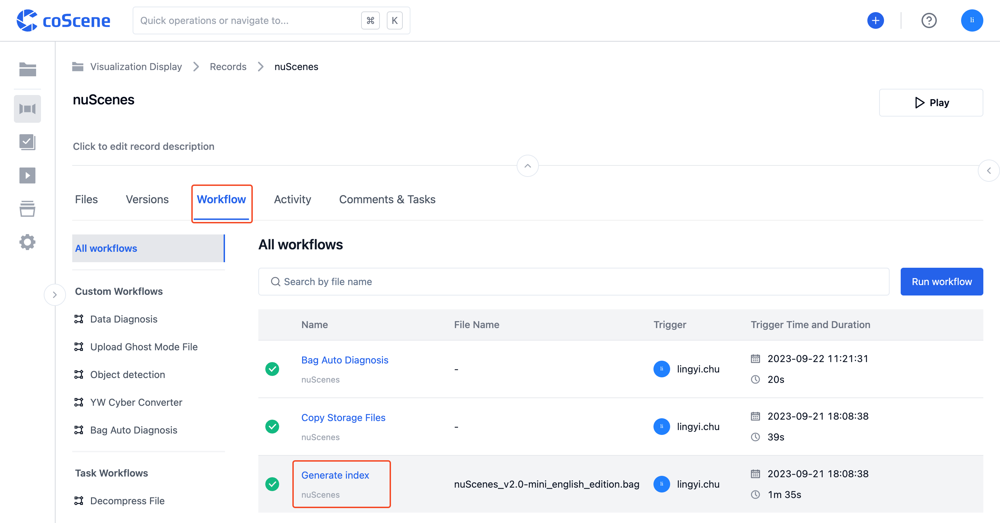

# 触发一个工作流

> 谁可以使用这个功能 
> 组织管理员、项目管理员和项目成员可触发工作流

## 自动触发的工作流

在项目的记录中，上传一个 Bag 文件。

该文件将自动触发「生成 ROS bag 索引」工作流。点击【工作流】，查看工作流的运行状态。

## 手动触发一个工作流

**在记录详情页触发工作流**

在项目的记录中，上传一个 Bag 文件。

点击【工作流】，进入工作流分页后，再点击【运行工作流】按钮。

跳出「运行工作流」弹框。

在「运行工作流」弹框中，选择工作流模板。

在记录详情页，默认输入记录为当前记录，不可变更。点击【运行】按钮后，触发工作流。

