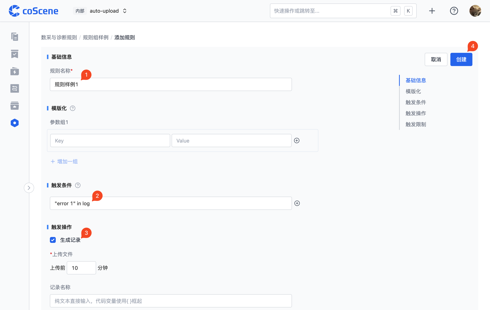
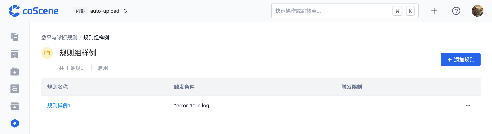
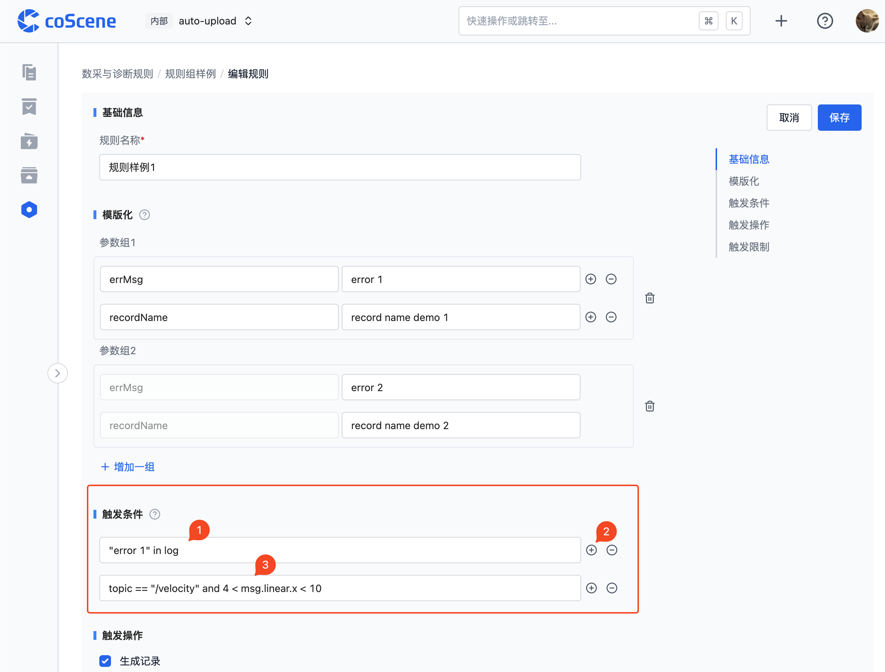
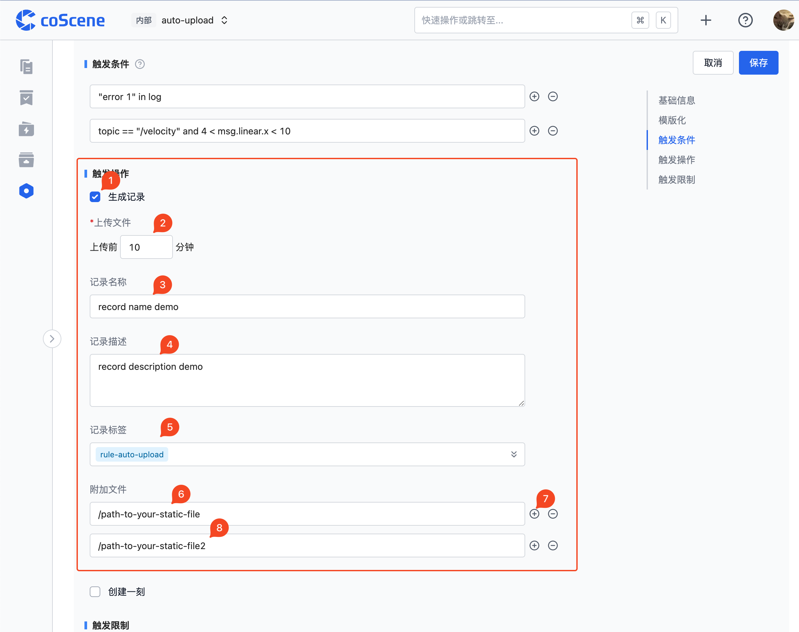
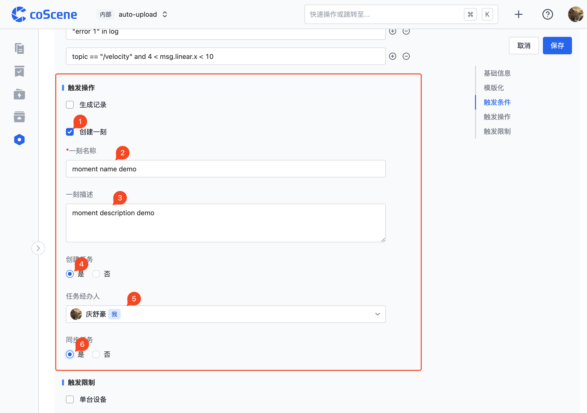

# 添加规则

> 每个项目规则单独配置，仅项目管理员可编辑

数采与诊断规则定义触发数据采集与诊断的条件，以及触发后的操作。例如：当设备日志中发生某个事件时，自动采集指定目录下的数据，存储为一条记录，并在该时间点创建一刻。规则的基本结构与标准格式参见后续章节。

<br />

## 使用前提

规则仅对特定格式的数据生效，即：包含消息、时间戳、主题、消息类型的流数据。

其中，支持的日志文本文件中的时间戳格式如下（[参考文档](https://www.w3schools.com/python/python_datetime.asp)）：

<table>
    <tr>
        <th>时间戳类型</th><th>时间戳格式</th><th>示例</th>
    </tr>
    <tr>
        <td rowspan="4">常规<p><i>*文件中的时间戳</i></p></td><td>%m%d %H:%M:%S.%f</td><td>0212 12:12:12.548513</td>
    </tr>
    <tr>
        <td>%b %d %H:%M:%S</td><td>Dec 12 12:12:12</td>
    </tr>
    <tr>
        <td>%Y-%m-%d %H:%M:%S.%f</td><td>2023-02-12 12:12:12.548513</td>
    </tr>
    <tr>
        <td>%H:%M:%S.%f</td><td>12:12:12.548513</td>
    </tr>
    <tr>
        <td rowspan="3">特殊<p><i>*文件名/文件第一行中的时间戳</i></p><p><i>（用于文件中时间戳未全部包含年、月、日、时、分、秒的情况）</i></p></td><td>%Y-%m-%d %H:%M:%S</td><td>2023-02-12 12:12:12</td>
    </tr>
    <tr>
        <td>%Y/%m/%d %H:%M:%S</td><td>2023/02/12 12:12:12</td>
    </tr>
    <tr>
        <td>%Y%m%d%H</td><td>2023021212</td>
    </tr>
</table>

若有其他格式的时间戳，请联系刻行。

<br />

## 规则组

规则组是规则的集合，用于对规则进行分类管理。规则组的创建与编辑操作如下：

- 在项目中，进入「管理项目-数采与诊断规则」页面，点击【添加规则组】。


- 创建规则组（或点击进入已创建的规则组页面后），点击规则组名称即可编辑。点击【添加规则】可添加规则。

  详细添加规则的操作参见后续章节 [规则](#规则)。


## 规则

规则是规则组中的单个规则，用于定义触发数据采集与诊断的条件，以及触发后的操作。基本规则的创建与编辑操作如下：

(详细操作参见后续章节 [基础信息](#基础信息), [模版化](#模版化), [触发条件](#触发条件), [触发操作](#触发操作), [触发限制](#触发限制) ）

- 进入已创建的规则组页面后（或创建规则组后），点击【添加规则】。


- 更改规则名称。
- 编辑规则触发条件（可复制 `"error 1" in log` ）。
- 保持触发操作部分生成记录的勾选框为勾选状态。
- 点击【创建】。


- 保存成功后，即可查看配置完成的规则。


<br />

### 基础信息

在该部分可编辑规则的基础信息，目前仅可编辑规则的名称。


<br />

### 模版化

模版化是指规则的模版化操作，即使用参数组生成多条规则，一般用于想要创建多个高度相似但部分信息不同的规则的场景。
在这种复杂场景下，可以将信息不同的部分参数化，进而使用模版化操作来生成多条规则，而不需要手动创建多条规则。
（该部分为选填，若无模版化需求，可跳过该部分）

模版化参数组的基础编辑操作如下：

- 点击右侧【+】按钮增加一组参数组。
- 编辑参数组的 Key-Value 键值对内容。（下图例：第一组 `errorMsg` - `error 1`, 第二组 `recordName` - `record name demo 1`）
- 点击下方【+ 增加一组】按钮增加一组参数组。
- 编辑新增的参数组的 Value 内容。（下图例：第一个 Value `error 2`, 第二个 Value `record name demo 2`）

需要注意：因为需要确保不同参数组的 Key 值是一样的，所以只有第一个参数组的 Key 值是可以编辑（且必填）的，其余参数组的 Key 值都预填充了第一个参数组的 Key 值且不可编辑。
也是因为相同的原因，只有第一个参数组可以增加删除 Key-Value 对。


<br />

### 触发条件

触发条件被满足时会触发规则的触发操作。这里可以添加多个触发条件，只要有一个条件满足即可触发。

添加触发条件的基础编辑操作如下：
- 直接编辑触发条件。（下图例：`"error 1" in log`）
- 点击条件右侧的 `+` 按钮增加一个条件。
- 编辑新增触发条件 （下图例：`topic == "/velocity" and 4 < msg.linear.x < 10`）



\*更多规则条件样式参见后续章节 [常用规则条件示例](#常用规则条件示例)，以及 [规则引擎](./5-rule-engine.md)。

<br />

### 触发操作

触发操作是指规则条件满足后触发后的操作，目前支持的操作有：生成记录、创建一刻。

生成记录的操作是指在配置了数据采集与诊断规则的设备中，当规则触发条件满足时，会在记录中生成一条记录，记录中包含了触发条件满足时的数据。

创建一刻的操作是指在配置了数据采集与诊断规则的项目中上传数据，当规则触发条件满足时，会在数据所在记录中创建包含触发信息的一刻，并且若勾选，创建任务与同步任务。

触发操作至少需要勾选一个，且可以同时勾选多个。

<br />

添加生成记录触发操作的基础编辑操作如下：
- 勾选 【生成记录】
- 编辑生成记录的所包含数据时间范围（下图例：在触发条件满足时，生成记录并上传`10`分钟以内的相关文件）
- 编辑记录名称（下图例：`record name demo`）
- 编辑记录描述（下图例：`record description demo`）
- 编辑记录标签（下图例：`rule-auto-upload`，注：标签可多选）
- 编辑附加文件，即在生成记录时需要同时上传的静态文件（下图例：`/path-to-your-static-file`）
- 点击右侧 【+】 按钮增加一个附加文件
- 编辑新增的附加文件路径（下图例：`/path-to-your-static-file2`）



添加创建一刻触发操作并创建任务与同步任务的基础编辑操作如下：
- 勾选 【创建一刻】
- 编辑一刻名称（下图例：`moment name demo`）
- 编辑一刻描述（下图例：`moment description demo`）
- 选择创建任务为【是】
- 选择任务经办人（下图例：下拉框选择`我`）
- 选择同步任务为【是】（同步任务参见[任务同步到-jira](../10-integration/1-jira-integration.md#任务同步到-jira)）




<br />

### 触发限制

触发限制是指即对规则的触发生成记录操作的频率进行限制，例如：规则在 1 天内最多触发生成记录 10 次。

若不作限制，则可跳过该部分（该情况下，当规则触发操作设置勾选了生成记录，只要触发条件满足，都会生成记录并上传）。

限制分为单台设备限制和所有设备限制两种，若两种限制都设置了，则两种限制都满足时规则才会触发。

添加包含两种触发限制的基础编辑操作如下：
- 勾选 【单台设备】
- 编辑单台设备的限制条件 （下图例：1 天内最多触发 10 次）
- 勾选 【所有设备】
- 编辑所有设备的限制条件 （下图例：1 天内最多触发 30 次）


<br />

## 常用规则条件示例

> 以下展示了部分典型的规则触发条件

```yaml
# 触发了某个错误码
'Error code 123 happened' in log

# 检查 x 方向的速度是否在 4~10 之间
topic == '/velocity' and 4 < msg.linear.x < 10

# 分析日志中的值并检查它是否在 4~10 之间
4 < regex(log, 'X velocity is (\\d+)').group(1) < 10

# 机器人返回充电桩 30 秒后没有开始充电
timeout(
  'Returned to base' in log,
  'charging state: CHARGING' in log,
  duration=30
)

# 命令没有在 10 秒内完成
timeout(
  set_value('cmd_id', regex(log, 'Sending command id (\\d+)').group(1)),
  regex(log, 'Command (\\d+) finished').group(1) == get_value('cmd_id'),
  duration=10
)

# 如果温度在 60 秒内上升 5
# 假设消息中存在字段 `value`
topic == '/temp' and sequential(
  set_value('start_temp', msg.value),
  msg.value - get_value('start_temp') > 5,
  duration=60
)

# 检查初始化在 20 秒内完成
timeout(
  'Initialization start' in log,
  # The three modules can finish init in any order
  any_order(
    'GPS started' in log,
    'Localization started' in log,
    'Motor online' in log),
  'Initialization finished' in log,
  duration=20
)

# 检测到一个 topic 超过 20 秒未收到消息，
# 例如，定位模块挂了
timeout(
  topic == '/localization',
  topic == '/localization',
  duration=20
)

# 温度高于 40 的时间超过 60 秒
sustained(
  topic == '/temp',
  msg.value > 40,
  duration=60
)

# chassis 环路频繁超时：60 秒内超时次数大于 10 次
repeated(
  timeout(
    'Send chassis command' in log,
    'Chassis received' in log,
    duration=1
  ),
  times=10,
  duration=60
)

# 触发错误，但如果发生以下情况，则忽略它们
# 错误发生的时间间隔在 10 秒之内
debounce(
  'Error 123' in log,
  duration=10
)
```
