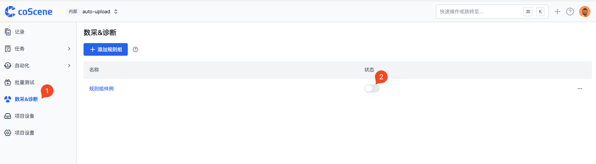
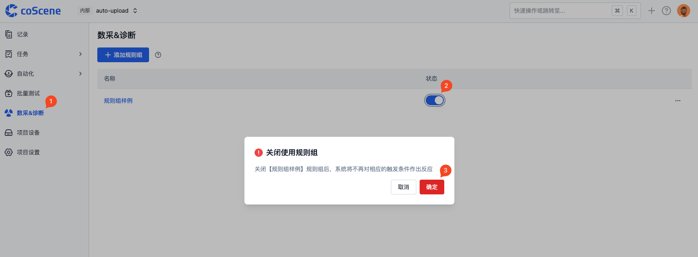
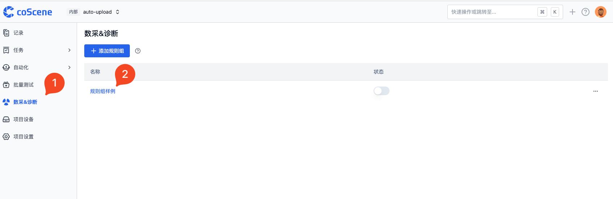
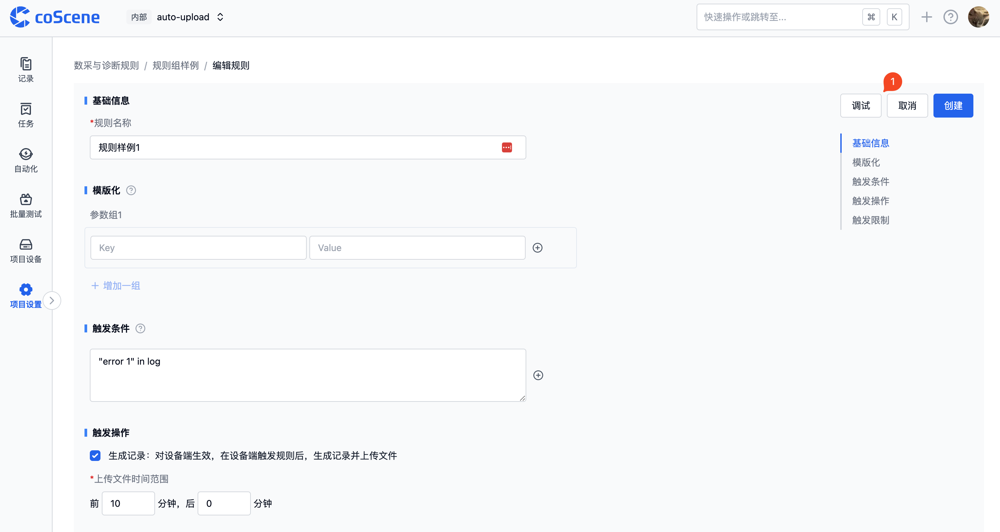
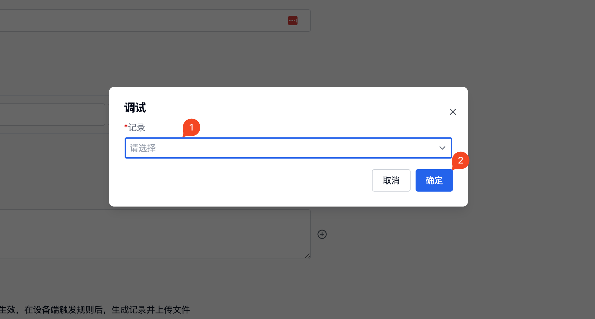
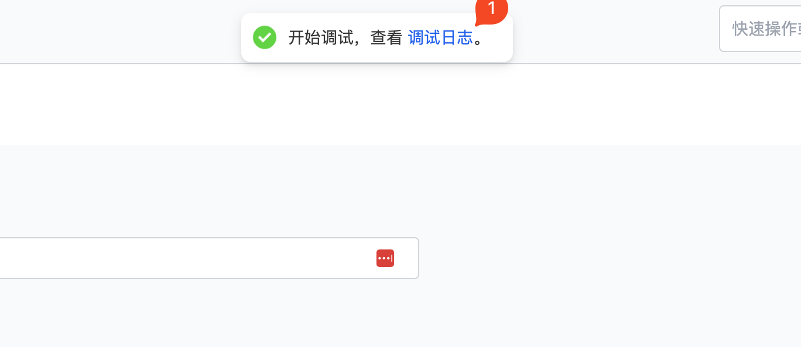
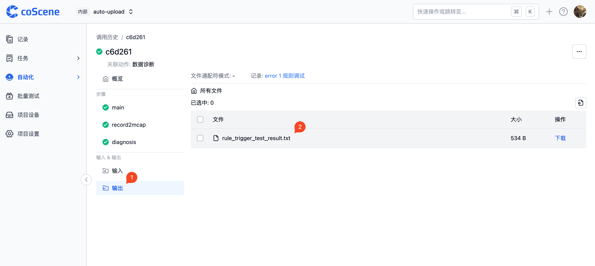
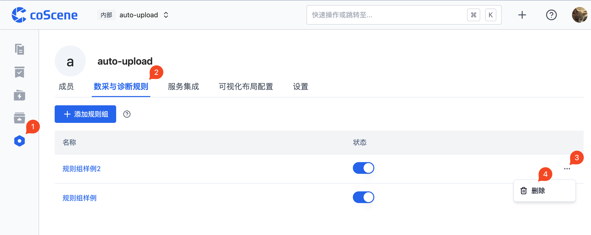
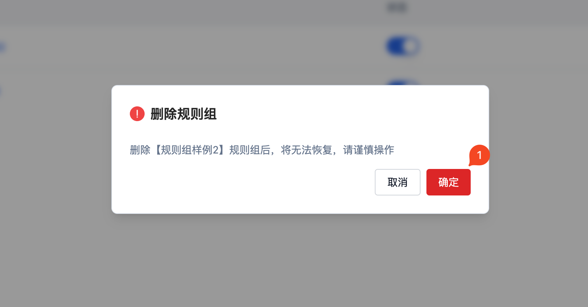

# 管理规则组

下面将介绍如何管理规则组。

## 启用

在使用规则组之前，需要先启用规则组。启用规则组后，规则组中的规则才会生效。
若在特定场景下暂时不需要使用规则组中的规则，也可以禁用规则组。

启用的规则组会在规则组状态列表中显示为蓝色，禁用的规则组状态会置灰。

下面是启用规则组的操作步骤：

- 进入「数采&诊断规则」分页，选择需要启用的规则组，点击对应的【状态】按钮。

下面是禁用规则组的操作步骤：

- 进入「数采&诊断规则」分页，选择需要禁用的规则组，点击对应的【状态】按钮。
- 弹窗选择【确定】。

 

## 编辑

进入编辑规则组页面的操作如下图，具体编辑规则组规则的操作请参见[规则](./3-add-rule.md#规则)。

- 进入「数采&诊断规则」页面，选择需要编辑的规则组，点击规则组名称（下图例：`规则组样例`）。

 

## 调试

进入想要测试的规则页面，点击【调试】按钮。

选择调试规则所需要的记录，点击【确定】。

点击【调试日志】查看调试的动作结果。

进入相应的动作调用历史界面，点击【输出】，点击【rule_trigger_test_result.txt】查看规则应用到记录后的触发结果。

 

## 删除

若规则组中的规则不再需要使用，可以删除规则组。

下面是删除规则组的操作步骤：

- 进入「管理项目-数采与诊断规则」页面，选择需要删除的规则组，点击对应右侧的 `...` 按钮，选择【删除】。
- 弹窗选择【确定】。

