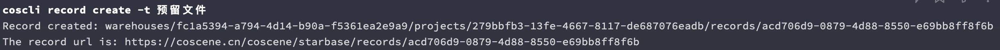
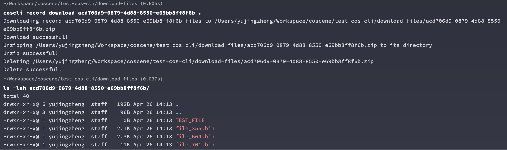
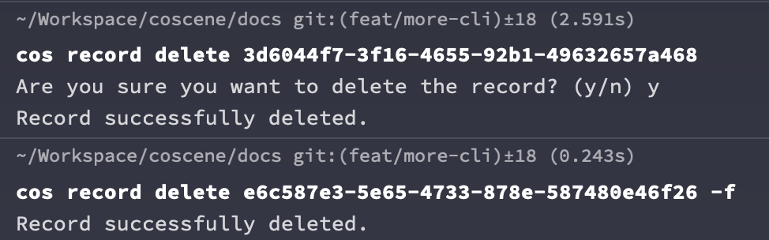
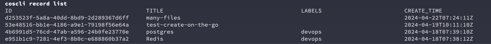
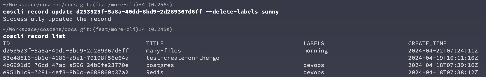
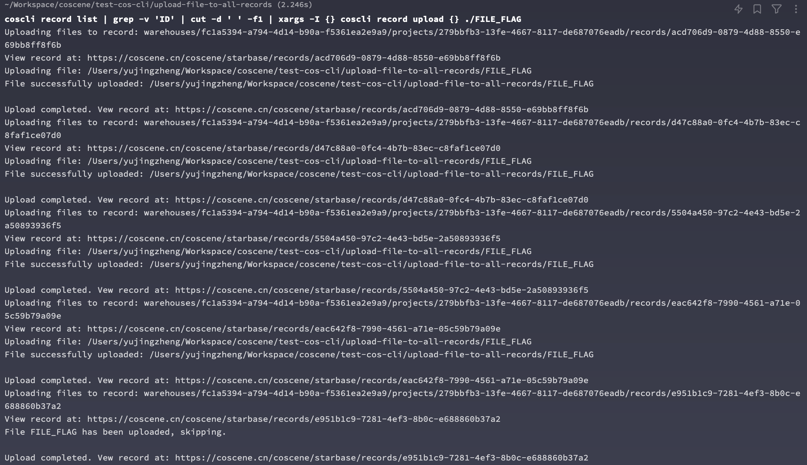

# 使用命令行操作记录

关于刻行命令行中操作记录的详细信息，您可以使用 `coscli record -h` 来查看详细用法


以下是一些常见操作的示例：

## 创建记录

```bash
# 创建一个叫做<预留文件>的记录
coscli record create -t 预留文件
```



您可以点击结果中的网址，在网页中查看刚创建的记录

## 查看项目中的记录

```bash
coscli record list
```


List 命令会将项目中的所有记录列出，我们可以通过串联`grep` 和 `cut` 等命令来获取某个记录的 ID

```bash
coscli record list | grep '预留' | cut -d ' ' -f1
```


## 上传文件到记录

您可以将任意指定的文件或者目录内的文件上传到特定记录，我们以前述的`预留文件`记录为例

```bash
# 创建一个临时文件
touch TEST_FILE

# 将该文件上传到前面创建的 Record
coscli record upload acd706d9-0879-4d88-8550-e69bb8ff8f6b ./TEST_FILE
```


此时再刷新网页中的记录，就可以看到我们刚上传的文件了


## 下载记录中的文件

我们也可以将记录中的文件下载到本地，在`预留文件`这个记录中，我们又上传了一些随机文件作为示例。


```bash
coscli record download acd706d9-0879-4d88-8550-e69bb8ff8f6b .
```



命令行工具会将记录中的所有文件打包在以记录 ID 为名字的文件夹内，这个功能在您之后可能会遇到的下载多个记录中帮助您保持文件的独立性，方便管理。

## 删除记录

命令行工具也可以用来删除记录，删除记录是一个非常危险的操作，请在删除时手工确认是否真的需要
删除记录，或者使用 `-f` 标记来强制删除。



## 管理记录的标签

`coscli record list` 可以很方便的看到记录的标签，我们也可以对记录的标签进行更多的操作。我们以列表中的第一个记录举例。



### 给记录添加标签

```
coscli record update d253523f-5a8a-40dd-8bd9-2d289367d6ff -l afternoon,rainy
```

记录成功的添加了 afternoon 和 rainy 的标签


### 替换记录的已有标签

```
coscli record update d253523f-5a8a-40dd-8bd9-2d289367d6ff --update-labels sunny,morning
```

可以看到现在的记录的标签已经从 afternoon, rainy 更新成了 sunny, morning


### 删除指定标签

```
coscli record update d253523f-5a8a-40dd-8bd9-2d289367d6ff --delete-labels sunny
```

通过命令行删除 `sunny` 标签，可以看到现在只剩下了 `morning` 的标签了



## 常见批量操作举例

### 上传同一个文件到项目中的所有记录中

```
coscli record list | grep -v 'ID' | cut -d ' ' -f1 | xargs -I {} coscli record upload {} ./FILE_FLAG
```



### 为每一个当前目录下的文件夹建立一个记录

假定我们有如下的 5 个文件夹，文件夹中包含若干个随机文件和文件夹，具体结构如下图所示。


我们立刻利用刻行命令行工具和标准的 Linux 命令行工具来一次性完成所有文件记录的创建和文件上传。

```bash
# 遍历当前目录下的所有子目录
for dir in */; do
  # 去除目录名称末尾的斜杠，并创建一个新的记录，获取记录ID
  record_id=$(coscli record create -t "${dir%/}" | head -n1 | cut -d " " -f3)

  # 上传当前子目录的内容到创建的记录中
  coscli record upload -R "$record_id" "$dir"
done
```


打开网页端任意记录就可以看到，命令行将本地的文件夹内的所有文件和文件夹都上传到了对应记录


### 找出所有不含任何文件的空记录

```bash
# 遍历每个记录ID
for id in $(coscli record list | grep -v 'ID' | cut -d ' ' -f1); do
    # 获取记录中的文件列表
    files=$(coscli record list-files $id | tail -n +2)

    # 检查文件列表是否为空
    if [[ -z "$files" ]]; then
        # 如果文件列表为空，则输出该记录ID
        echo "Record $id has no files."
    fi
done
```

### 给所有空记录打上标签

```bash
# 遍历每个记录ID
for id in $(coscli record list | grep -v 'ID' | cut -d ' ' -f1); do
    # 获取记录中的文件列表
    files=$(coscli record list-files $id | tail -n +2)

    # 检查文件列表是否为空
    if [[ -z "$files" ]]; then
        # 给所有空的记录打上标签 empty-record
        coscli record update $id -l empty-record
    fi
done
```
