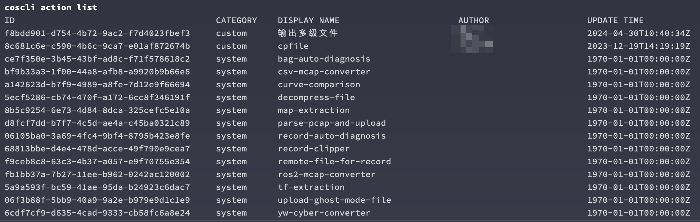

# 使用命令行工具管理动作（Actions）

刻行的动作系统可以用来触发复杂的计算和处理过程，通过使用 CLI 工具编写脚本，可以极大
的提高实际工作流程中的自动化程度。关于使用命令行操作动作的详细帮助可以参考

```bash
coscli action -h
```


# 列出当前项目中的动作

```bash
coscli action list
```



默认 List 下，命令行会将项目中所有的动作都列出来。通过 Category 类别以及 Author 作者，
我们可以更好的区分想要的动作。

当然我们也可以使用 `grep` 等标准命令来做进一步的筛选


## 触发动作

找到我们想要的执行的动作之后，我们可以在命令行中，直接触发这个动作，实现全流程的自动化。

这里我们准备了一个动作，会将当前目录下文件进行 List 操作并输出。

动作需要记录的数据进行运行，我们先找到我们需要的动作 ID 和记录 ID，然后使用这两个 ID，触发动作。

```bash
RECORD_ID=$(coscli record list | grep -v ID | cut -d ' ' -f1 | head -n1)
ACTION_ID=$(coscli action list | grep 'coScene-test' | cut -d ' ' -f1)
coscli action run $ACTION_ID $RECORD_ID
```


执行动作是一个比较消耗计算和存储资源的操作，在没有 `-f` 标识位的情况下，需要手动确认
才会真正执行。如果对当前操作不需要进行手动确认的，可以使用 `-f` 标志直接跳过。这在批量
处理大量数据的情况下非常实用。

```bash
coscli action run $ACTION_ID $RECORD_ID -f
```


较为复杂的动作可能会需要额外的参数对动作进行定制，您可以使用 `-p` 的标志位提供这些参数

```bash
coscli action run $ACTION_ID $RECORD_ID -f -p 参数1=123 -p 参数2=456
```

请注意在这种调用模式下，如果有 `参数1` 和 `参数2` 之外的参数，那么剩余的这些未提供明确数值的参数会使用动作中定义的默认值

### 查看动作调用历史

成功触发之后，我们就可以在调用历史中查看我们触发的调用了。

## 找出某个动作的所有调用记录

## 根据状态过滤
