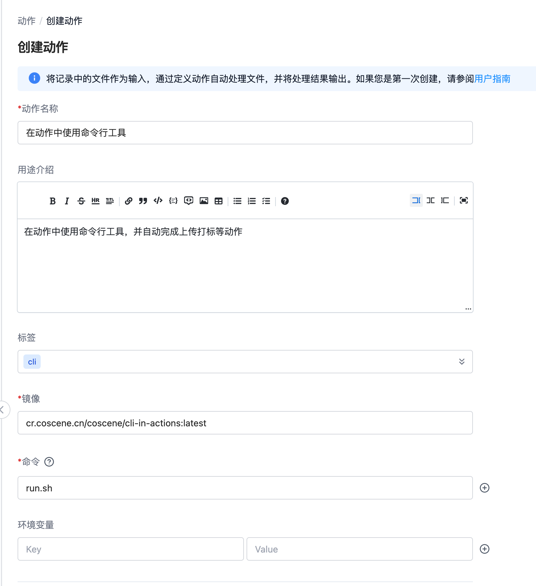

# 在动作中使用命令行工具

刻行的动作中也内置了使用命令行工具的所需参数，用户只需要在动作对应的镜像中包含刻行的命令行
工具，就可以在动作执行的过程中根据需要调用命令行工具。

文本将指引你编写一个刻行动作，在动作调用过程中，使用命令行工具创建刻行记录，并自动完成上传文件和打标签的过程。

本文中用到的所有源代码都在这个仓库中。

## 准备脚本文件

我们准备在这个动作中，做如下操作

1. 生成 5 个文件夹，以 \$\{当前时间\}-cli-action-folder 1-5 命名;
2. 在这 5 个文件夹内，随机放入 1-10 个完全随机内容的文件;
3. 使用命令行工具，为 5 个文件夹创建 5 个云端记录，并上传所有文件夹内的文件
4. 统计文件夹内的文件数目 N ，为记录打上 files: N 的标签

```bash
#!/bin/bash

# 当前时间的
current_time=$(date +%H%M)

# 创建 5 个文件夹，命名为 cli-action-folder1 到 cli-action-folder5
for i in {1..5}; do
    folder_name="${current_time}-cli-action-folder${i}"
    # 创建本地文件夹
    mkdir -p "${folder_name}"
    # 创建云端记录
    coscli record create -t "${folder_name}"
    # 获取记录 ID
    RECORD_ID=$(coscli record list | grep "cli-action-folder${i}" | cut -d ' ' -f1)

    # 在每个文件夹内生成 1 到 10 个随机内容的文件
    num_files=$((RANDOM % 10 + 1))  # 生成 1 到 10 的随机数
    for j in $(seq 1 $num_files); do
        # 使用 /dev/urandom 生成随机内容，并将其输出到文件中
        dd if=/dev/urandom of="${folder_name}/file${j}.txt" bs=1 count=$((RANDOM + 128)) 2>/dev/null
    done

    # 上传文件
    coscli record upload $RECORD_ID "${folder_name}"/
    # 根据文件数量，更新标签
    coscli record update $RECORD_ID -l "files: ${num_files}"
done
```

最后将我们的执行过程放在名为 `run.sh` 的脚本文件中。

## 准备镜像和动作

关于如何认证和使用刻行镜像仓库，请参见[推送镜像](../8-regression/2-image-management.md)

以下的 Dockerfile 会在 Ubuntu 系统中安装刻行命令行工具，然后执行 run.sh

```bash
FROM ubuntu:20.04

# 设置工作目录
WORKDIR /app

# 复制当前目录下的所有文件到工作目录
COPY . /app

# 安装 curl 并运行安装脚本，然后清理缓存
RUN apt-get update && \
    apt-get install -y curl && \
    curl -fL https://download.coscene.cn/coscli/install.sh | sh && \
    apt-get clean && \
    rm -rf /var/lib/apt/lists/*

# 确保 run.sh 是可执行的
RUN chmod +x run.sh

# 设置容器启动时执行的命令
ENTRYPOINT ["./run.sh"]
```

构建完成后，我们推送到刻行的镜像仓库

```bash
docker build -t cr.coscene.cn/coscene/cli-in-actions:latest .
docker push cr.coscene.cn/coscene/cli-in-actions:latest
```

接下来创建对应的动作



让我们来手动触发这个动作，验证全部的流程
