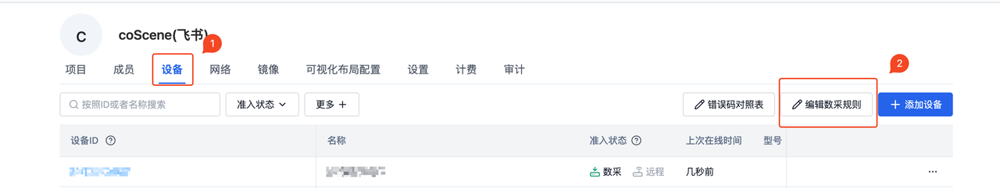
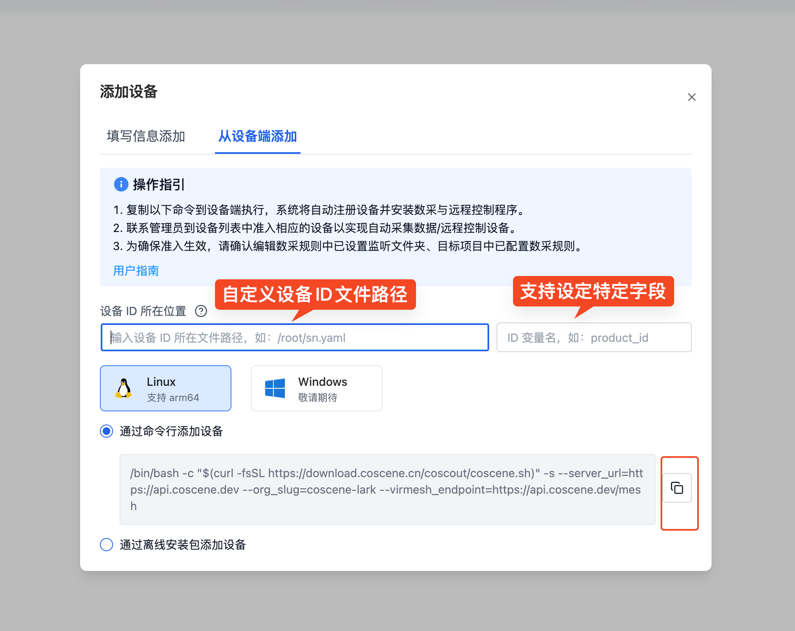
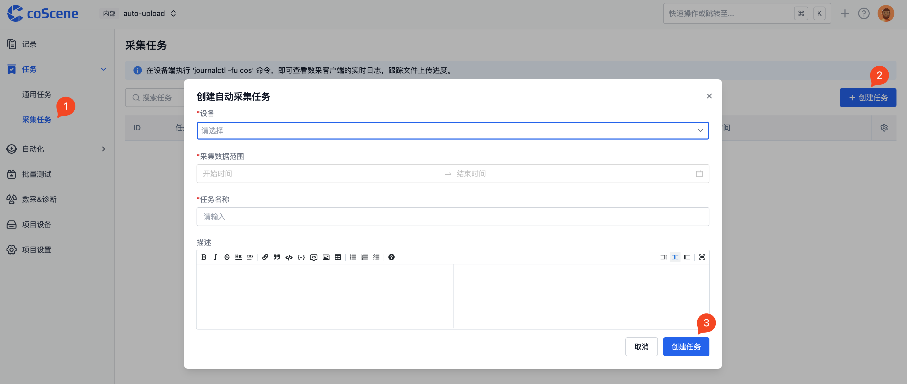
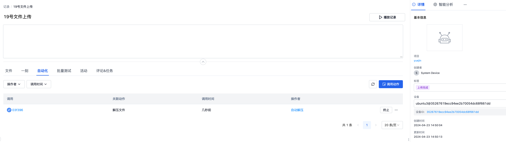

# 通用数据采集

## 背景

机器人行业的设备常见环境故障、软件故障和硬件故障等问题，运维人员的问题排查需要大量时间成本。刻行时空平台提供了一种依据时间段对机器端数据进行上传的通用数据采集方案，方便用户快速的获取机器端数据，并手动选择需要记录的时间段数据。用户在平台侧创建采集任务，确认数据时间范围。机器端 Agent 获取到任务后依据配置的文件地址，扫描文件数据，将符合时间要求的文件上传至平台。

手动采集的教程过程如下：首先，用户在刻行时空平台上创建采集任务，明确所需数据的时间范围。接着，机器端的 Agent 会获取到这个任务。然后，Agent 依据配置好的文件地址，对文件数据进行扫描。最后，将符合时间要求的文件上传至平台。

本文将以一个名为 ubuntu3 的设备为例，模拟运维人员手动采集数据上传到平台，并进行解压数据处理的过程，展示平台的数据手动采集与诊断功能。实现该功能需要完成以下六个步骤：

1. 配置采集规则
2. 安装设备agent
3. 添加设备至项目
4. 创建采集任务
5. 跟踪文件上传进度
6. 处理数据

## 准备工作

首先，登录刻行时空平台并创建项目：

1. 访问[官方网站 https://www.coscene.cn/](https://www.coscene.cn)，点击右上角的快速登录进入登录界面，选择登录方式进入刻行平台。


2. 在平台创建一个【项目】。项目作为数据管理单元，负责数据的存储、管理、隔离及权限控制。


3. 确认用户在刻行的组织角色是否为管理员。出于数据安全考虑，只有组织管理员才有配置数据自动采集与诊断的权限。如果不是管理员，请联系组织管理员更新组织角色。

4. 准备一台机器人设备


## 配置采集规则

1. 进入【组织管理】-【设备】-【编辑数采规则】，配置整体的数采规则信息。



```yaml
mod:
  # mod 名称，默认 default，支持监听设备端指定目录下的文件，定制版请联系刻行
  name: 'default'
  conf:
    # 启用开关，true/false，默认启用
    enabled: true

    # 设备端的监听目录，作为项目中数据采集任务与规则采集的指定目录
    base_dirs:
      - /home/bag/
      - /home/log/

# 自动更新
updater:
  # 数采客户端自动更新开关，true/false，默认关闭
  enabled: false
```

2. 具体的配置文件信息介绍，请查看文档[数采规则](../4-recipes/3-device/4-device-collector.md)

## 安装设备 Agent

1. 编辑数据采集规则之后，需要安装对应设备agent。首先进入【组织管理】-【设备】-【添加设备】，获取设备 Agent 安装命令。


2. 安装命令支持指定相关的设备 ID 文件路径以及关联字段名，若不设定则会随机生成 ID 绑定当前设备。最后复制下图位置的命令行，添加到对应的设备，即可连接。



## 添加设备至项目

1. 进入对应的项目，选择【项目设备】-【添加设备】-【从组织设备选择】，选择添加刚才安装的设备到当前项目。


## 创建采集任务

1. 在项目中，通过【任务】-【采集任务】-【创建任务】，选择对应的设备，填写需要采集的时间段信息和相关的描述信息，点击创建任务。
2. 根据需要采集的内容，选择设备中相应的目标数据路径进行填写。通过目标数据路径，会自动采集该时间范围内对应路径的数据。



## 跟踪文件上传进度

1. 创建完任务后，机器端 Agent 获取对应的任务信息后依据任务的时间段和配置的文件地址信息进行处理，然后上传符合要求的文件至刻行平台。依据机器端的网络速度和上传文件的数量，单次任务完成时间长短不同，请耐心等待。
2. 在设备端执行 'journalctl --user-unit=cos -f -n 50' 命令，即可查看数采客户端的实时日志，跟踪文件上传进度。
3. 在任务采集完成之后，任务详情中关联了此次任务关联的 record 信息，点击查看 record 即可查看相关的文件信息。单次的数据采集任务就完成了，就是如此的简单。


## 处理数据

当数据上传至平台之后，用户可以结合平台提供的[自动化](../4-recipes/12-action/1-quickstart.md)能力，对数据进行后续的处理，提升数据流转速度，提升研发效率。

这里以【自动解压缩】为例，当上传的数据包含压缩包时，通过自动化的能力自动的将压缩包文件解压，避免了下载数据 - 解压 - 上传解压数据的繁琐流程。

### 配置解压触发器

1. 在【自动化】-【触发器】-【创建触发器】中，创建新的触发器。文件通配符填写 `*.tar.gz` 和 `finish.flag`, 其中判断存在压缩包，而且文件上传结束后触发（Agent 在文件上传结束会上传 finish.flag 标记文件标识文件上传过程结束）。


### 触发解压

1. 在刚才的 record 中手动上传一个压缩包文件，查看对应的解压工作流已经自动触发。



2. 等待解压操作执行完成，查看文件列表，已经存在一个对应的解压文件夹。打开对应文件夹，即可看到解压后的数据文件。


## 可能会遇到的问题


### Q：机器端对应时间的文件没有采集

数据采集的文件时间采用的是文件的最后修改时间，可以在机器端通过 `ls -l --time-style=+"%Y-%m-%d %H:%M:%S"` 查看文件对应的修改时间，确定文件的时间时候确实在任务的时间范围内。

## 总结

上面介绍了一个用户创建采集任务，机器端 Agent 依据任务信息自动上传相关的文件至刻行平台的场景流程。结合刻行平台的自动化能力，可以搭配创建数据诊断、数据处理等流程，快速的搭建一套符合自身业务的数据流转流程，大幅提升研发效率。
