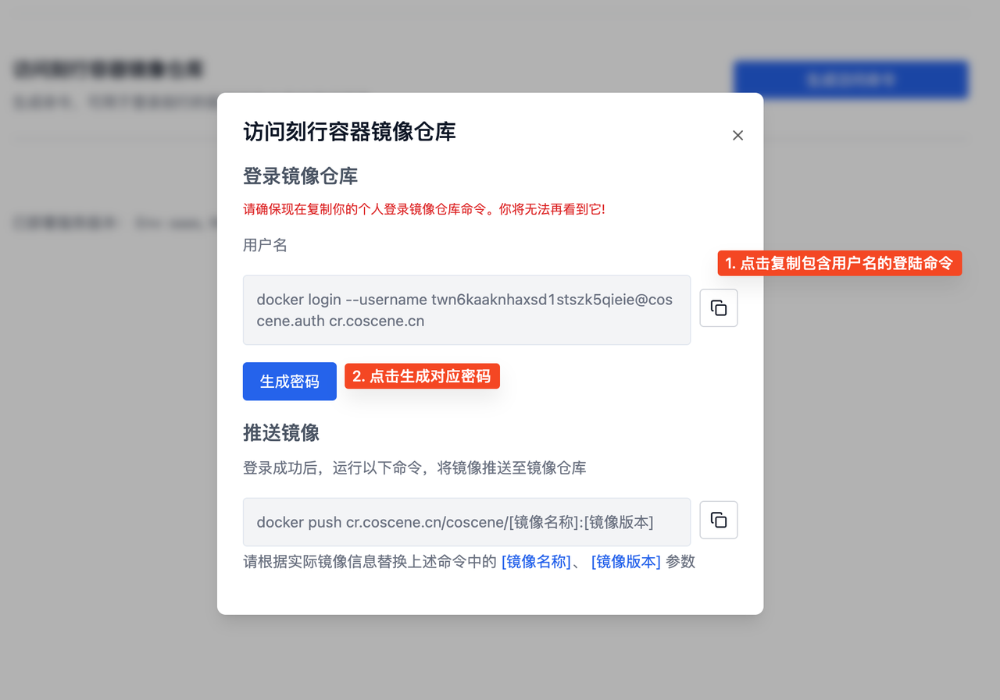
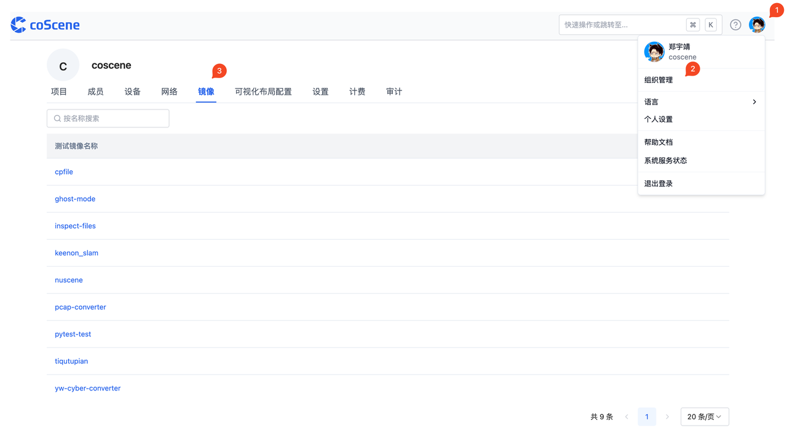
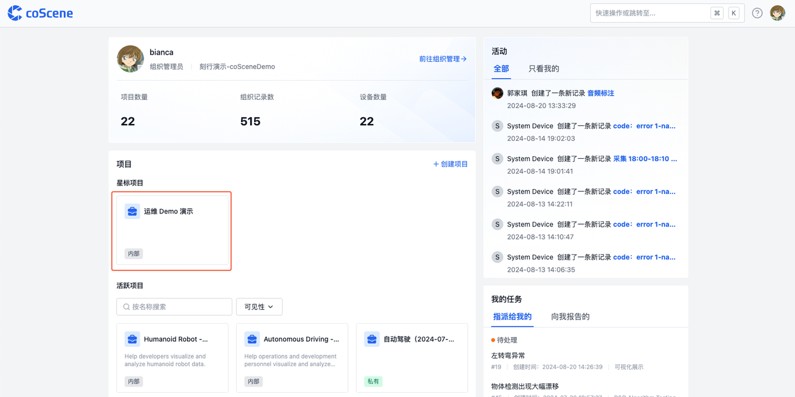
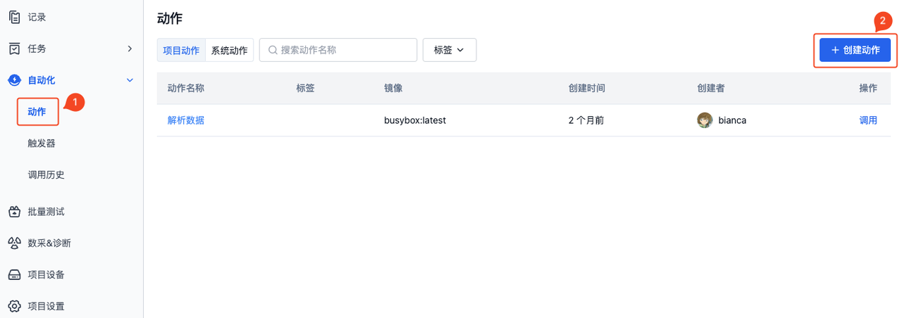
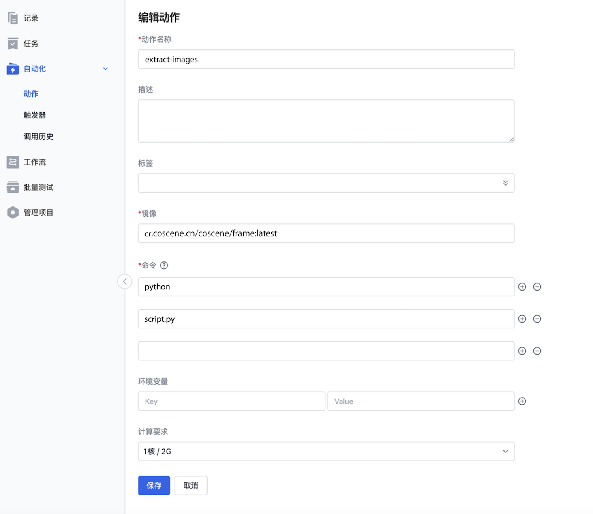
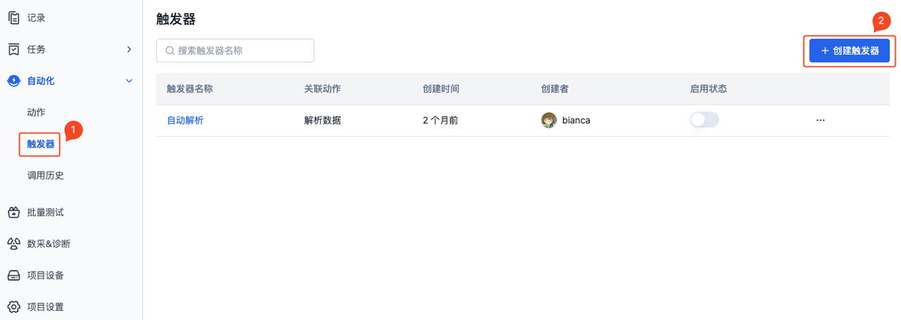
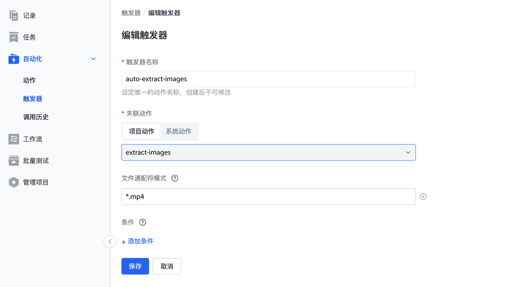
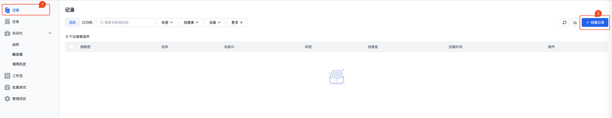

# 自动化处理数据

AI 时代大量的数据，带来无限可能的的同时，也给我们带来了更多数据本身和数据应用的挑战。在实际的生产过程中，AI 工程师们需要对数据进行清洗、预处理、训练、测试、部署等一系列的工作，这些工作需要大量的人力和时间，而且往往是重复的。刻行时空平台提供的自动化系统，使用户不再需要手动重复处理数据，只需要构建好数据处理的流程，即可直接调用并输出结果，极大减少了人为操作带来的误差，同时提高了数据处理速度和准确性。

本文以「视频抽帧」为例，讲述如何实现当 MP4 文件上传后，自动完成抽取图片的流程.

## 准备镜像

在本机启动 Docker 后，开始准备镜像。若未安装 Docker，请参考对应的[安装文档](https://docs.docker.com/engine/install/)

## 准备镜像文件

1. 在本机创建一个文件夹，如：`coScene-auto`
2. 在文件夹中创建 `dockerfile` 文件，文件名为：`dockerfile`，内容如下：

```yaml
# 使用 Python 官方镜像作为基础镜像
FROM python:3.9

# 设置工作目录
WORKDIR /app

# 将当前目录下的文件复制到镜像的 /app 目录中
COPY . /app

# 安装所需的依赖库
RUN apt-get update && apt-get install ffmpeg libsm6 libxext6 -y
RUN pip install opencv-python

# 设置环境变量
ENV INPUT_FOLDER=/cos/files
ENV OUTPUT_FOLDER=/cos/outputs

# 运行 Python 脚本
CMD ["python", "script.py"]
```

3. 在文件夹中创建 `.py` 文件，文件名为：`script.py`，内容如下：

```yaml
import cv2
import os

def extract_frames(input_folder, output_folder):
    # 创建输出目录
    os.makedirs(output_folder, exist_ok=True)

    # 遍历输入文件夹中的所有文件
    for file_name in os.listdir(input_folder):
        # 检查文件是否是 MP4 格式
        if file_name.endswith(".mp4"):
            # 构造输入文件路径
            input_file = os.path.join(input_folder, file_name)

            # 打开视频文件
            video = cv2.VideoCapture(input_file)

            # 获取视频的帧速率
            fps = video.get(cv2.CAP_PROP_FPS)

            # 初始化帧计数器
            frame_count = 0

            # 循环读取视频帧
            while True:
                # 读取一帧
                success, frame = video.read()

                # 检查是否成功读取帧
                if not success:
                    break

                # 构造输出文件名
                output_file = os.path.join(output_folder, f"{file_name}_{frame_count}.jpg")

                # 保存帧为图像文件
                cv2.imwrite(output_file, frame)

                # 增加帧计数器
                frame_count += 1

            # 释放视频对象
            video.release()

            print(f"成功提取 {frame_count} 帧图片，保存到 {output_folder}")

# 输入和输出文件夹路径
input_folder = "/cos/files"
output_folder = "/cos/outputs"

# 调用函数提取帧图片
extract_frames(input_folder, output_folder)
```

## 登录镜像仓库

1. 登录[刻行时空平台](https://www.coscene.cn/)，在右上角用户设置下拉面板中，访问【个人设置】，在【个人设置】页面中，访问【安全】页面
2. 点击生成访问命令，获取登录刻行镜像仓库的命令和密码
   
   
3. 在本机命令行中，输入用户名与密码，登录刻行时空的镜像仓库
   
4. 复制推送镜像命令中的镜像仓库地址，如下图为：`cr.coscene.cn/coscene`
   

## 构建镜像

1. 打开本机终端，进入之前创建的 `coScene-auto` 文件夹
2. 执行以下命令，构建镜像

```yaml
docker build -f dockerfile -t cr.coscene.cn/coscene/frame:latest .
```

注意：

- `cr.coscene.cn/coscene` 为镜像仓库地址，需用实际的地址替换，获取方式见「准备镜像-登录镜像仓库-4」
- `frame:latest` 为镜像名称:镜像版本，可自定义命名

## 推送镜像

1. 在本机终端执行以下命令，将镜像推送到镜像仓库

```yaml
docker push cr.coscene.cn/coscene/frame:latest
```

注意：

- `cr.coscene.cn/coscene` 为镜像仓库地址，需用实际的地址替换，获取方式见「准备镜像-登录镜像仓库-4」
- `frame:latest` 为镜像名称:镜像版本，可自定义命名

2. 推送成功后，在「我的 - 组织管理 - 镜像」页面中，可以查看已推送的镜像
   

## 创建动作

1. 点击项目名称，进入项目
   
2. 进入项目-自动化-动作页面，点击【创建动作】
   
3. 在创建动作页面，输入以下内容后，点击【保存】

- 动作名称：`extract-images`
- 镜像：`cr.coscene.cn/coscene/frame:latest`，获取自「准备镜像-推送镜像」
- 命令：`python`、`script.py`
  

## 设置触发器

1. 进入项目-自动化-触发器页面，点击【创建触发器】
   
2. 在创建触发器页面，输入以下内容后，点击【保存】

- 触发器名称：`auto-extract-images`
- 关联动作：选择项目动作-`extract-images`
- 触发条件：在文件通配符模式中输入`*.mp4`，即当有`.mp4`为后缀的文件上传时，自动调用关联动作
  

## 创建记录并上传文件

1. 进入项目-记录页面，点击【创建记录】
   
2. 点击记录名称进入记录后，上传 MP4 文件，或下载示例文件 [coScene-auto.mp4](https://daiincoscene-artifacts-prod.oss-cn-hangzhou.aliyuncs.com/docs/5-use-case/coScene-auto.mp4)
   

## 查看结果

1. 当 MP4 文件上传后，自动触发`extract-images`动作，在记录的「调用历史」中可查看动作的执行情况
   
2. 点击调用序号，在调用历史的输出中，可查看提取出的图片信息
   

## 总结

当 MP4 文件上传到记录中，自动完成抽取图片的流程之后，即可根据需要将数据另存到新的记录，并进行下一步的处理。更多操作参见：[自动化](https://docs.coscene.cn/docs/category/%E8%87%AA%E5%8A%A8%E5%8C%96/)、[镜像](https://docs.coscene.cn/docs/category/%E9%95%9C%E5%83%8F/)


