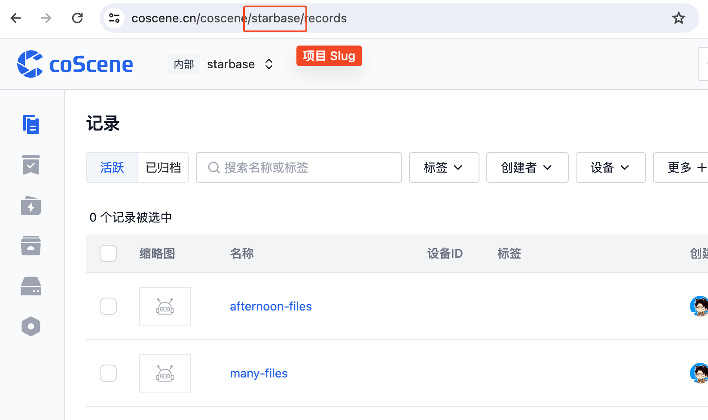

# 安装和初始化

## 安装

在命令行运行下面的命令安装最新版本的刻行命令行工具

```Bash
curl -fL https://download.coscene.cn/coscli/install.sh | sh
```

在命令行中可以使用 `coscli -v` 来确认命令行工具已经成功安装

**安装特定版本**

```Bash
curl -fL https://download.coscene.cn/coscli/install.sh | sh -s -- <version-name>

# e.g. 安装 v0.1.0 版本的 coscli
curl -fL https://download.coscene.cn/coscli/install.sh | sh -s -- v0.1.0
```

**更新至最新版本**

```Bash
coscli update
```

## 登陆

刻行的命令行工具需要您的个人访问令牌才能工作，您可以在[刻行-我的设置](https://coscene.cn/profile?section=security)页面中生成访问令牌。

命令行工具同时需要指定一个默认项目作为所有操作的默认环境，请选择您想要工作的项目，并在 URL 中获取项目的 Slug。



### 配置命令行权限

```Bash
# -p 后填写 <项目 slug>
# -t 后填写 <个人访问令牌>
cos login set -p <项目 slug> -t <个人访问令牌>
```
