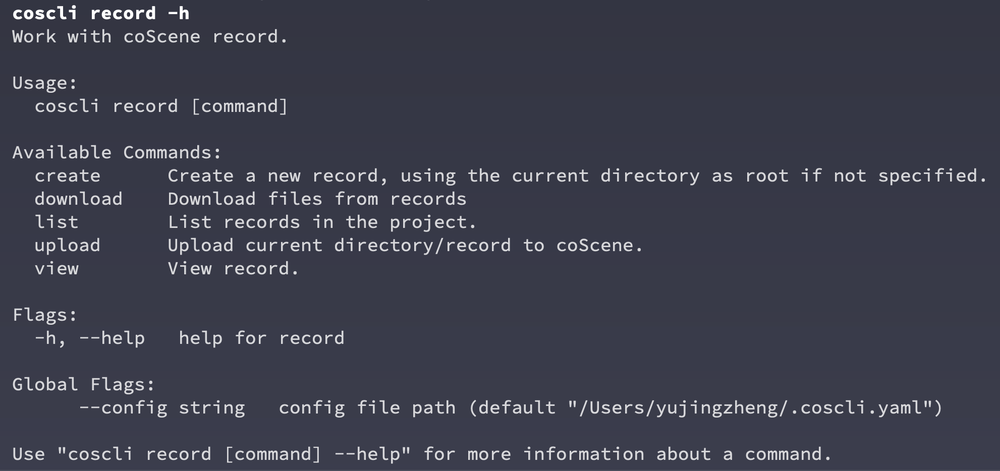
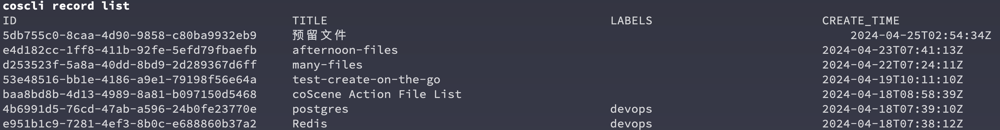
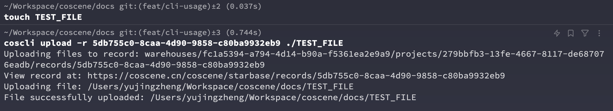
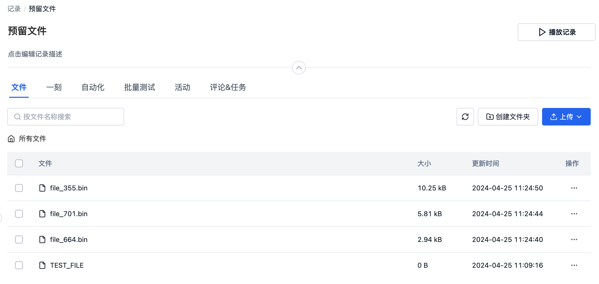
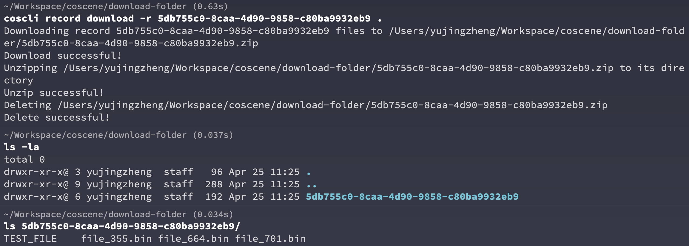
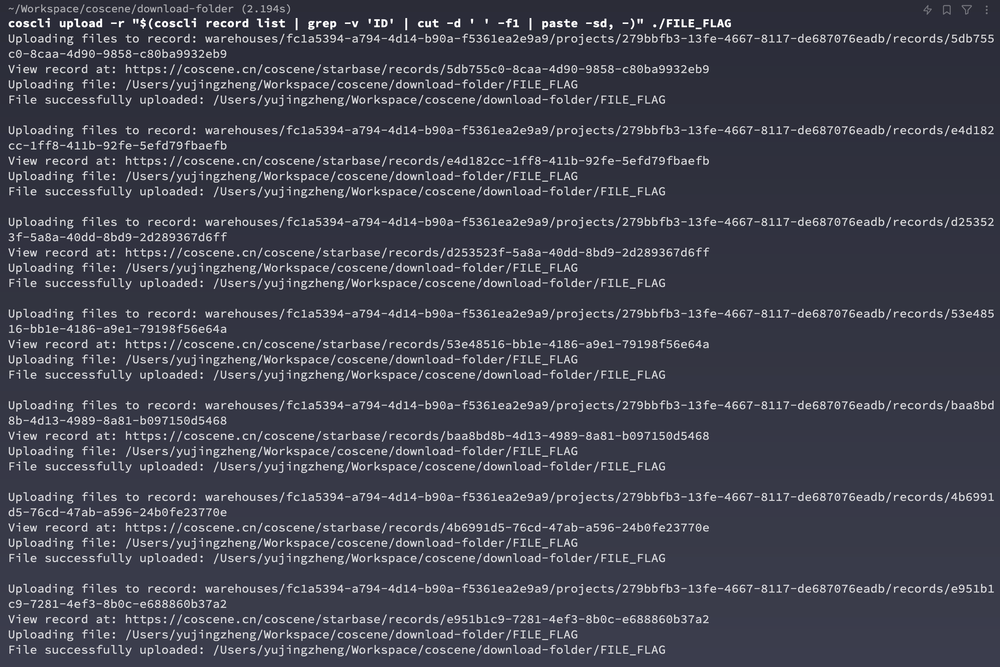

# 使用命令行操作记录

关于刻行命令行中操作记录的详细信息，您可以使用 `coscli record -h` 来查看详细用法



以下是一些常见操作的示例：

## 创建记录

```bash
# 创建一个叫做<预留文件>的记录
coscli record create -t 预留文件
```


您可以点击结果中的网址，在网页中查看刚创建的记录

## 查看项目中的记录

```bash
coscli record list
```



List 命令会将项目中的所有记录列出，我们可以通过串联`grep` 和 `cut` 等命令来获取某个记录的 ID

```bash
coscli record list | grep '预留' | cut -d ' ' -f1
```


## 上传文件到记录

您可以将任意指定的文件或者目录内的文件上传到特定记录，我们以前述的`预留文件`记录为例

```
touch TEST_FILE # 创建一个临时文件
coscli upload -r 5db755c0-8caa-4d90-9858-c80ba9932eb9 ./TEST_FILE # 将该文件上传到前面创建的 Record
```



此时再刷新网页中的记录，就可以看到我们刚上传的文件了


## 下载记录中的文件

我们也可以将记录中的文件下载到本地，在`预留文件`这个记录中，我们又上传了一些随机文件作为示例



```
coscli record download -r 5db755c0-8caa-4d90-9858-c80ba9932eb9 .
```



命令行工具会将记录中的所有文件打包在以记录 ID 为名字的文件夹内，这个功能在您之后可能会遇到的下载多个记录中帮助您保持文件的独立性，方便管理。

## 常见批量操作距离

### 上传同一个文件到项目中的所有记录中

```
coscli upload -r "$(coscli record list | grep -v 'ID' | cut -d ' ' -f1 | paste -sd, -)" ./FILE_FLAG
```



### 为每一个当前目录下的文件夹建立一个记录
