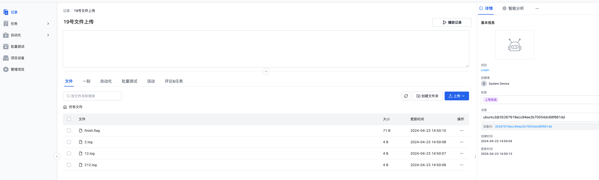
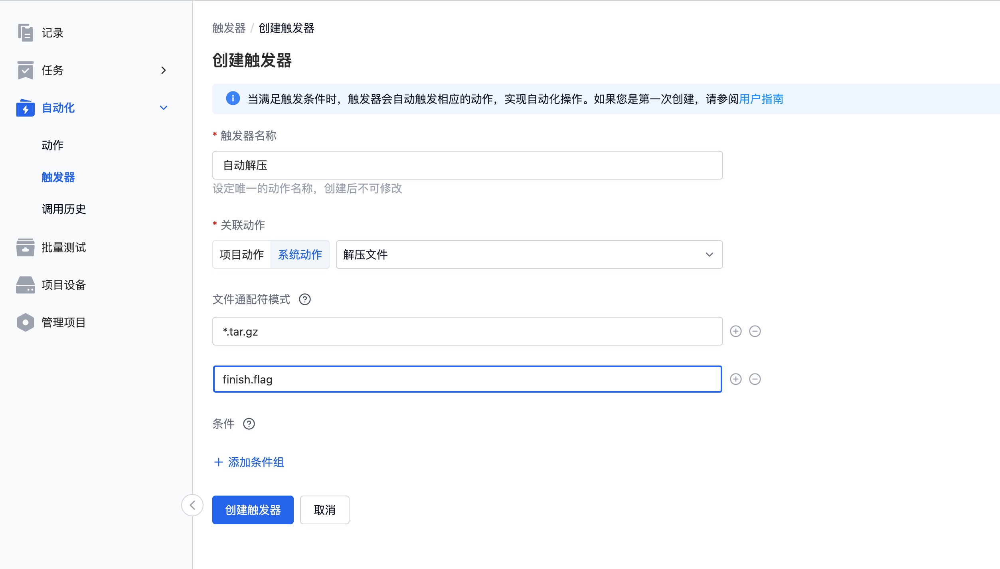
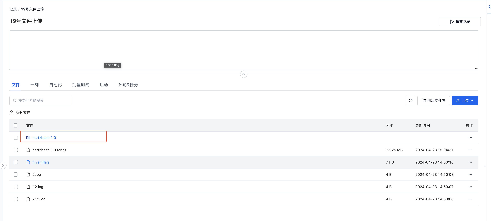

# 通用数据采集

刻行平台提供了一种依据时间段对机器端数据进行上传的通用数据采集方案，方便用户快速的获取机器端数据。用户在平台侧创建采集任务，确认数据时间范围。机器端 Agent 获取到任务后依据配置的文件地址，扫描文件数据，将符合时间要求的文件上传至平台。

## 配置采集规则

进入【组织管理】-【设备】-【编辑数采规则】，配置整体的数采规则信息。


```yaml
event_code:
  enabled: false
mod:
  conf:
    enabled: true
    upload_files:
        - folder1_path // 需要扫描的文件夹
        - folder2_path
        - file_path // 需要额外上传的文件地址，请填写绝对路径
  name: 'default' # mod 名称
```

具体的配置文件信息介绍，请查看文档[数采规则](../4-recipes/3-device/4-device-collector.md)

## 设备安装 Agent

进入【组织管理】-【设备】-【添加设备】，获取设备 Agent 安装命令


安装命令支持指定相关的设备 ID 文件路径以及关联字段名，若不设定则会随机生成 ID 绑定当前设备。


在机器上打开命令行终端，粘贴上图复制的安装命令，在命令后面添加 `--mod=task` 参数，安装 cos Agent 至机器端。等待几分钟后即可在组织设备中查看到对应的设备信息。


在网页端查看相关的设备，若未出现相关设备，第一次安装过程较慢，请耐心等待 1 分钟后刷新网页。找到对应的机器，点击【准入数采】准许设备进行数据采集操作。

## 将设备添加至项目

进入对应的项目，选择【项目设备】-【添加设备】-【从组织设备选择】，选择添加刚才安装的设备到当前项目。


## 创建采集任务

在项目中，通过【任务】-【自动采集任务】-【创建任务】，选择对应的设备，填写需要采集的时间段信息和相关的描述信息，点击创建任务。


## 等待采集任务完成

创建完任务后，机器端 Agent 获取对应的任务信息后依据任务的时间段和配置的文件地址信息进行处理，然后上传符合要求的文件至刻行平台。依据机器端的网络速度和上传文件的数量，单次任务完成时间长短不同，请耐心等待。

在任务采集完成之后，任务详情中关联了此次任务关联的 record 信息，点击查看 record 即可查看相关的文件信息。单次的数据采集任务就完成了，就是如此的简单。





## 数据的后续处理

当数据上传至刻行平台之后，用户可以结合刻行平台提供的[自动化](../4-recipes/12-action/1-quickstart.md)能力，对数据进行后续的处理，提升数据流转速度，提升研发效率。

这里以【自动解压缩】为例，当上传的数据包含压缩包时，通过自动化的能力自动的将压缩包文件解压，避免了下载数据 - 解压 - 上传解压数据的繁琐流程。

### 配置解压触发器

在【自动化】-【触发器】-【创建触发器】中，创建新的触发器。文件通配符填写 `*.tar.gz` 和 `finish.flag`, 其中判断存在压缩包，而且文件上传结束后触发（Agent 在文件上传结束会上传 finish.flag 标记文件标识文件上传过程结束）。


### 触发解压

在刚才的 record 中手动上传一个压缩包文件，查看对应的解压工作流已经自动触发。


等待解压操作执行完成，查看文件列表，已经存在一个对应的解压文件夹。



## Q&A

### Q：机器端对应时间的文件没有采集

A: 数据采集的文件时间采用的是文件的最后修改时间，可以在机器端通过 `ls -l --time-style=+"%Y-%m-%d %H:%M:%S"` 查看文件对应的修改时间，确定文件的时间时候确实在任务的时间范围内。


## 总结

上面介绍了一个用户创建采集任务，机器端 Agent 依据任务信息自动上传相关的文件至刻行平台的场景流程。结合刻行平台的自动化能力，可以搭配创建数据诊断、数据处理等流程，快速的搭建一套符合自身业务的数据流转流程，大幅提升研发效率。
