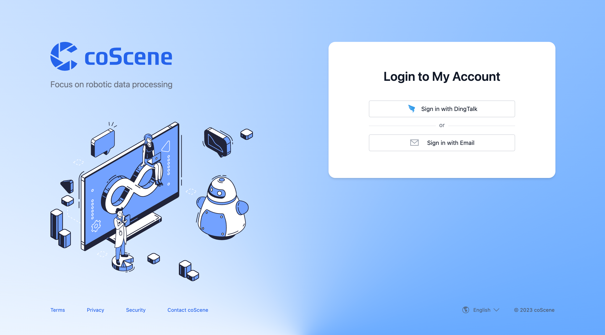

# Log in and Start Your First Project

## 1. Log In

You can log in on the homepage using DingTalk or email. Please visit the coScene Data Platform website [https://coscene.cn](https://coscene.cn) to get started.

## 2. Access Projects

Projects are the basic type for managing data in coScene. A project can be **a department, a team, or a specific topic**. On the homepage, you can view the projects in your organization that you have access to. Click to enter a project and you can access the data within it.

<video src="https://coscene-artifacts-prod.oss-cn-hangzhou.aliyuncs.com/docs/en/2-get-started/visit-project.mp4" controls="controls" width="700" height="400"></video>

## 3. Create a Project

If you do not see any accessible projects in your organization after logging in, you can create a new one. Within an organization, the default visibility for newly created projects is set to be visible to all members within the organization, and they can be accessed by them.

<video src="https://coscene-artifacts-prod.oss-cn-hangzhou.aliyuncs.com/docs/en/2-get-started/creating-a-project.mp4" controls="controls" width="700" height="400"></video>

Congratulations! You've completed the first step on the coScene data platform. Next, we will introduce how to use the recording function, upload, and visualize your robot data!
