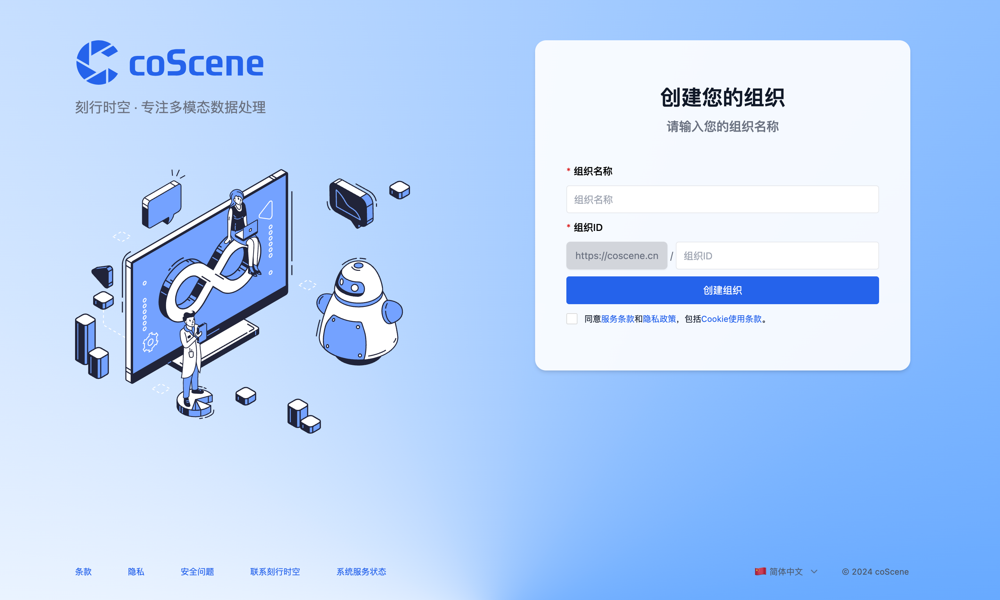

# Login to coScene

1. Access the [coScene platform https://www.coscene.cn/](https://www.coscene.cn) through your browser, click on "Quick Login" in the upper right corner to enter the login interface

2. Choose a login method to enter the platform. If you cannot log in, please contact contact@coscene.io

3. If you are the first user of your organization, you will be asked to create the organization by filling in the "Organization Name" and "Organization Slug", "Agree", and click "Create Organization"

:::info
The first user from an organization to log in to the coScene data platform will automatically become the "Organization Administrator";
When other colleagues log in using the organization's "Feishu/DingTalk/corporate email", they will automatically join the same organization (i.e., the organization created by the first user)
:::

4. Now you can enter the organization and start using the platform.

