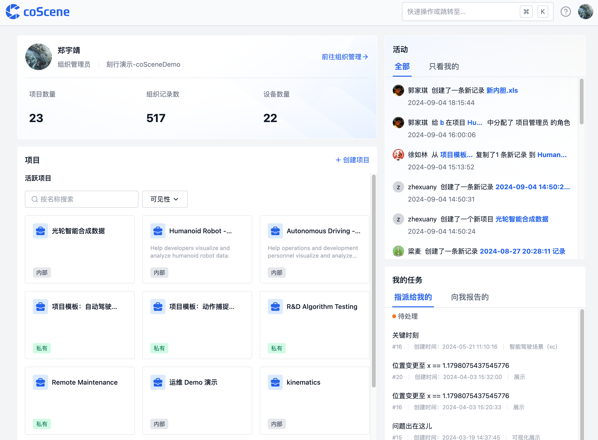
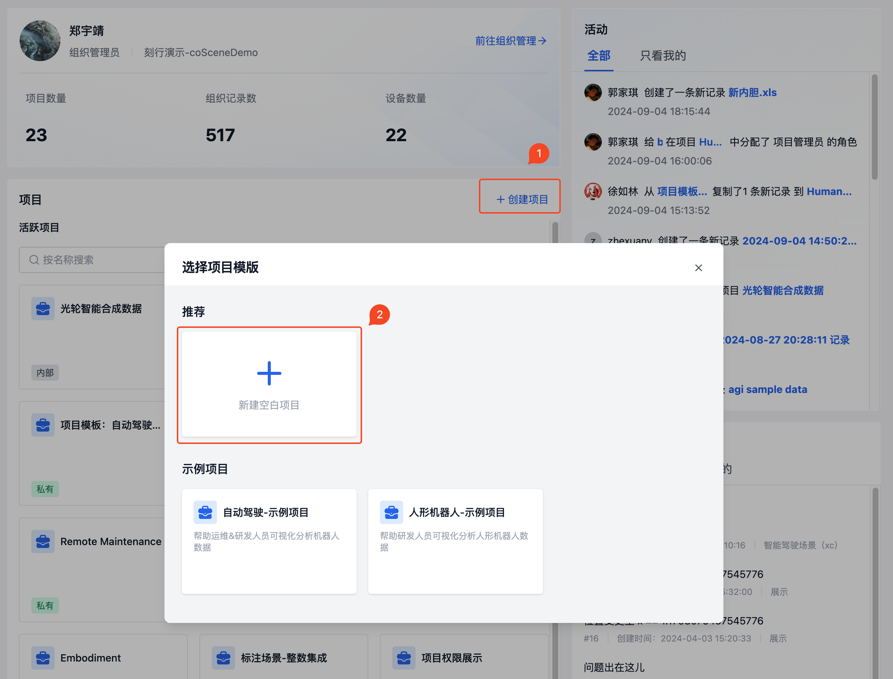
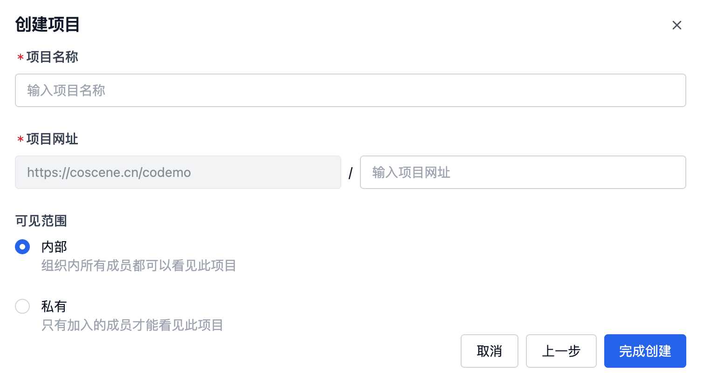
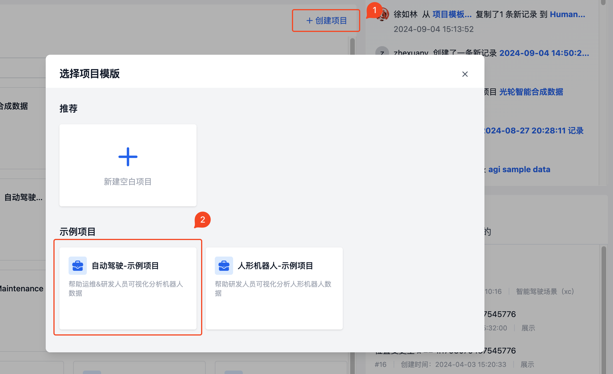
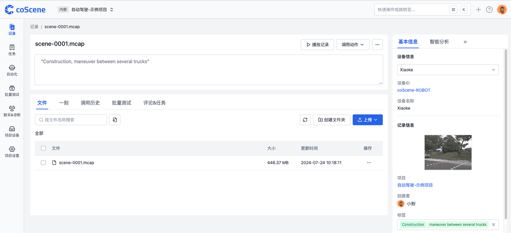

# Create a Project

## Project Overview

A "project" is the basic unit for managing data. A project can be a department, a team, or a specific topic. On the platform's homepage, all projects you have access to will be listed directly in the project list.

## Create a Blank Project

1. Click on "Create Project" from the homepage and select [Blank Project].

2. Enter the project name, URL, and select the project visibility as needed to complete the creation.

## Create a Sample Project

Sample projects are project templates provided by coScene based on different scenarios. Each sample project contains example data to help you quickly understand the platform's capabilities.

1. After clicking "Create Project", select a sample template, set the project name and other information, and then you can enter the sample project.

2. View the records included in the sample project in the record list.

3. Click on a record to enter the record details page and view the sample files in the record. Users can refer to subsequent documentation to use these files to experience more platform features.

