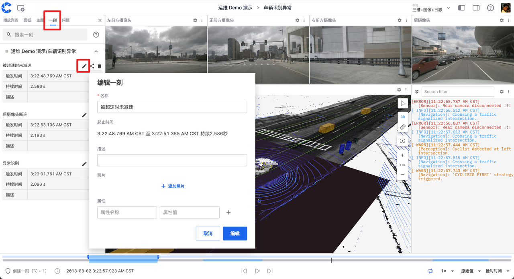
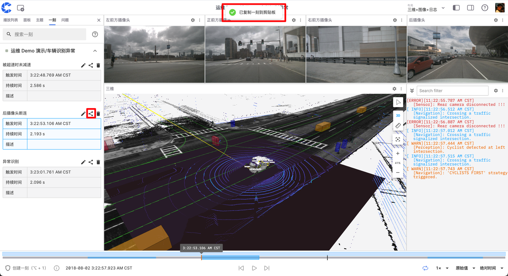

# Creating Your First "Moment"

While playing data in the visualization interface, you can create "moments" to quickly mark specific time periods in the multimodal data stream. These "moments" may contain important data changes, anomalies, or anything you consider worth noting. By creating "moments," you can easily review, analyze, and share this information, greatly improving the efficiency and accuracy of data processing.

## Creating a "Moment"

1. Click [Create Moment] in the lower-left corner of the visualization page, or use the shortcut [Alt + 1] (Option + 1 for Mac users) to mark the start point of a moment.

2. Click again to mark the end point of the moment. A window for creating a moment will automatically pop up, with the blue area indicating the time range of the moment.

3. Fill in the relevant information and click "Create Moment" to complete.

## Managing "Moments"

In the moment panel on the left, you can edit, share, and delete the "moments" you've created.

### Editing

Click the edit button to modify the information of the current moment.

### Sharing

Click the share button to copy the link of the current moment to the clipboard.

### Deleting

Click the delete button to remove the selected moment.

## Viewing "Moments"

You can view created "moments" in two ways:

1. View all moments of the current record in the moment panel on the left side of the visualization page.

2. View all moments of a record in the "Moments" tab on the record details page.

