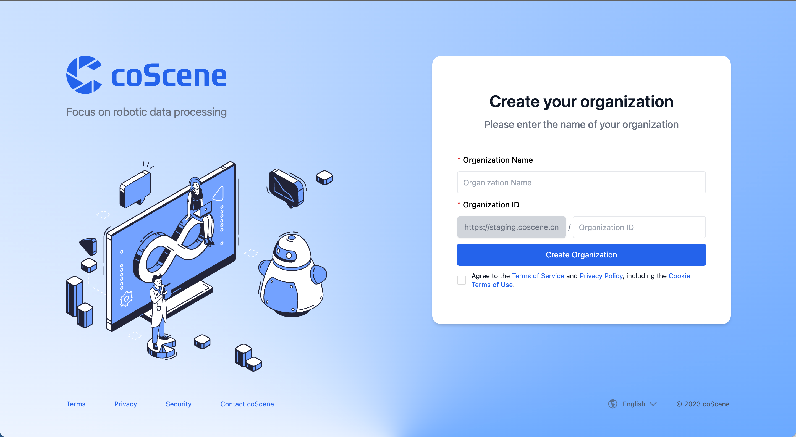

# Data Model

## Organization

An organization is a logical concept representing a team or a company. An organization can have multiple projects and multiple members.

When logging into the coScene platform, if you are the first user to log in from the selected organization, you will become the administrator of that organization and perform initial settings for the organization. If you are not the first user to log in, you will be a regular member of the organization.

## Device

A device refers to any physical device that can be connected to the coScene platform, such as: smart terminals, smartwatches, smart bands, smart glasses, smart in-car devices, smart home devices, etc.

Any member of the organization can add devices within the organization. Devices added in the organization are visible across all projects. For detailed operations on devices, please see [the device operation guide](../4-receipts/3-device/1-device.md).

## Project

While an organization acts as a container for resource management, it doesn't store any data generated by users and devices during runtime. Data storage, management, isolation, and application all happen at the project level. Projects serve as units for data management and also take responsibility for...

## Record

Many existing systems and tools can handle individual or single-sequence files. For instance, WebViz can directly open a Bag file for playback, and Uber XVIZ can restore the scene at the time of an event using a series of GLB and json files. These are impressive engineering capabilities. However, in the development of complex systems like robots and autonomous driving, numerous environmental factors, program interventions, and human interventions mean that a single file or file sequence is often insufficient to fully reconstruct the system's operational state.

Files generated by a device during its operation and R&D processes include not only the data itself but also related data like the software version being run, weather conditions, road conditions, hardware configurations, calibration files, maps, etc. The purpose of a "record" is to account for these complex relationships, storing closely related files in the same container and organically linking these files during post-processing.

The content of a record can be continuously iterated and enriched. Users and workflows can continuously update useful information within a record. A common example is that raw data can be sent to annotation providers like Baidu and Tsinghua for specific frame and semantic annotations. These annotations play a significant role in subsequent machine learning, training, and testing processes.

Beyond file management, coScene also manages file versions and lineages. You might have heard the famous phrase in the machine learning world: "garbage in, garbage out." On the coScene platform, we ensure data quality through record versioning and lineage management. In the record version, we can see the historical versions of the record and the modification logs for each version. In the record lineage, we can see the upstream and downstream records and the lineage relationships of each record. For detailed information about lineage and version history, please refer to [the explanation about record lineage and version history](../4-receipts/4-record/4-manage-records.md).

## Supported Data Formats and Platform Processing Capabilities

| Data Format          | Read         | Write        |
| -------------------- | ------------ | ------------ |
| ROS1                 | ✅           |              |
| MCAP                 | ✅           | ✅           |
| CyberRT              | ✅           |              |
| Non-standard Formats | Customizable | Customizable |
