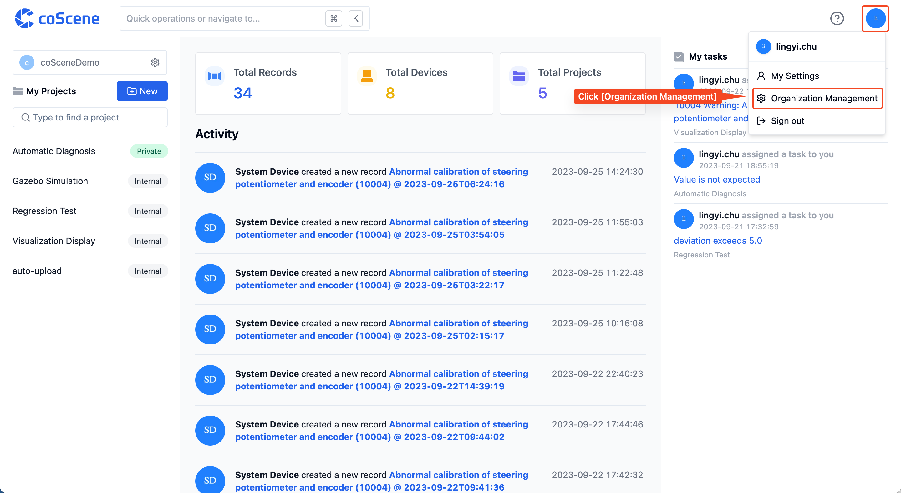
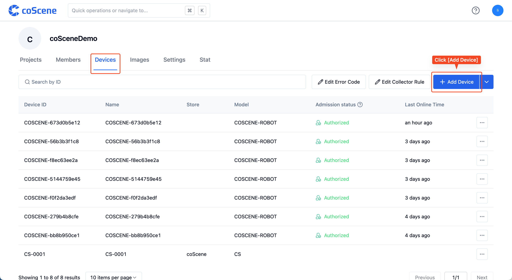
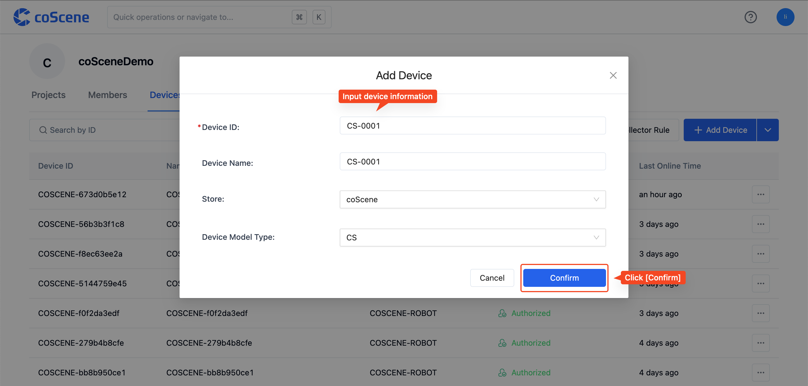

# Organization

You and your team will automatically join the same organization. On the "Organization Management" page, you can view the projects, members, devices, and statistics of the organization.

## Adding Projects within the Organization

Please refer to [the section about projects in the operation guide](../4-recipes/2-project.md).

## Adding Members to the Organization

> Taking logging in as a member of a certain DingTalk company as an example.

After a user from a certain DingTalk company logs in, they automatically join the company's organization, becoming a "member" with organizational member permissions.

When a user leaves the company and is no longer a member of the DingTalk company, they can no longer enter the original organization. However, the user's operation records are still retained.

## Adding Devices to the Organization

> Devices within the organization can be invoked by various projects.

On the "Organization Management" page's "Devices" tab, click the [Add Device] button.

In the "Add Device" pop-up, enter the device ID and other information, then click [Confirm]. The device ID is a unique identifier and cannot be duplicated.

The device is successfully added.

## Viewing Organization Statistics

> Who can use this feature 
> Only organization administrators can view organizational statistics.

Organizational statistics include: organization storage capacity, number of organization records, number of organization projects, and number of organization devices.

On the "Organization Management" page's "Settings" tab, you can view the organization's storage capacity.

On the homepage, you can view the number of organization records, number of projects, and number of devices.

