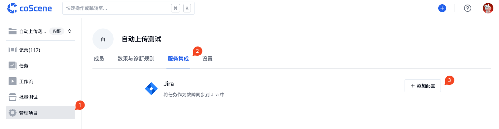
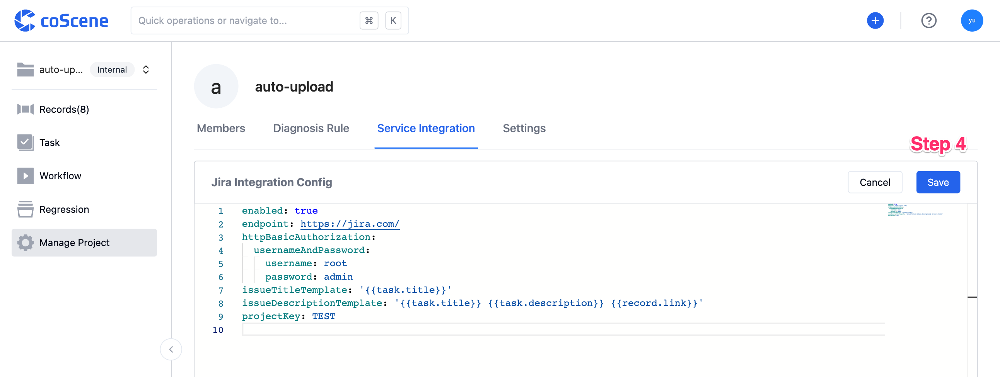
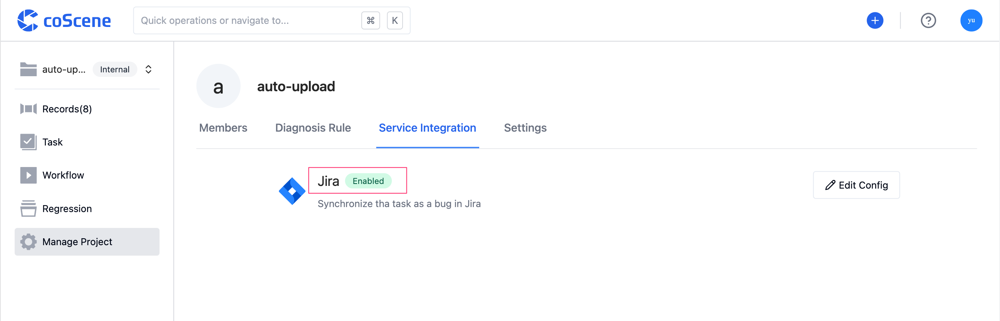
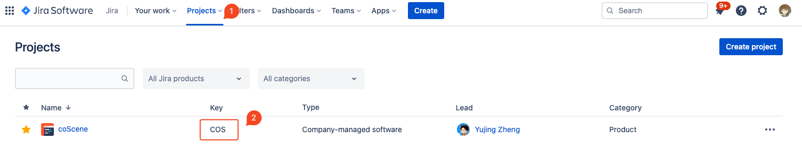
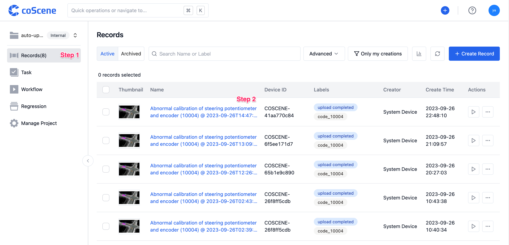
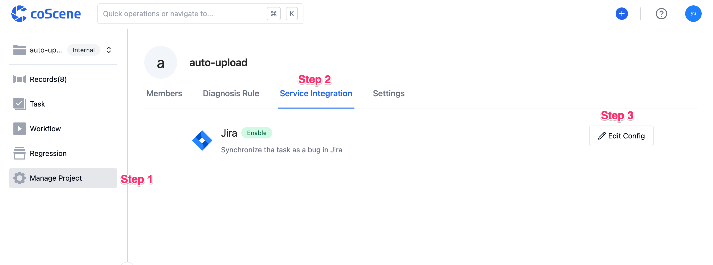

# Jira

Integrate with Jira to synchronize tasks as issues in Jira.

<br />

## Configuration Integration

> Each project is configured separately, and only the project administrator can edit.

In the project, go to the "Manage Project - Service Integration" page and click "Add Configuration".



Edit the configuration online. Once done, click "Save".



After successful saving, the configuration is automatically enabled.



<br />

## Integration Configuration Format

Here is an example configuration:

```yaml
enabled: true # Enable configuration

endpoint: https://jira.com/ # Jira URL
httpBasicAuthorization:
  usernameAndPassword:
    username: root # Jira username
    password: admin # Jira password

projectKey: TEST # Jira project Key

issueTitleTemplate: '{{task.title}}' # Jira title is the task name
issueDescriptionTemplate: '{{task.title}} {{task.description}} {{record.link}}' # Jira description consists of task name, task description, and record link
issueType: 'Bug' # Jira type

customFields: # Custom fields
  customfield_1:
    id: '88888' # Field 1 (dropdown style), select the option with id 88888
  customfield_2: TEST # Field 2 (text box style), enter the content as TEST
```

- **Jira Project Key**

  You need to look up the project's Key on the Jira platform:

  

- **Jira Type**

  Supports standard fields, such as: Bug, Task, Story.

- **Custom Fields**

  If there are custom fields, please contact coScene.

<br />

## Synchronize Tasks to Jira

> After the Jira integration configuration is complete, the tasks in the project can be synchronized to Jira.

Enter the project's record page:



In the "Comments & Tasks" module, click the "Synchronize Task" button corresponding to the task:


Once synchronized successfully, the created Jira link will be displayed.

<br />

## Manage Jira Integration

### Edit Integration

In the project, go to the "Manage Project - Service Integration" page and click "Edit Configuration".



Edit the configuration online. Once done, click "Save".


<br />

### Disable Integration

In the project, go to the "Manage Project - Service Integration" page and click "Edit Configuration".


Change the `enabled: true` in the configuration to `enabled: false`, then click "Save".


<br />

### Delete Integration

In the project, go to the "Manage Project - Service Integration" page and click "Edit Configuration".


Delete all the content in the configuration and then click "Save".


<br />
