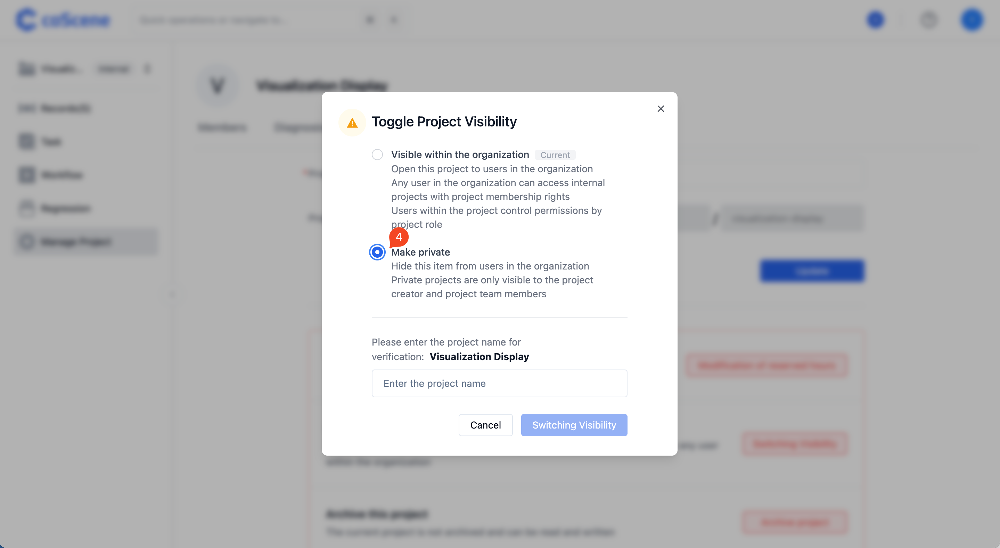
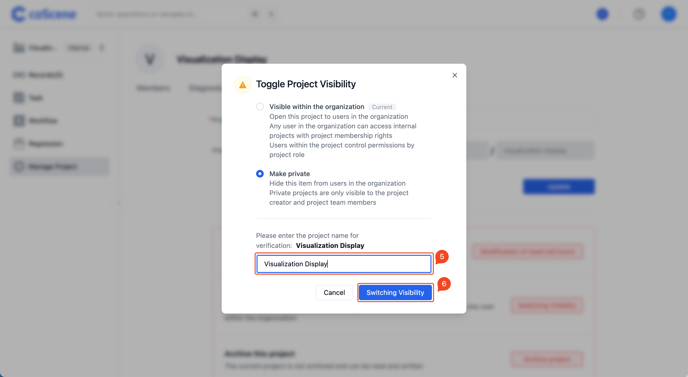
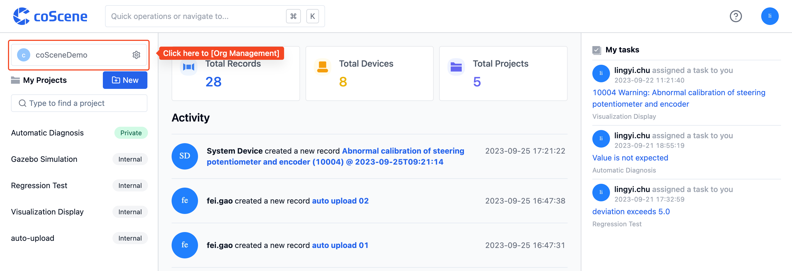
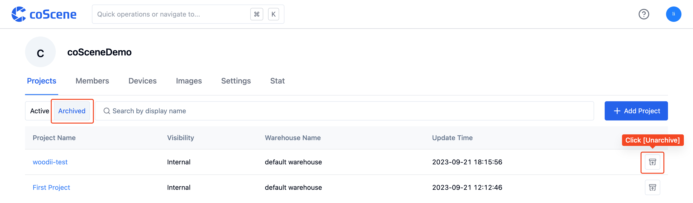

# Project

## 1. Create Project

### 1.1 Permissions to Create a Project

- "Administrators" and "Members" in the organization have the authority to create new projects in the organization; "Read-only Members" can only join existing projects.

### 1.2 How to Create a New Project

- Click the [Create Project] button in the top-left corner of the homepage to start creating.

---

## 2. Project Visibility

In coScene, you can choose who can access your project.

> Who can use this feature 
> Only organization administrators and project administrators can set project visibility.

### 2.1 About Project Visibility

We suggest you review the following considerations before changing project visibility.

**Set the Project to Private**

- Only organization administrators and internal project users can access.
- The permissions of internal project users are controlled by project roles.

**Set the Project to Internal**

- Any user within the organization can access and will have project member permissions in internal projects.
- The permissions of internal project users are controlled by project roles.

### 2.2 Change Project Visibility

- In the project, click [Manage Project].

  

- Under [Settings], click [Toggle Visibility].

  

- Choose visibility, verify if the changed project visibility is correct.

  

- After typing the name of the project whose visibility you want to change, click [Toggle Project Visibility].

  

---

## 3. Project Member Permissions

---

## 4. Archive and Unarchive Projects

In coScene, you can archive projects to store data with low activity for others to view and reference.

> Who can use this feature 
> Only organization administrators and project administrators can archive projects.

### 3.1 Archive Project

> After a project is archived, it becomes read-only, and all data within the project will no longer be updated.

- In the project, click [Manage Project].

  

- Under [Settings], click [Archive Project].

  

### 3.2 Unarchive Project

> After unarchiving a project, it returns to a readable and writable state.

- In the project, click [Manage Project].

  

- Under [Settings], click [Unarchive Project].

  

### 3.3 More Methods

- Under "My Projects" on the homepage, click [View All Projects] to enter the default "Project List" page in the organization management page.

  

**Archive Project**

- Under [Active], hover over the target project and click the [Archive] button.

  

**Unarchive Project**

- Under [Projects], click [Archived] to switch to the archived project list. Hover over the target project and click the [Unarchive] button.

  
