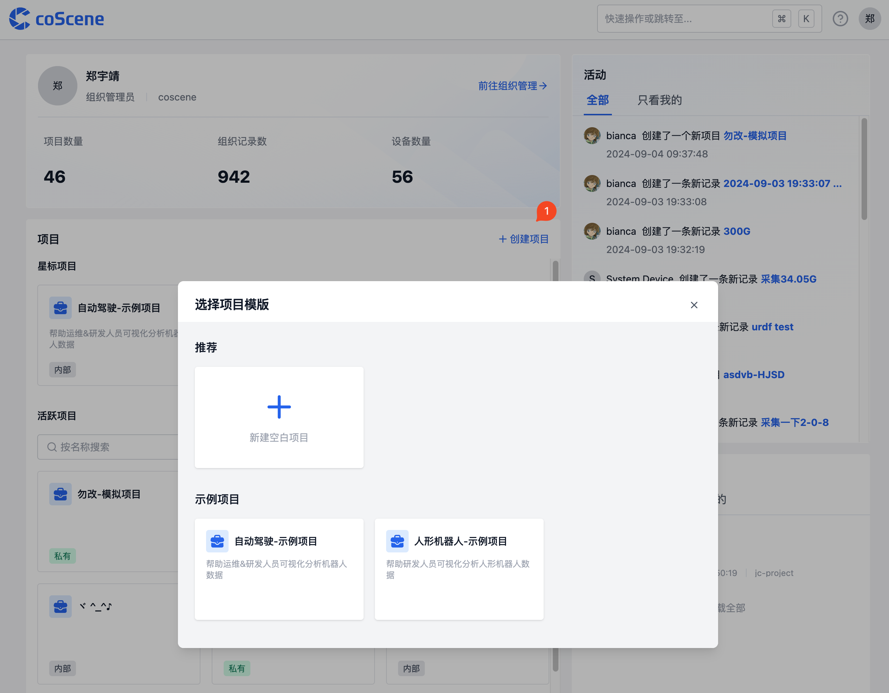
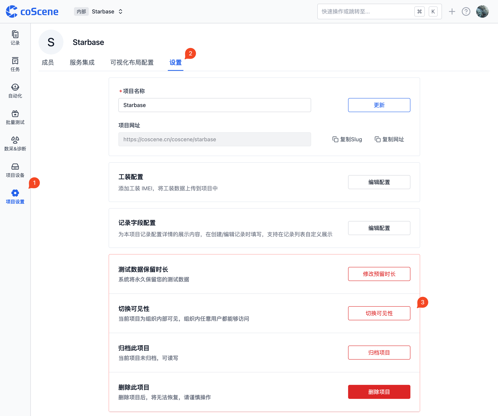
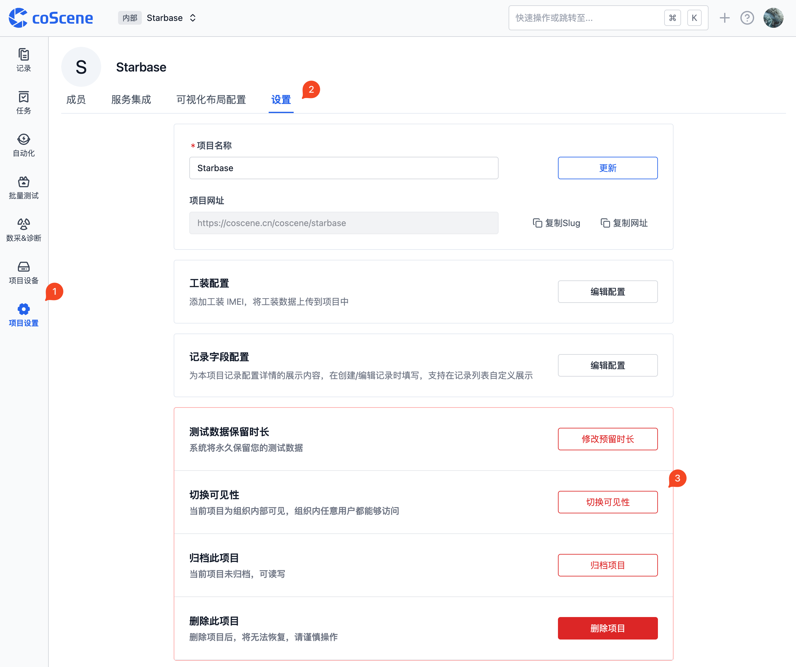
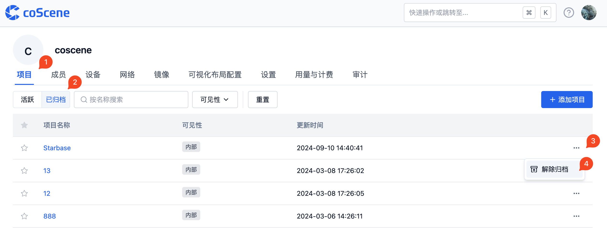

# Project

## 1. Create New Project

Click the "Create Project" button on the homepage, then follow the guided steps to complete project creation.

## 2. Project Visibility Settings

coScene offers two project visibility options that project administrators can set according to their needs:

### 2.1 Visibility Types

1. **Private Project**

   - Access restriction: Only organization administrators and project members can access
   - Permission control: Project member permissions are determined by project roles

2. **Internal Project**
   - Access scope: All users within the organization can access
   - Permission control: Accessing users have project member permissions, specific permissions are determined by project roles

### 2.2 Modify Project Visibility

Project administrators can switch project visibility in the project settings.

## 3. Archive and Restore Projects

coScene supports project archiving functionality for managing historical data or low-activity projects.

Archiving effects:

- After archiving: The project becomes read-only, and data updates stop
- After restoration: The project returns to a readable and writable state, functioning normally

### 3.1 Archive Project

Project administrators can perform archiving operations in the project settings.

### 3.2 Restore Archived Project

Organization administrators can restore archived projects through the following steps:

1. Switch to the archived projects view in the organization's project list
2. Select the project that needs to be restored
3. Click "Unarchive" to restore the project

