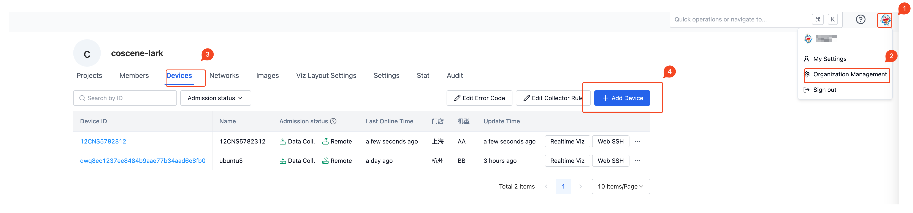
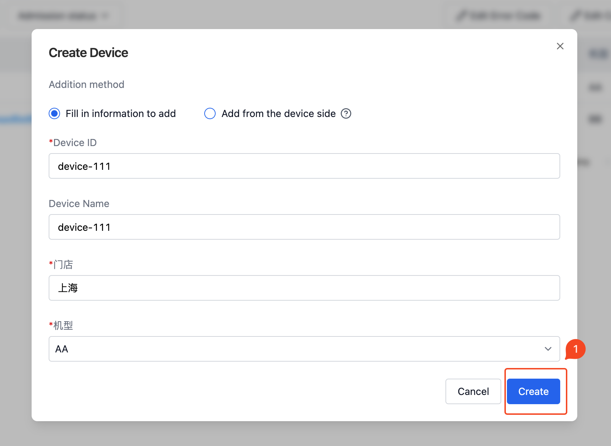
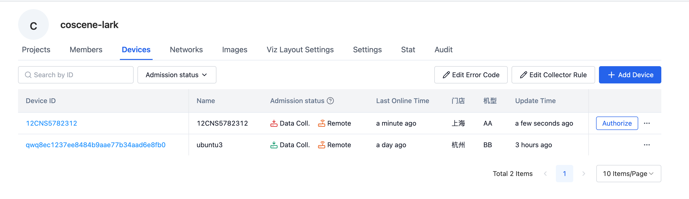

# Add device

## Fill in the information to add

In the "Devices" tab of the "Organization Management" page, click the "Add Device" button.



In the "Add Device" pop-up box, enter the device ID and other information, and click "Create". Among them, the device ID is a unique identifier and cannot be repeated.

When the organization administrator sets [Custom Field](./1-device.md#Custom Field), the user needs to complete all required fields according to the page prompts. As shown in the example in the figure, the store and model are custom field information.



After clicking Create, the device was successfully added.

## Add from device side

Same as the above "Fill in information and add" entry, click [Add device] and then select [Add from device side].


Currently, it only supports **Linux devices**, arm64 and x86_64 architectures, and does not currently support Windows devices. If you have relevant needs, please contact the Kexing team.

*The current program requires systemd service to be installed. **Please use the root account to execute the following commands**. *

### Network installation

1. Select [Add device via command line] and copy the relevant command information.


2. Enter the device, open a shell terminal, paste the copied installation command, and press Enter to execute.


1. After the installation is completed, you can view the relevant devices on the device list page (according to the performance of the device, there will be a certain delay in startup, resulting in a certain delay in the refresh of the web page). At this point, the device has completed the registration operation. For further operations, please see [Device Access] (./3-manage-device.md#Device Access).



### Offline installation registration

The following command assumes that the user is located in the `/root` directory. If you switch directories, please pay attention to changing the relevant path information.

1. Download the installation script [coscene.sh](https://download.coscene.cn/coscout/coscene.sh), offline binary file compression package [cos_binaries.tar.gz](https://download.coscene.cn /coscout/tar/latest/cos_binaries.tar.gz) to the device, the storage locations are `/root/coscene.sh`, `/root/cos_binaries.tar.gz`
2. In the root directory, grant execution permissions to the installation script.
```shell
chmod +x /root/coscene.sh
```

3. Take the offline binary file compression package `cos_binaries.tar.gz` placed in the `/root/cos_binaries.tar.gz` location of the device as an example.

```shell
./coscene.sh --server_url=*** --project_slug=*** --virmesh_endpoint=*** --use_local=/root/cos_binaries.tar.gz
```
Execute the above command in the root directory for offline installation. For the parameters `--server_url`, `--project_slug` and `--virmesh_endpoint`, please refer to the web page generation results. The parameter `--use_local` is for offline binary file compression. The path to the package. If the directory location of the binary file is modified, please modify the `--use_local` parameter to avoid installation errors.

### View log information

Execute the following command on the device to view the log information of the data collection program.

```shell
journalctl -fu cos
```
