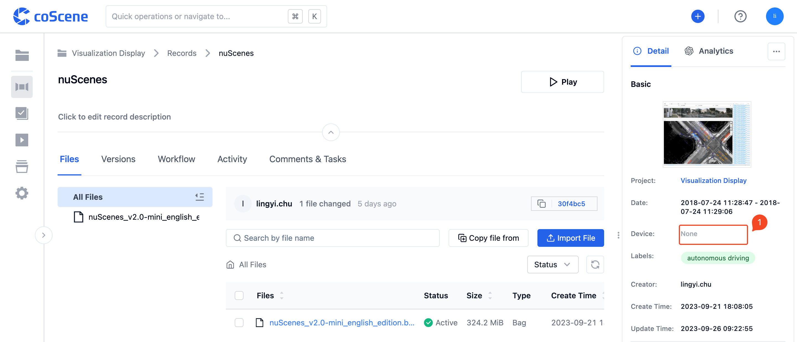
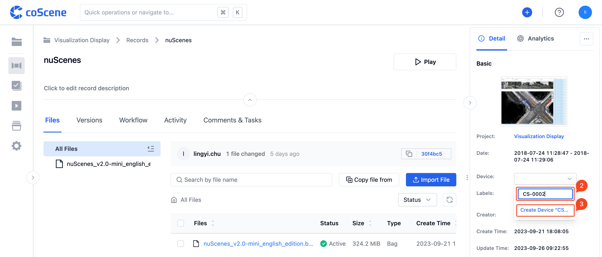

# Create Devices

## Add Device in Records

After creating a record, input the "Device ID" in the "Device" field on the record details page, and click [Create Device].

 

## Create Device in Organization

Navigate to the "Devices" tab on the organization management page.

Click [Create Device], input the basic information, and then click [Confirm].

 
