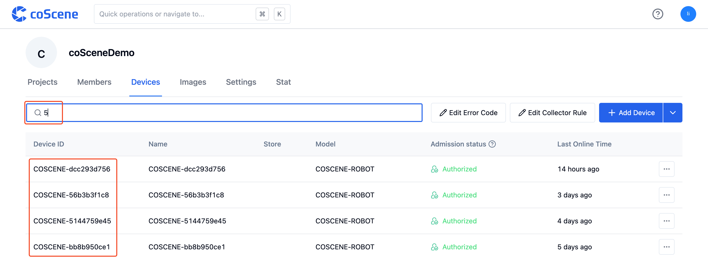

# Manage Devices

Devices are managed at the organizational level, and devices within the organization can be applied to all projects.

## Edit Device from Records

> View device details from records and edit device information.

In the record detail page, click on the device to navigate to the device management page.

Click on the [Edit] icon to start editing the device.

After entering the device information, click the [Save] button.

The device information is updated.

 

## Manage Devices within the Organization

> Search, edit, and delete devices within the organization.

Enter the "Device" tab of the organization management page.

In the search box, enter the "Device ID" to retrieve the device you need to manage.

In the operation bar, choose to edit or delete the device.

 
