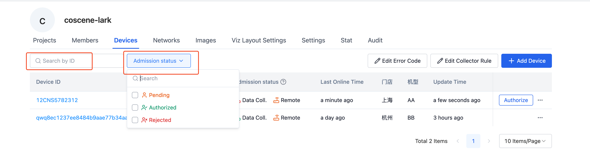
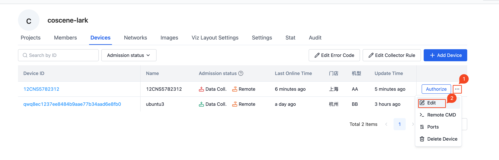
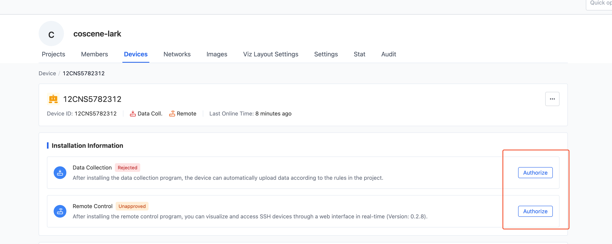

# Manage devices

Equipment is managed at the organizational level, and equipment within the organization can be applied to all projects. "Organization Management" - "Devices" page to view the existing device list.

## Filter equipment

As shown in the figure, filtering on the two fields "Device ID" and "Access Status" is currently supported.

## Edit device

Select the device that needs to be operated in the device list and click the [Edit] button to modify the device information.

## Device access

When you complete [Add from the device side](./2-create-device.md#Add from the device side), the [Admit] operation button will appear in the device list. On the device details page, you can access the "Data Collection" and "Remote Control" modules separately.

When "data collection" is allowed, the machine-side program will start collecting data according to the rules and automatically upload it to the corresponding project.

After "remote control" is accessed, users can perform real-time operations on the machine through the Kexing platform, such as SSH connection, real-time visualization and other functions

## Delete device

Select the device you want to delete in the device list, click [Delete Device], and confirm twice to delete the device. After deleting the device
1. Accessed devices will be canceled and data cannot be uploaded automatically.
2. The device and requests from the device will be cleared in the organization
3. The device will not be added to the record
4. The detailed information of the device will not be viewable in the record.

