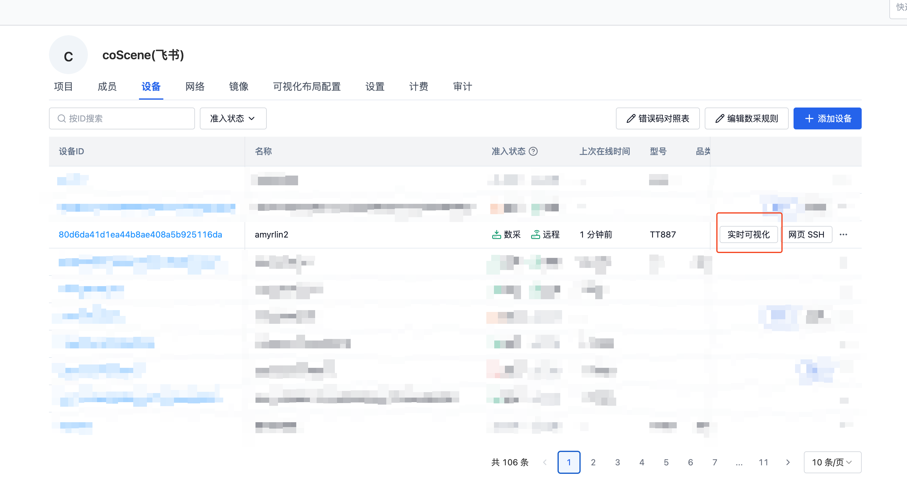
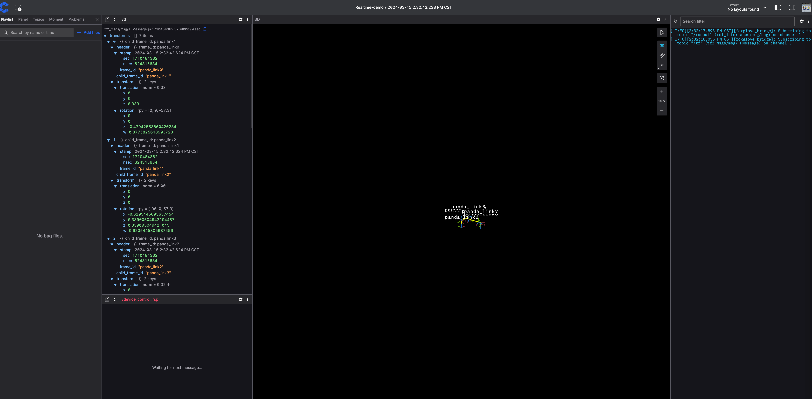
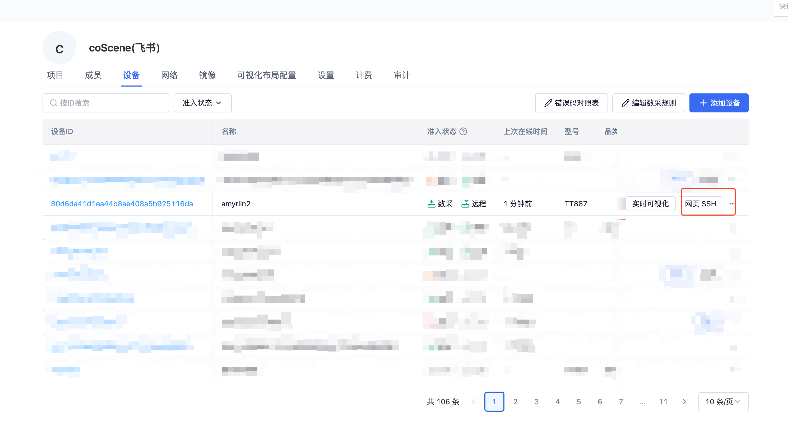
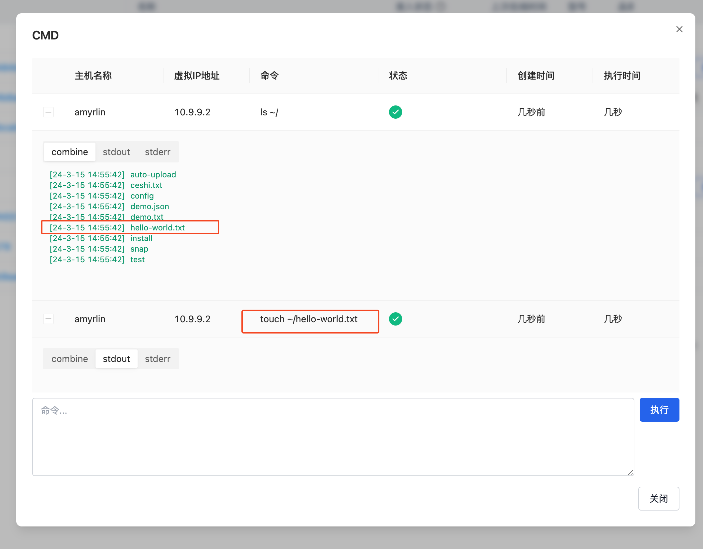
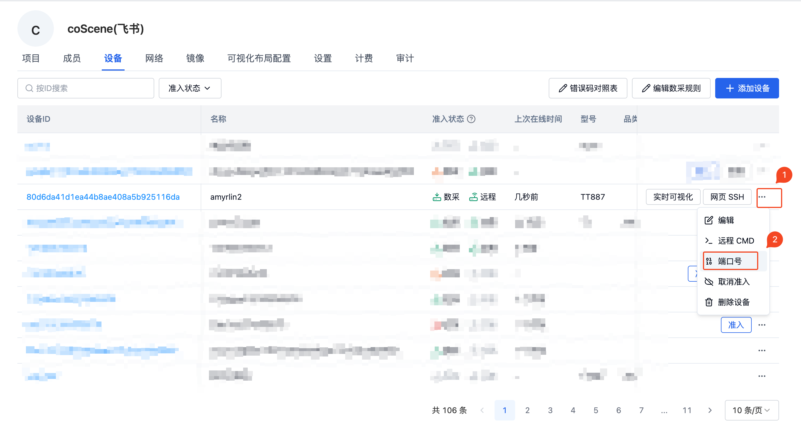
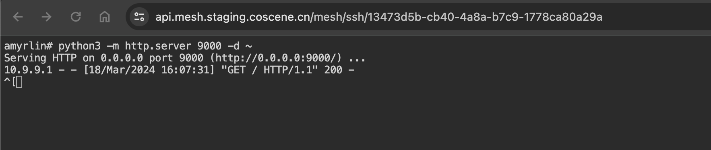

# 远程控制设备

在刻行平台上可以实时远程操作设备，例如远程下发命令，SSH 连接等操作，提升运维能力。

## 前提条件

1. 设备端已经安装刻行相关的设备端程序，具体请参考[设备端安装](./2-create-device.md#add-from-device-side)。
2. 组织管理员已经准入设备，允许进行远程控制设备。[设备准入](./3-manage-device.md#device-access)请参考相关文档。

## 实时可视化

当设备准入后，在「组织管理」里「设备」页面列表查看设备，设备会出现【实时可视化】的按钮，点击之后即可连接到机器实时展示机器的实时情况。

## 网页 SSH

当设备准入后，在「组织管理」里「设备」页面列表查看设备，设备会出现【网页 SSH】的按钮，点击之后即可在浏览器中打开新的 Tab 通过 SSH 连接到机器。

页面默认提供了 [Trzsz 文件传输工具](https://trzsz.github.io/cn/)，用户可以通过`trz file1` 命令上传本地的文件至远程机器端，通过 `tsz file1 file2 file3` 将远程机器的文件下载到本地机器上。更为复杂的命令使用请参考[详细说明文档](https://trzsz.github.io/cn/)。

## 远程 CMD

当机器实时在线时，用户可以通过远程 CMD 功能对机器进行命令下发操作，执行特定的任务。

点击【远程 CMD】按钮，进去操作页面。示例中执行 `touch ~/hello-world.txt` 命令，创建一个名为`hello-world.txt` 的文件。

然后再执行 `ls ~/` 命令获取所有文件信息，通过执行命令历史记录的结果可以看出，命令均成功执行。

## 端口号映射

当机器端没有公网 IP 时，用户无法直接访问机器的端口，而端口号映射功能可以将机器端的端口进行转发，使得可以被用户在公网进行访问。例如可以将机器端运行的服务暂时暴露，本地连接进行调试等操作。

我们这里操作一个简单的示例。通过【网页 SSH】功能我们连接到远端机器，在机器上执行命令 `python3 -m http.server 9000 -d ~` 运行一个简单的 HTTP Server，会将`~`目录下的文件作为静态文件可以直接访问。Server 监听了 9000 的端口，然后我们配置对机器端 9000 的端口进行转发。此时我们在本地浏览器请求映射后的地址，即可将请求转发至机器端。

1. 网页端配置 9000 端口映射
   

2. 通过网页 SSH 在机器端执行 `python3 -m http.server 9000 -d ~` 启动简易 HTTP Server
   

3. 在浏览器中请求相关地址，发现列举了机器端 `~` 目录下的所有文件信息
   

4. 查看机器端的日志信息，发现浏览器的请求已经转发到了机器端，并且返回了 200 标识请求成功。
   
