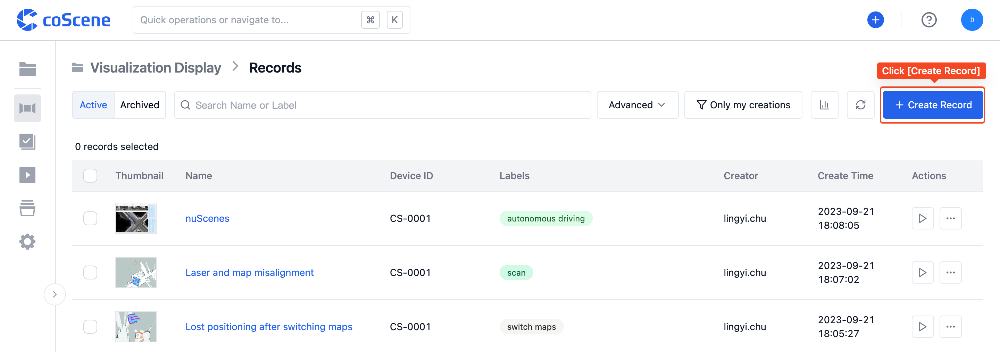
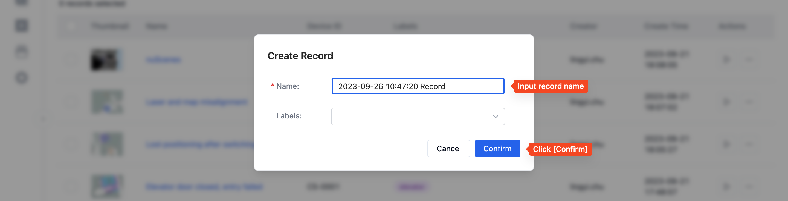
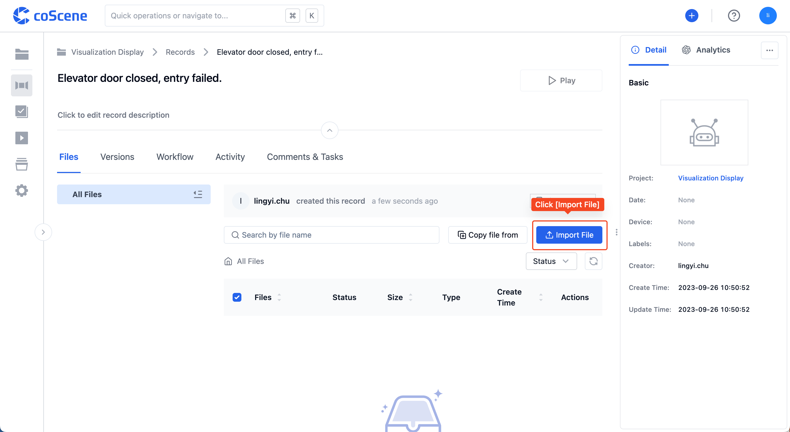
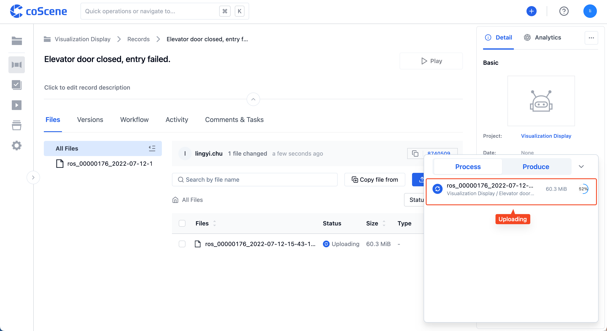
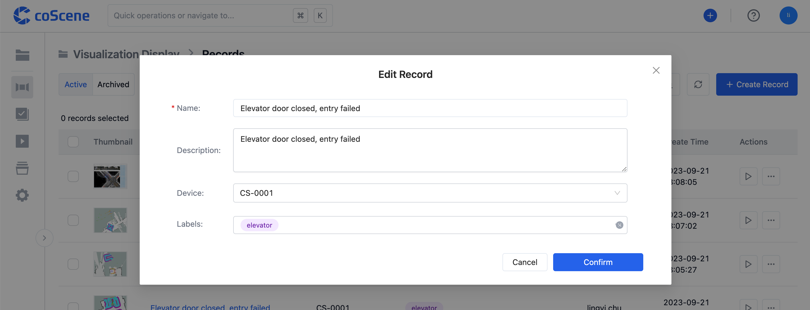
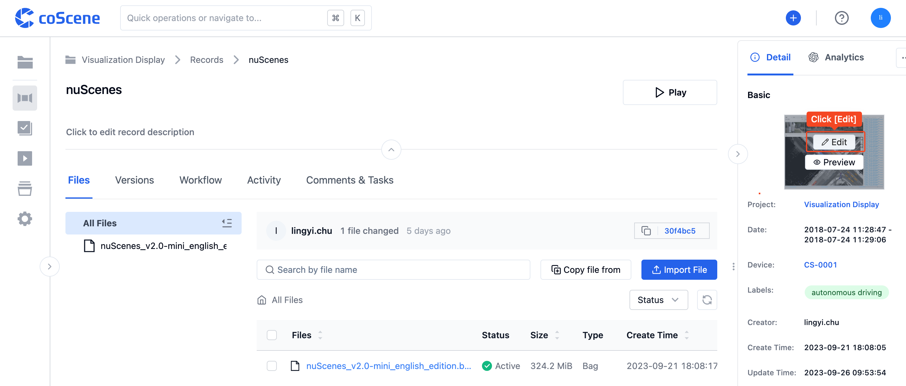

# Create a Record

When users need to view data generated by a device over a period of time, they can create a record within a project and upload all the data generated by the device to this record.

## 2 Ways to Create a Record

### 1. Create a Record from the Record List

Step 1: In the "Record List" within the project, click the [Create Record] button, enter the record name, and it's successfully created:

Step 2: In the "Record Details Page", click [Upload File] to upload the data generated by the device from your local machine to the record.

### 2. Drag and Drop Files into the Project to Create a Record

On any page within the project, simply drag and drop files into the browser to trigger the [Create Record] action and upload the files.

## Record Attributes

A record can have the following attributes set for categorization and retrieval:

- Start and End Time: The start and end time of the event recorded.
- Device: You can choose from the list of already added devices, or add a new device.
- Tags: You can set category tags.
- Description: You can write a description of the scene at the time of recording, any faults, or other relevant information.

- Thumbnail: You can upload a scene photo or keyframe to help identify the record.

