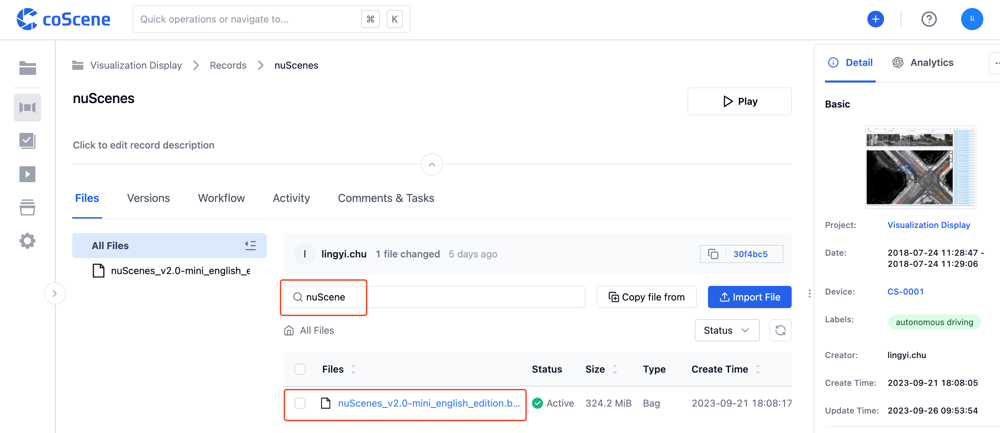
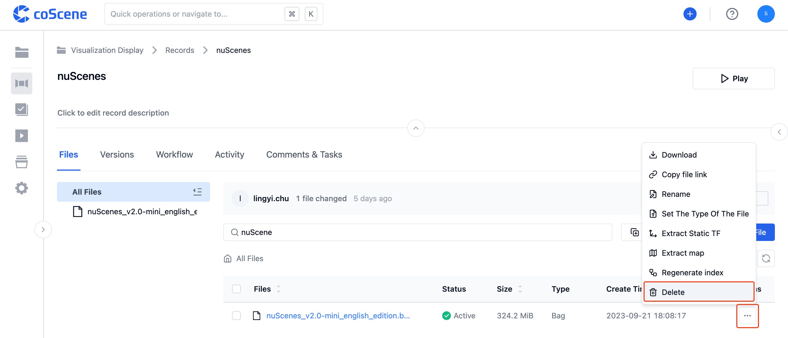

# Upload Files

In coScene, there are two ways to upload files: **Local Upload and URL Upload**

## Local File Upload

Users can drag and drop files or click the [Upload File] button within a record to upload local files to the record.

## URL File Upload

Within a record, users can paste the file URL to import the remote file into the record.

Step 1: On the "Record Details Page", click the dropdown button next to the [Upload File] button to expand [URL Upload].

Step 2: Click the [URL Upload] button and paste the link of the file you want to upload.

Step 3: After verifying the basic file information, click [Confirm] to import the file from the URL into the record.

## File Visualization

In the "File List", select a file and click the [View] button to redirect to the "Visualization Interface" for playback:

> Currently, only Rosbag files can be viewed.

## File Management

### Search

Enter keywords in the search box within the "File List" to search for file names:

### Download

In the "File List", click the [Download] button of a file to download it to your local device:

### Delete

In the "File List", click the [Delete] button of a file to remove it:

> Deleted files cannot be restored; however, you can find and download them by tracing back versions.

