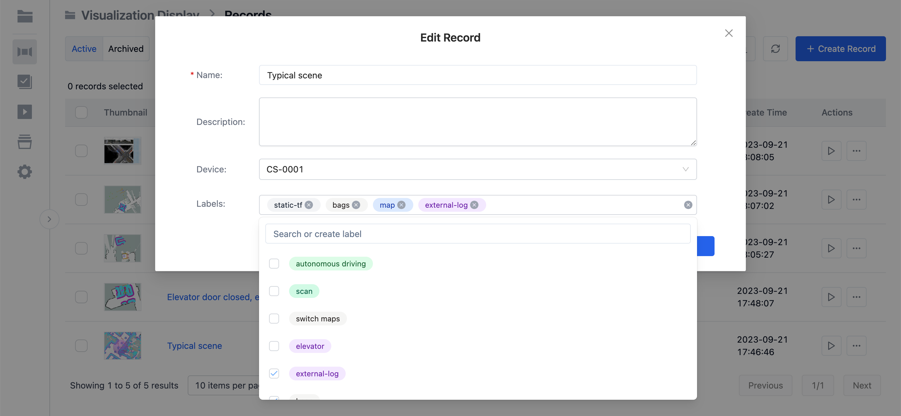
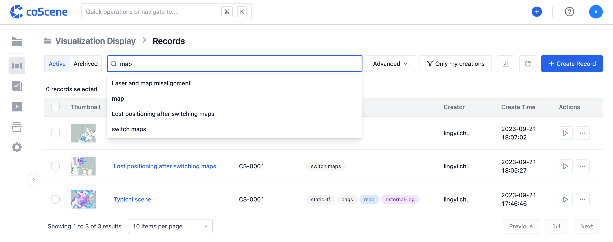
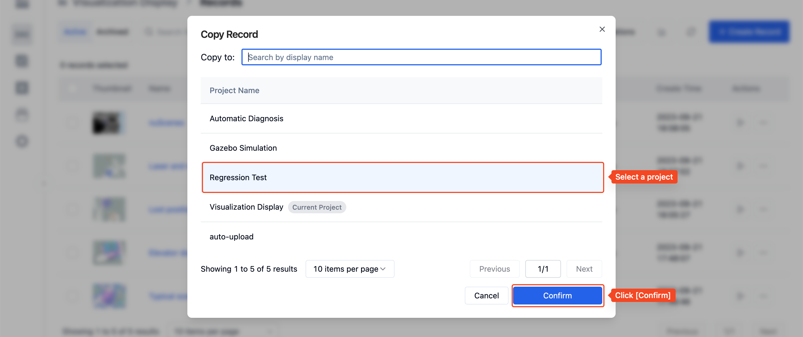
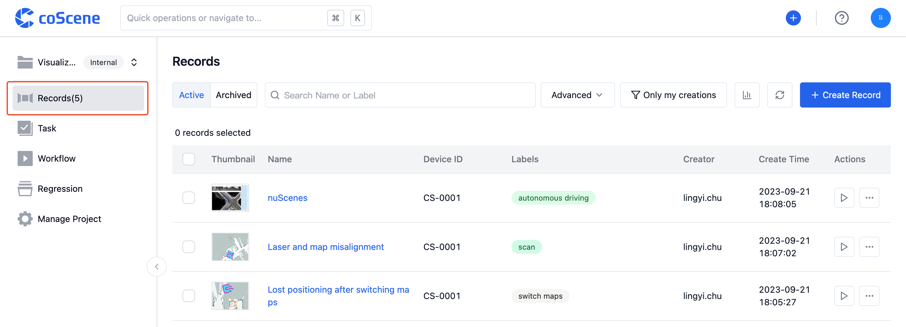
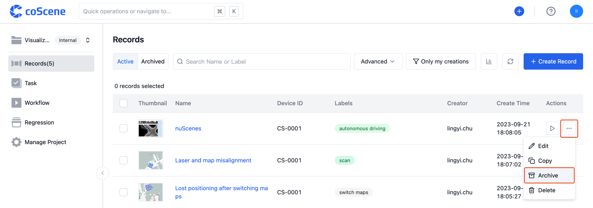
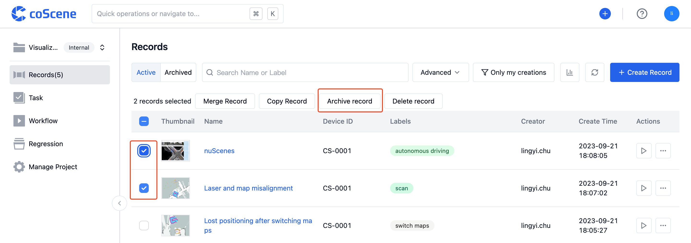
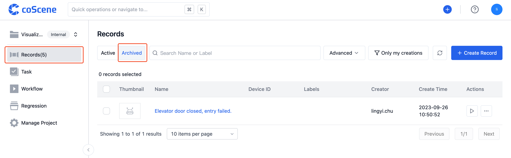
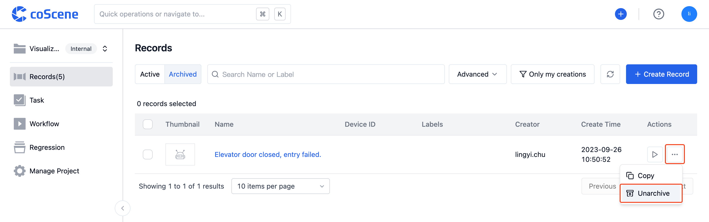

# Manage Records

On the record list page, you can add, edit, copy, and archive previously created records. You can also search and filter records and generate statistics based on existing categories.

## Categorization and Tagging

- When creating or editing a record, you can set tags for it. Each tag can correspond to a category.
- Multiple tags can be set for each record.

  

## Statistics

- Click on the [Statistics] button in the "Record List" to display the number of records under each tag:

  

## Search and Filter

- In the "Record List", you can input keywords in the search bar to search for record names and descriptions:

  

- You can also click on the [Advanced] button to expand more filter options and filter records by start and end time, tags, devices, and other attributes:

## Copy

If you wish to reuse or aggregate the collected data, you can copy a record from one project to another.

- Select the record and click the [Copy] button. From the pop-up window, choose the project to copy the record to:

  

  

## Archive

You can archive records to store low-activity data for others to view and reference.

> Who can use this feature 
> Organization administrators, project administrators, and project members can archive records.

### Archiving Records

> Once a record is archived, it becomes read-only, and all data within the record will no longer update.

**Archive a Single Record**

- From the "Record List Page" operation:

  - Click on the [Records] page of the project, go to the [Active] record list.

    

  - Select the record you wish to archive and click [Archive] on the right.

    

**Bulk Archive Records**

- Click on the [Records] page of the project, go to the [Active] record list.

  

- Select the records you wish to archive, then click [Archive Record].

  
  
### Unarchiving Records

> Once a record is unarchived, it is restored to a readable and writable state.

**Unarchive a Single Record**

- From the "Record List Page" operation:

  - Click on the [Records] page of the project, go to the [Archived] record list.

    

  - Select the record you wish to unarchive and click [Unarchive] on the right.

    

**Bulk Unarchive Records**

- Click on the [Records] page of the project, go to the [Archived] record list.

  

- Select the records you wish to unarchive, then click [Unarchived Record].
  
  
