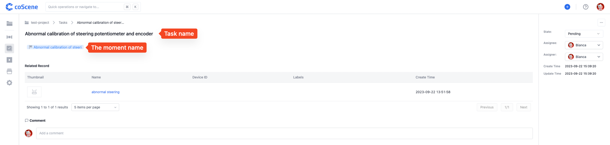

# Create a Task

The circulation of tasks is an essential way for users to collaborate on projects through the KeXing platform. Organization users can create, assign, and process several tasks for a record and collaborate with other members. Combining tasks, comments, and "moments" can enhance work quality and efficiency.

This section will start with creating a task, helping you understand how to use tasks for effective collaboration.

## Create a Task from the Record Details Page

You can go to the "Comments & Tasks" module on the task details page to create a task associated with a record. When creating a task, specify the handler and add a description of the task so that relevant users can complete the task process with effective information.

<video src="https://coscene-artifacts-prod.oss-cn-hangzhou.aliyuncs.com/docs/en/4-recipes/5-task-and-comment/create-task.mp4" controls="controls" width="700" height="400"></video>

 

## Create a Task from the Visualization Interface

While playing the content of a record in the visualization interface, you can create a "moment" to mark a keyframe and check the "create an associated task" option for convenient work progression. This eliminates the need to navigate to the record details page to create a task and reference the "moment."

<video src="https://coscene-artifacts-prod.oss-cn-hangzhou.aliyuncs.com/docs/en/4-recipes/5-task-and-comment/create-task-from-moment.mp4" controls="controls" width="700" height="400"></video>

 

The created task will automatically reference the "moment" in the description, helping relevant members quickly locate it.

 
