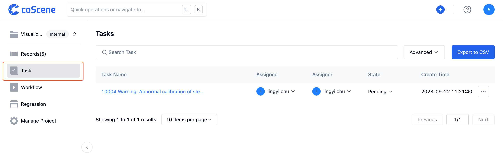

# Work on a Task

## View Tasks

On the main page of CoScene, on the right under "My Tasks," you can see a list of tasks assigned to you that are not yet completed. Clicking on the task title will redirect you to the task's details page, where you can view task information and take action.

 

You can also go into a project and click on "Tasks" in the sidebar on the left to view and manage all tasks within the project.

 

## Handle Tasks

### Change Task Status

A task can have three statuses: "Pending," "In Progress," and "Completed." By default, when a task is created, its status is "Pending." Team members can change the task status based on its actual progress.

You can click on the task's "Status" on the task page to change its status.

<video src="https://coscene-artifacts-prod.oss-cn-hangzhou.aliyuncs.com/docs/4-recipes/task/change-task-status.mp4" controls="controls" width="700" height="400"></video>

Once a task is completed and its status changes to "Processed," it will no longer appear in the task list on the assignee's homepage.

 

### Edit Task Information

On the task details page, you can modify the task title and description.

<video src="https://coscene-artifacts-prod.oss-cn-hangzhou.aliyuncs.com/docs/4-recipes/task/edit-task.mp4" controls="controls" width="700" height="400"></video>

 

### Delegate Task to Relevant Members

Once the current assignee completes the part of the task within their scope of work, or in other situations where the task needs to be assigned to another team member, they can change the "Assignee" information to delegate the task.

You can change the "Assignee" to delegate the task to another relevant user. The designated assignee will receive a notification.

<video src="https://coscene-artifacts-prod.oss-cn-hangzhou.aliyuncs.com/docs/4-recipes/task/change-assignee.mp4" controls="controls" width="700" height="400"></video>

 

## Add Comments to Tasks

Similar to records, users can also comment on a specific task to retrieve and add more information related to the task.

You can add comments in the task details interface, mention other users, add relevant links, and other information to enhance task efficiency.

<video src="https://coscene-artifacts-prod.oss-cn-hangzhou.aliyuncs.com/docs/4-recipes/task/add-comment-to-task.mp4" controls="controls" width="700" height="400"></video>

 

 

## Delete Task

Click the action button in the top right corner of the task details page to delete the task:

<video src="https://coscene-artifacts-prod.oss-cn-hangzhou.aliyuncs.com/docs/4-recipes/task/delete-task.mp4" controls="controls" width="700" height="400"></video>

 

 

You can also delete tasks from the "Tasks" list

<video src="https://coscene-artifacts-prod.oss-cn-hangzhou.aliyuncs.com/docs/4-recipes/task/delete-task-in-list.mp4" controls="controls" width="700" height="400"></video>

 
